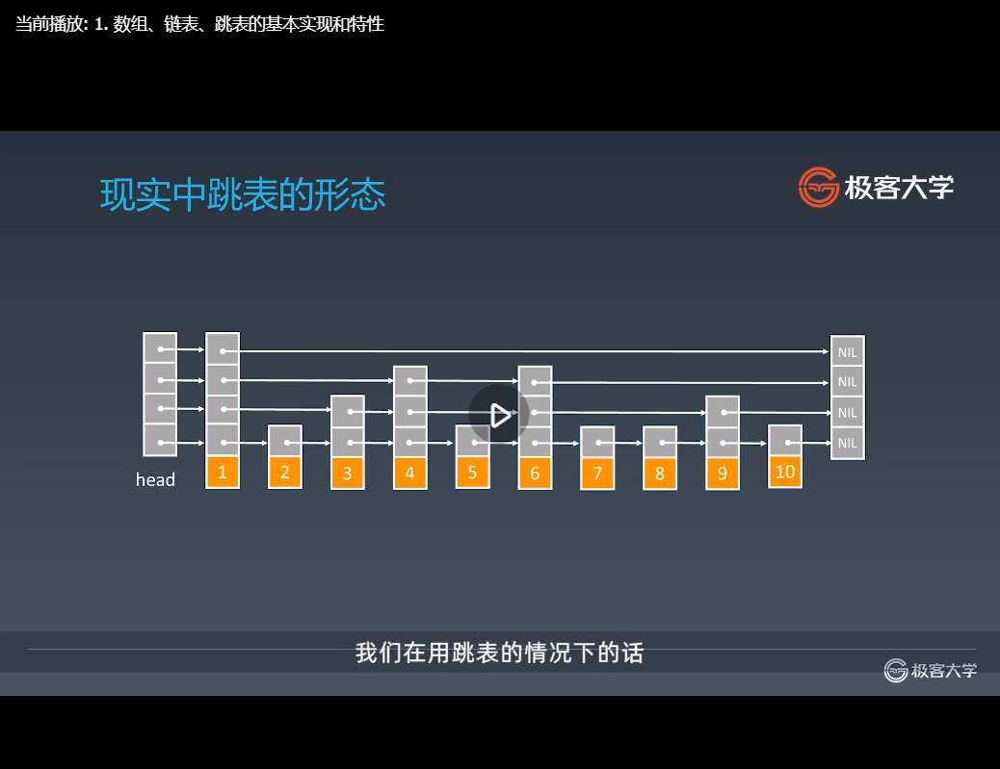

学习笔记
#第一周 
##一、学习总结：
###1.效果
总的来说，效果一般。我遇到一个问题有点爱死磕，导致占用很多时间，效率低，所以五毒神掌每道题现在只过了两遍。
###2.学习过程
我是先看的老师的录播，然后着手做习题的，用习题来检验学习效果。
###3.感受
感觉算法题真的难，以前没有过这方面的训练，底子太薄，一做起来题目一点思路都没有，做了半天看答案。看了答案遇到不会的又看看答案，好虐心。
###4.收获
掌握了数据、链表、栈的一些简单增、删、改、交换操作，遇到一些特殊问题会去想用栈解决
##二、学习笔记
###1. 数据结构和算法总览
####如何有效学习数据结构与算法
#####线上课程
- 注重预习——基础知识自己预习和查看：我想班主任的话已经把所有的课件，都发给大家了。那么在上课之前大家一定要抽时间把这个课件先预习和查看一遍。
- 课堂互动——跟着我一起思考、回答问题
- 课后作业——按照切题办法
#####期待效果
- 职业顶尖级别——对于算法数据结构的理解
- 一线互联网公司面试：那么具体表现在于各位参加一线互联网公司面试的时候不再胆怯，而且通过训练准备和几家公司面试的尝试，总会拿到一家顶级互联网公司的offer，然后升职加薪入职。
- 各位掌握好了训练方法之后，坚持做题、练习算法和数据结构，最后在LeetCode上面可以达到300+的积累量
#####精通一个领域
<<outliers>>：中文名：<<异类：不一样的成功启示录>>
- Chunk it up 切碎知识点：
  庖丁解牛
  脉络连接: Elon Musk在reddit回答网友的问题，他觉得任何知识体系的话都是一棵树，所谓他叫做语法树。那么你关键要掌握这个领域的知识的话，就是要把这些知识变成一棵树状结构，有最基本的根，然后分出主干，再分出枝叶。 每个知识点的话要最后和你熟悉的知识挂靠在一起，成为一个树型结构。
          他说了就是人脑不适合记忆和理解孤立的知识，所以一定要把它弄成一个脑图。
  

- Deliberate Practicing 刻意练习
  大家要达到职业化的话，就一定要进行每一个区域的刻意化练习。
    - 例如，游戏(CS、LOL、吃鸡、星际)
      控兵（微操）
      运营
      战术
      热键操作 vs 鼠标操作
      ...
- Feedback 反馈：
  主动式反馈(自己去找):
     高手代码(GitHub，LeetCode，etc)
     第一视角直播
  被动式反馈(高手给你指点):
     code review
     教练看你打，给你反馈

#####数据结构
那么现在我们来给大家分解数据结构和算法这一块的知识脉络，在这里话，我想给大家把东西做简单，同时便于大家理解和分类的话，主要就是三大块即可：
- 一维
  基础：数组array(string)，链表linked list
  高级：栈stack，队列queue，双端队列deque，集合set，映射map(hash or map)，etc 
- 二维 你可以想象成为二维的数据结构，都是从一维泛化而来的，我们人类生活在三维世界，所以各位对于理解二维的话应该是没有什么问题的。 你可以简单理解为，当一个一维的链表，它的分叉有两个的时候，它就变成了一个二维的数据结构，就变成了相当于树这样，后续的话对于树的话，我们有详细的解释。
  基础：树tree，图graph
  高级：二叉搜索树binary search tree(red-black tree,AVL)，堆heap，并查集disjoint set，字典树Trie，etc
- 特殊
  主要是用于工程中特定的情景，比如说
  位运算Bitwise，布隆过滤器BloomFilter
  缓存：LRU Cache
#####算法（总共八大点）
前三点就类似于几何里面的公理一样，而前三点是算法最基础的地方
- if-else，switch -->branch
- for,while loop -->Iteration
- 递归 Recursion (Divide & Conquer, Backtrace)
这三部分的话就变成了所有的算法和数据结构它们的基石，大家可以这么理解：任何的高级的算法数据结构，到了最后都会转换成if else或者是for loop或者是递归。
  为什么，因为我们现在用的这些算法数据结构，都是叫做最为初级的，它没有任何所谓的智能或者人工智能部分在里面，它就是最朴素的一些运算操作，那么它们的关键最后你要用的语句，其实就只能是if else for loop 和递归。
  基于这点的话，后面把所有的知识体系都学完了之后，大家可以把这些东西化繁为简后，它的根本就是找到它的重复单元，基于这个重复单元，你就可以泛化成下面的这些高级的数据结构。
  后面解释完了之后，学完整个课程，大家再回看的话，你会发现所有这些复杂的算法，最后其实就是找它的重复单元是什么。
  那么基于递归也好或者For Loop也好，就开始了下面的五点高级的算法。
- 搜索Search；深度优先搜索 Depth first search，广度优先搜索 Breadth first search，A*，etc
- 动态规划 Dynamic Programming
- 二分查找 Binary Search
- 贪心 Greedy 以及 排序 Sort
- 数学Math，集合Geometry
  注意：在头脑中回忆上面每种算法的思想和代码模板
#####数据结构和算法脑图
 MindNode软件做的
https://pan.baidu.com/s/1rucC3q-9zD-lzs3yBkFU_g   ykyn
#####职业化运动
- 基本功是区别业余和职业选手的根本
- 基础动作的分解训练和反复练习 -->最大的误区：只做一遍
#####Deliberate Practicing
- 刻意练习——过遍数（无毒神掌）
- 练习缺陷、弱点地方
  当你某一个方面练习得非常好，很有信心的时候，这一点的话就会成为你所谓的舒适区， 
  而你要提高的话，经常你要一只脚踏在舒适区之外，把自己的弱项进行反复练习，这样的话过了一段时间强化之后，你回头看就发现自己突破了自己的原来的情景。
  专项练习：切题也是这样，如果大家对于递归觉得心里一直犯糊，或者是对于动态规划的话，一听到这个词，一做动态规划的题就没有头绪，那么就逼自己反复地练习这些，那么大家经过十道题二十道题以及上百道动态规划的题目的练习之后，各位都可以达到一个很熟练的水平。
  
  这些职业选手在练的话，都是相当于这样很工整的一些球形，
  也就是对应于我们在进行算法和数据结构练习的时候，就是一些很典型的题目，然后不断地练习一个题目，举一反三，把不同的算法、不同的数据结构，过遍数，把它练习好了之后，这就是所谓刻意练习，最后给你带来基本功的一个提升，这在每行每业都用得非常多的。
  在这里首先你要克服自己的理解的一个误区，只想做一些比如说高大上的框架，学习一些高大上的，比如说人工智能的技术，其实并不是这样的，
  把这些基础全部都练习好了之后，这个时候你就会发现，你真正写工程的代码就会事半功倍了。
#####切题四件套
和后面要讲的五毒神掌是个体与全部的关系
- Clarification：多看几遍，和面试官沟通，确保理解正确
- Possible solutions：想所有可能的解法来解这个题目，关键（要养成这样的思维习惯，就是把每一个不同解法，它的时间和空间复杂度学会分析，从中找出最优的一种解法，这种最优的解法一般来说就是时间最快的一种解法）是在于把所有可能的想法，首先先过一遍，同时比较不同的方法，它们的时间和空间复杂度，从中找出最优的一种解法
  compare(time/space)
  optimal(加强)
- Coding（多写）
- Test cases：写完代码之后，把测试样例能够列举几个。一方面的话，能够测自己的程序是否正确，另外一方面，也给面试官一个感觉，就是说你有始有终，而且最后的话，会给自己的程序的正确性的话，会进行一些反复的测试
#####无毒神掌（五遍刷题法）：刷题技巧
任何一个题目至少做五遍
######刷题第一遍
- 5分钟：读题 + 思考
- 直接看解法：注意！多解法，比较解法优劣
- 背诵、默写好的解法
######刷题第二遍
- 马上自己写——>LeetCode提交
- 多种解法比较、体会——>优化!
  那么每一种解法的话在LeetCode上面，它还有不同的执行时间和内存消耗，最重要的就是执行时间。
  那么不同解法的话，你就比较它们的执行时间，同时对于同一种解法的话，你的执行时间要是偏长的话，你要想一想优化的办法，直到这些不同的解法都能通过，而且的话执行时间是相对比较优的（领先90%、80%都很好）
######刷题第三遍
- 过了一天后，再重复做题
- 不同解法的熟练程序——>对自己不是特别熟练的那些题的话，进行专项练习
######刷题第四遍
- 过了一周：反复回来练习相同题目，同时对于自己不熟练的题目，再进行专项练习
那么前四遍已经完了之后，基本上我们得到学员的效果的话，他就是对这一类题目会比较熟练了
######刷题第五遍
- 面试前一周恢复性训练
如果你有面试的话，面试前一个星期，进行恢复性训练的话，再过来把之前做的题目，再重新做一遍。
  当然的话看你对面试的准备的程度，你可以提前两周，或者是提前半周都可以。
  主要是按照看你自己的时间的安排。
#####小结
- 职业训练：拆分知识点、刻意练习、寻求反馈
- 五遍刷题法（五毒神掌）
- 最算法题的最大误区：只做一遍

大家一定要用之前提过的，反复强调过的五毒神掌（五遍刷题法），反复地把一个题目进行练习，直到这个东西变成自己的肌肉式记忆。
大家一看到这个题目，就知道方法一什么、方法二什么、方法三什么，然后马上把代码模板可以写出来，达到这个效果之后，那么一线的互联网公司以及算法和数据结构的内功，大家已经慢慢开始积累起来了。

###2.1训练环境设置、编码技巧和Code Style（略）
常用工具配置
基本功和编程指法（Best Practices/Top tips）
自顶向下的编程方式：https://markhneedham.com/blog/2008/09/15/clean-code-book-review/
###2.2时间复杂度和空间复杂度分析
       /运行时间   /占用空间
现实在写工程代码的时候，经常要分析的地方，通过读程序来判定它的时间复杂度的方式。
1. 首先时间复杂度大概有哪几种？
时间复杂度表达的话，经常用这里所谓的Big O notation来代表
Big O notation（七种），这里的O的话表示它的复杂度是n的怎样的一个函数
最常见的七种时间复杂度：
O(1): Constant Complexity 常数复杂度
O(log n): Logarithmic Complexity 对数复杂度
O(n): Linear Complexity 线性时间复杂度
O(n^2): N square Complexity 平方
O(n^3): N cubic Complexity 立方
O(2^n): Exponential Complexity 指数
O(n!): Factorial 阶乘
注意：只看最高复杂度的运算，不用考虑前面的常数系数
怎么来看这样一个时间复杂度？最常用的方式，就是直接看这个函数，或者是说这段代码的话，它根据n的不同情况，它会运行多少次。
O(1)： int n = 1000; System.out.println("..."");
O(1): int n = 1000;System.out.println("..."");System.out.println("do..."");System.out.println("and more..."");
O(N): for(int i = 1;i<=n;i++){System.out.println("..."):}
O(N^2): for(int i = 1;i<=n;i++){
for(int j=1;j<=n;j++){
System.out.println("..."):
}}
O(log(n)): for(int i=1;i<n;i=i*2){System.out.println(""...");}
O(k^n): int fib(int n){ if(n<2) return n; return fib(n-1)+fib(n-2);}
Fibonacci数列球它的第n项的话，这里用了一种递归的形式，递归程序在递归的时候，怎么计算它的时间复杂度，答案是k的n次方。
这里k是一个常数，也就是你可以认为是2的n次方，或者3的n次方，其实是一样的，就是k的n次方，它是指数级的。
所以简单的递归求Fibonacci的话，它是非常慢的，指数级的时间复杂度

2. 时间复杂度曲线：

从这个地方可以看到n如果比较小的时候，也就在10以内的话，不同的时间复杂度其实都差不多。
但是如果当n开始扩大，那这个图的话是在5以内都差不多，
如果当n增大的话，会发现指数级的话，它涨得是非常快的。
也就是说当你在写程序的时候，如果你能够优化时间复杂度。
比如说从2的n次方降到n平方的话，那么从这个曲线来看的话，当你在较大的时候，你得到的收益是非常高的。
从图可以看到，n越大的话，它的差别可谓是天壤之别。

伏笔or反复强调的地方：
第1点：各位在写程序的时候，一定要对自己程序的时间和空间复杂度，有所了解，而且是养成习惯。写完了之后，能够下意识地分析出这段程序的时间和空间复杂度
第2点：能够用最简洁的时间和空间复杂度完成这段程序的话，基本上是一个顶尖职业选手的必备的素养
从图可以看到，如果时间复杂度写砸的话，其实你带给公司的程序或者机器或者说资源的损耗，那么随着n的增大的话是成百上千的一个增加，
而如果你能够简化的话，对公司来说是节约很多成本，而且这些节约成本的话，其实就是改动一些代码所带来的，可谓是对于你来说影响力非常大

计算:1+2+3+...+100
方法一：从1到n的循环累加 ：O(n)
y=0
for i= 1 to n:
  y+=i
方法二：求和公式sum=n(n+1)/2：O(1)
y=n*(n+1)/2
更复杂的情况：递归
关键就是要了解它的递归总共执行了语句多少次。
如果是循环，很好理解，n次的循环就执行了n次。递归的话其实它层层嵌套下去怎么办？
其实，很多时候我们要借助的是，把递归它的执行顺序，画出这么一个树型结构，我们称之为它的递归状态的递归树，
或者就是状态树这样一个东西。

Fib:0,1,1,2,3,5,8,13,21,...
F(n)=F(n-1)+F(n-2)
面试（直接用递归）：一定不要在面试中直接这么写
int fib(int n){
if(n<2) return n;
return fib(n-1)+fib(n-2);
}
可以加一个缓存，把这些中间结果能够缓存下来，或者是直接用一个循环来写，写完这整个Fibonacci数列求n项的
状态树见视频图：
f(6)=f(5)+f(4),f(5)=f(4)+f(3),f(4)=f(3)+f(2)
计算f(6)会引出两个分支，分别是f(5)和f(4)。会发现要计算6的话，就会变成至少要计算一个F5，也要计算一个F4，至少是多出两次运算
同理F5可展开为计算F4再加上F3，F4可展开为计算F3再加上F2
可以看到两个现象：
第一个现象的话就是它每多展开一层的话，运行的节点数就是上面一层的两倍，它的节点数也就是它的执行次数的话，是按指数级递增的，
所以下到最后一层，它就变成2的n次方，大概这么一个数量级的节点，那么肯定最后总的执行次数的话，就是变成指数级了
第二个现象的话就是有重复的节点，出现在我们执行的状态树里面，F3被计算了很多次，同时F1和F2也被计算了很多很多次，正是因为有这么多大量冗余的计算的话，导致求第6个数的Fibonacci数的话
变成了2的6次方这么一个繁复的时间复杂度。所以这里你可以看到它的时间复杂度展开的话，是非常相对来说是比较恐怖的，或者是事倍功半的

3. 主定理：它是用来解决所有递归的函数，怎么来计算它的时间复杂度。任何一个分治或者是递归的函数，都可以算出它的时间复杂度，怎么算，就是通过这个主定理。
本身比较复杂的话，那怎样化简为实际可用的办法。
其实关键就是这四种，大家记住就可以了 
   
一般在各种递归的情形的话，有这四种情形，是在面试和大家平时工程中农会用上的，大家把这四种的话记住即可。
Binary Search/二分查找:   T(n)=2T(n/2)+O(1)  O(log n)
一般发生在一个数列本身有序的时候，在有序数列找到要的目标数。所以每次都一分为二，只查一边这么下去的话，最后它时间复杂度是log(n)，所以二分查找是log(n)的时间复杂度
Binary tree traversal/二叉树遍历：  T(n)=2T(n/2)+O(1)  O(n)
如果是二叉树的遍历的话，它为O(n)，因为通过主定理我们可以知道，它每次要一分为二，但是每次一分为二之后，每一边它是相等的时间复杂度这么下去，
最后它的一个递推公式就变成了图中T(n)=2T(n/2)+O(1)这样，最后的话用主定理可以推算出，它的运行时间为O(n)的。
当然的话这里有一个简化的思考方式，就是二叉树的遍历的话，我们会每一个节点都访问一次且仅访问一次，所以它的时间复杂度就是O(n)的
Optimal sorted matrix search/排好序的二维矩阵进行二分查找： T(n)=2T(n/2)+O(log n)  O(n)
同理用主定理可以得出，最后时间复杂度是O(n)的，记住就好
Merge sort/归并排序：T(n)=2T(n/2)+O(n)  O(nlog n)
所有排序最优的办法就是nlog n的，所以归并排序也是nlog n的时间复杂度

二叉树遍历-前序、中序、后序：时间复杂度是多少？ O(n)
图的遍历：时间复杂度是多少？   O(n)
搜索算法：DFS/深度优先、BFS/广度优先 时间复杂度是多少？   O(n)
每个节点会访问一次且仅访问一次，所以它的时间复杂度是线性于节点总数，也就是O(n)的时间复杂度

二分查找：时间复杂度是多少？log n

4. 空间复杂度
 主要有两条原则
 数组的长度:如果代码里面开了数组，那么数组的长度，基本上就是你的空间复杂度
 递归的深度（特殊说明）:如果是有递归的话，那么它递归最深的深度，就是你的空间复杂度的最大值
 当然，如果你又是递归里面又开了数组，那就是两者之间的最大值就是你的空间复杂度

5. 实例分析
pa-lou-ti-by-leetcode/climbing stairs/爬楼梯：
          时间复杂度    空间复杂度
简单递归   O(2^n)   O(n)
记忆化递归  O(n)   O(n)
尾递归   
动态规划   O(n)   O(n)
斐波那契数  O(n)   O(1)
7. 参考链接
如何理解算法时间复杂度的表示法: https://www.zhihu.com/question/21387264
Master theorem: http://en.wikipedia.org/wiki/Master_theorem_(analysis_of_algorithms)
主定理: http://zh.wikipedia.org/wiki/%E4%B8%BB%E5%AE%9A%E7%90%86

###3.1 数组、链表、跳表的基本实现和特性
#### Array
列举常见写法
java,C++ : int a[100]
Python: list = []
javascript: let x = [1,2,3]


它底层的硬件实现的话，有一个叫做内存管理器的东西。每当你申请数组的话，计算机实际上是在内存中给你开辟了一段连续的地址，每一个地址的话，就直接可以通过内存管理器进行访问。
图上示意就是它的相应的内存地址，直接访问的话也就它访问第一个元素和访问中间的任何一个元素，时间复杂度都是一样的，也就是常数时间成为O(1)。
可以看到它可以进行随机地访问任何的一个元素，所以的话它的访问时间非常的快，这就是它的特性之一。

#####Array增加元素

数组的问题关键就是在于要增加删除数组元素的时候，会进行一些相应的操作。
首先看插入操作是怎么进行的，ABCEFG在E前插入D，首先把EFG往下都挪一个位置，把3号位置让出来，D插入index为3的位置。
我们发现必须要挪动EFG，而这一个操作的话，就导致我们插入这个操作不再是常数级的了，而是O(n)的时间复杂度，在最坏的情况下，要挪整个数组，好的情况O(1)，平均来说，它平均要移一般的元素位置，然后将D插入进去
#####Array删除元素

ABCZDEF删除Z，DEF往前挪动，最后一位置为空，能够唤起比如说java它的垃圾回收机制即可，或者是你必须手动管理内存的话，就把这一个数组的size减少即可
#####Java 源码分析（ArrayList）
讲解ArrayList
http://developer.classpath.org/doc/java/util/ArrayList-source.html
如果你对ArrayList进行很大量的修改操作的话，它会涉及到非常多的array copy，复制来复制去把数组的片段复制过来复制过去，
这样的话它的时间复杂度其实是偏低的，或者是说相对来说不是特别高效的。
#####Array时间复杂度
prepend O(1)
append O(1)
lookup O(1)
insert O(n)
delete O(n)
注意：
正常情况下数组的prepend操作的时间复杂度是O(n)，但是可以进行特殊优化到O(1)。
采用的方式是申请大一些的内存空间，然后在数组最开始预留一部分空间，
然后prepend的操作则是把头下标前移一个位置即可。


####LinkedList
链表这个数据结构就是为了弥补前面我们讲的数组它的缺点

那么我们看链表怎么办？在一些修改和添加操作删除操作比较频繁的情况下，
数组在这个时候其实并不好用，它所作的一件事情就是元素定义好之后，它有所谓的value和next，next指向下一个元素，那么串在一起就变成了一个类似于数组的这么一个结构。

这里想强调的一点是它的每一个元素的话，一般用class来定义了，那么和前面的不太一样，
   这里你必须一般来说都要定义一个class，这个class一般我们就叫node就行了，里面的话有两个成员变量，
   一个成员变量就是value，当然这个成员变量也可以是一个类，就是比较丰富一点，它可以是一个类，就有很多的值都可以，
   另外的话就是有一个next的指针，指向它的下一个元素，那么在java的话就是next，它是一个引用到下一个元素去，串在一起就变成了一个链表。

单链表：只有一个next指针
双链表：既有先前指针prev，又有next指针

它的头指针我们一般用head来表示，它的尾指针用tail来表示，最后一个元素它的next指针指向空，为什么，因为没有next指针了。
如果tail指针的next也可以指回head来，这个地方叫循环链表。也就是说把头指针指向前面，这就变成一个循环链表了。
#####实现代码
讲解
Java 源码分析（LinkedList） http://developer.classpath.org/doc/java/util/LinkedList-source.html
Linked List 的标准实现代码  https://www.geeksforgeeks.org/implementing-a-linked-list-in-java-using-class/

关于LinkedList的操作，主要是添加删除操作时怎么来进行的，以及它的时间复杂度为多少
#####LinkedList增加结点

前面元素的next指过来，新元素的next指回去即可：
动画怎么操作，就是把它的前继结点的next指针，指向新结点，新结点next指针指向之前的下一个结点即可。
这里的增加操作总共要操作两次，但是是常数次的，所以的话它是O(1)的操作
#####LinkedList删除结点
是增加操作的逆操作，要做的一件事情就是把它的前驱的结点的next打掉，移到后继的结点去，
从这里可以看到它前面的next跳过了target node指向了下一个结点
#####结论
从这两个操作，你们可以发现它不涉及到，如果增加删除任何结点的话，它没有引起整个链表的群移操作，也不需要复制元素，挪动一半的元素，或者是挪动多个元素到新的位置，正是因为这样，所以它的移动的效率和修改操作的效率，非常高为O(1)。
但是也是因为这么一个结构，导致了你要访问这个链表中任何一个位置，其实它的操作就不再是简单了
#####LinkedList时间复杂度
prepend O(1)
append O(1)
lookup O(n)
insert O(1)
delete O(1)

####跳表/Skip List
科学家对于链表的话再进行了一些优化操作，就得出了跳表
````
链表的时间复杂度
prepend O(1)
append O(1)
lookup O(n)
insert O(1)
delete O(1)
````
普通链表在查询增加删除时的时间复杂度，除了查询其他都是O(1)的。
这个时候有一种情况下，链表它的速度在O(n)这一块，就会觉得不太够用了，注意指的是整个元素如果是有序的话。
#####链表元素有序的时候

如果数组有序，二分查找可以很快查到元素所在的位置以及查询到一个元素是否在一个有序的数组里面存在。

问题：如果是有序，但是是链表的情况，应该怎样有效地加速？
于是在近代1990年前后一种新的数据结构出现了，它的名字叫做跳表。
#####跳表的特点：只能用于元素有序的情况；是用来取代平衡树二分查找的
注意：只能用于元素有序的情况，或者可以这么认为跳表里面的元素始终必须是有序的、不然的话就没法用跳表了。
所以，跳表(skip list)对标的是平衡树(AVL Tree)和二分查找，是一种插入/删除/搜索都是O(logn)的数据结构。1989出现，比AVL和二分查找以及所谓的一些高级的数据结构，它出现得要晚将近30年。
（这就是为什么很多比较老的数据结构的话，用平衡二叉树会用得多一点，而一些比较新的，特别是在元素的个数不多的情况下，用的全部都是跳表，也就是说在更新换代了。）
它最大的优势是原理简单、容易实现、方便扩展、效率更高。 因此在一些热门的项目里用来替代平衡树，如Redis（在服务器端做缓存）、LevelDB（Google用来取代BigTable的，Jeff Dean发明的，可以google搜）等。
#####如何给有序的链表加速

整个算法和数据结构训练营里面的思想：
像这么一个结构，它是一维的数据结构，现在它是有序了，也就是说我们有附加的信息了，那么如何加速？
一般来说这种加速的方式的话，一维的数据结构要加速的话，经常采用的方式就是升维也就是说变成二维。
为什么要多一层维度？因为你多了一个维度之后，就会有多一级的信息在里面，这样多一级的信息就帮助你可以很快地得到一维里面你必须挨个走才能走到的那些元素。
######添加第一级索引

如果查8，我们怎么走，还是先找第一级，8是大于1的，所以继续往后到达4索引的值，8是大于4的，继续往后到了7，8也是大于7的，再继续往后发现9是大于8了，说明8是存在于7和9这两个索引之间的元素里面的，
那么这个时候从第一级元素向下走到原始的链表，再开始，从这个位置挨个找就会发现8找到了，说明8也是存在的。
######添加第二级索引

######添加多级索引
以此类推，增加多级索引

假设有五级索引的这么一个原始的链表，那么我们要查一个元素，比如说要查62元素或者是中间元素，就类似于这样的，一级一级一级一级走下来，最后的话就可以查到我们需要的62这个元素。
当然的话你最后查到原始链表，这里发现，比如说是我们要查63或者61在原始的链表里面没有，我们就说元素不存在在我们有序的链表里面，也就是说在跳表里面差不到这么一个元素。
#####跳表查询的时间复杂度分析：它是logn的时间复杂度来进行查询
n/2、n/4、n/8、第k级索引结点的个数就是n/(2^k)
假设索引有h级，最高级的索引有2个结点。n/(2^h)=2，从而求得h=log2(n) - 1

最后的话得出就是证明出来的话，它的总体的时间复杂度是O(logn)了。
也就是从最朴素的原始链表的话，它的O(n)的时间复杂度降到了log2n的时间复杂度，这已经是一个很大的改进了。
#####现实中跳表的形态

在现实当中，我们在用跳表的情况下的话，它会由于这个元素的增加和删除导致它的索引的话， 有些数它并不是完全非常工整的，
最后经过了多次改动了之后，它最后索引有些地方会跨几步，有些地方会少跨只跨两步，这就是因为里面的一些元素会被增加和删除了，
而且它的维护成本相对较高，也就是说当你增加一个元素的话，你会把它的索引要更新一遍，你要删除一个元素的话，也需要把它的索引都更新一遍，
在这种过程中它在增加和删除的话，它的时间复杂度的话就会变成logn了。
#####跳表的空间复杂度分析


#####工程中的应用
- LRU Cache - Linked list:
   https://www.jianshu.com/p/b1ab4a170c3c
   LRU 缓存机制 , https://leetcode-cn.com/problems/lru-cache/
- Redis - Skip List :
  可以见<<redis设计与实现>>或者<<redis深度历险>>的跳表讲解
  为啥 redis 使用跳表(skiplist)而不是使用 red-black？ https://www.zhihu.com/question/20202931
````
1 skiplist的复杂度和红黑树一样，而且实现起来更简单。
2 在并发环境下skiplist有另外一个优势，红黑树在插入和删除的时候可能需要做一些rebalance的操作，这样的操作可能会涉及到整个树的其他部分，而skiplist的操作显然更加局部性一些，锁需要盯住的节点更少，因此在这样的情况下性能好一些。
````
####小结
- 数组、链表、跳表的原理和实现
- 三者的时间复杂度、空间复杂度
- 工程运用
- 跳表：升维思想+空间换时间(升维本质是空间换时间)


###3.2实战题目解析：移动零
题目练习步骤：
1.5~10分钟：读题和思考思路,把所有可能的方法在题目上面整理出来，后面再比较它们，得出最好的思路
2.有思路：自己做和写代码，写的时候把所有方法都实现再执行测试样例通过(最后执行第5步五毒神掌)；不然，马上看题解！
3.默写背诵、熟练
4.然后开始自己写（闭卷）
5.五毒神掌
6.feedback
  老师codeReview
  看国内优秀题解、看国外的discuss优秀题解
核心思想：第一升维，第二空间换时间
###3.3实战题目解析：盛水最多的容器、爬楼梯
盛水最多的容器：枚举法、左右夹逼
爬楼梯：优化的思路：升维、空间换时间
懵逼时候：暴力？ 基本情况？ ，关键是找最近重复子问题（找重复性、找出递推公式），因为计算机/CPU只能执行 if else 、 for while 、 recursion
###3.4实战题目解析：3数之和、环形链表
两数之和：暴力求解、hash
3数之和（高频老题、面试官会避免）：暴力：三重循环、hash：两重循环+hash、夹逼/双指针：因为不需要下标，可以排序后夹逼；反馈：通过一些边界条件，加速代码
面试时：和面试官讨论的很好，另外的话把暴力求解、哈希表和双指针都先概述了一下，那么他们各自的方法时间复杂度也能够分析对，同时一气呵成写出这么一个代码，那么可能是最顶级的候选人
LinkedList:所有的LinkedList的题目的话，第一它解法非常固定，主要就是熟能生巧，它没有很多算法的东西，关键就是各位要熟悉怎么把next指针换过来换过去，和把prev指针换过来换过去。
要熟悉的办法就是多做，没有任何巧妙的地方。五遍刷题法，面试之前刷高频题。因为链表题虽然简单，但是一不小心代码很容易写复杂
1.reverse-linked-list
2.swap-nodes-in-pairs
3.linked-list-cycle 着重:hash、快慢指针：慢指针每次动1步，快指针每次动2步，快指针和慢指针是否重叠在一起，重叠有环，没有无环
4.linked-list-cycle-li
5.reverse-node-in-k-group

第4课 栈、队列、优先队列、双端队列
###4.1 栈和队列的实现与特性
####Stack（push、pop、peek、search）：推荐用Deque

栈的话，你就想象成为一个  先入后出  的这么一个容器结构即可。
那么先进来的元素就叠在一起了，不能从最下面出任何元素。
####Queue

那么队列的话更好理解，就是排队先来先出，谁先出来的话、谁先出去，就依次排队，就大家排队的话就是所谓的队列。
####Stack & Queue 关键点
不管是以后大家开始用stack queue的话，我觉得有两个特点，大家一定要记住：
Stack：先入后出，也叫first in last out，首字母缩写就FILO；添加、删除皆为O(1)，查询为O(n)
       为什么查询为O(n)，因为它是无序的，所以这些结构你要查任何一个元素的话，就必须把这个数据结构遍历一遍。
       如果我把这个数据结构外面再加一个哈希表可不可以？也可以的，这样的话让它的查询可以加速，但这样的话其实你是一个复合的数据结构，就是两个数据结构。
       单独做纯粹的stack或者是纯粹的queue来说的话，它的查询的话因为元素是无序的，所以你必须一个个遍历过去，那么查询的话就是O(n)。
Queue：先入先出；添加、删除皆为O(1)，查询也为O(n)

接下来讲两个在实战中经常会用的，实战中也就是在高级语言中，我们经常不用所谓的queue或者是stack这种东西，
而用直接用双端队列。
####Deque：Double-Ended Queue

所谓的双端队列，其实你就可以理解成为一个queue和stack的结合体就行了。
其实就是一个队列，它可以往最前面添加进去，也可以往最前面pop出来，也可以往它的尾端添加元素或者是取元素出去，
所以它的deque的话是Double-Ended Queue缩写，其实就是一个我们叫双端队列。

你就可以想成是一个简单的队列，但是它的头和尾都可以进行元素的出和入，这叫双端队列。

1. 简单理解：两端可以进出的Queue
   Deque - double ended queue
2. 插入和删除都是O(1)操作，查询的话还是O(n)的，因为这个元素是没有任何顺序可言的，所以的话你必须把queue里面全部都看一遍。
####Stack 、 Queue 、 Deque 的工程实现
##### Java、 Python、 C++等已有基础实现
  Java 的 Stack 源码：http://developer.classpath.org/doc/java/util/Stack-source.html
  Java 的 Queue 源码：http://fuseyism.com/classpath/doc/java/util/Queue-source.html
  Java 的 Deque 源码：http://fuseyism.com/classpath/doc/java/util/Deque-source.html
##### 如何查询接口信息？ 如何使用？ (Demo)
  google或者baidu：fuseyism.com或jdk
##### 示例代码
######Stack

push(E e)、pop()、peek()、search(E e)
######Queue

offer(E e)、poll()、peek()
讲解Queue的源码
######Deque

这里的话我用的是push(E e)，通过java 10的话，
你会发现更加好的话是用所谓的
addLast(E e)、removeLast()、addFirst(E e)、removeFirst()
####PriorityQueue
接下来我们看在面试的时候或者是高级一些数据结构的话，在面试中考得比较多的就是所谓的PriorityQueue，我们叫做优先队列。
1. 插入操作：O(1)
2. 取出操作：O(logN)-按照元素的优先级取出
   但是它的取出操作不再是O(1)的了，它的取出操作是logn的，可能有人问，你这样的话感觉取出变慢了。
   的确是这样，它的取出是变慢了，它好处是什么，它的顺序不再是先入先出或者是先入后出了，而是按照元素的优先级取出。
   这个是相当于什么？就相当于类似比如说VIP可以先行，或者是排队的时候，你等级比较高，你给钱给的比较多，是所谓的叫做VIP票的话，你就可以插队，类似于这种现象。
   这个的话在现实中应用场景肯定也很多，根据这个元素的重要性，你要先取出来什么之类的，你每次取最大值，或者你每次取最小值之类的，所以的话因为要按照优先级始终在这个数据结构里面保持一个相对的有序性，所以它在取出操作的话就退化成logn了。不过logn的话也已经很快了。
   
   如果只是最初级的实现的话，就是如果你要用queue来硬上的话，你要用最简单的queue硬上的话，你每次取出的话取最大值就只是O(n)，所以它里面的数据结构的话，其实是保持了一定的有序性，是一些高级的数据结构。
3. 底层具体实现的数据结构较为多样和复杂：heap、bst、treap
   具体它背后用的是什么数据结构？你就记住这第三点一句话就行了：底层具体实现的数据结构较为多样和复杂，可以用heap。
   注意即使是heap的话我们后面会讲，但是你这里你先记住，heap堆它也是多种实现的，它不一定是所谓的二叉树实现的堆，它可能是Fibonacci堆，还有其他形式的堆，都有可能。
   它可以是堆实现这个PriorityQueue，也可以是所谓的BST（binary search tree）二叉搜索树实现的，当然也可以是平衡的二叉搜索：比如说红黑树来实现或者是AVL来实现，都有可能，
   还可以是其他的一些高级的有序的数据结构，比如说treap来实现。
   这个后面我也会提到，我们的课程后面，所以大家记住就行了，就是PriorityQueue的话也是一个接口，或者是定义的一种抽象的数据结构，
   它的底层要怎么实现的话，可以有很多不同的实现即可，
   你做得简单粗暴一点的话，你也可以在背后就用一个最简单的数组来实现，只不过它的取出操作就比较慢，对吧。
   当然你也可以用一个实时进行动态排序，就反正你每次加一个元素，你就把它sort一下，每次都sort一下也可以，但是它的插入的操作就会比较慢了，就不再是O(1)了。 每次插入的话，都有可能把整个数组给排一下，那就是nlogn了。
   所以的话才会有比如说有些高级的数据结构在背后这样。
#####PriorityQueue的工程实现
https://docs.oracle.com/javase/10/docs/api/java/util/PriorityQueue.html
讲解PriorityQueue源码
####源代码怎么找？
- 你可以在直接source stack java，google这样搜的话搜出来也可以，直接搜搜出来，就它的源代码。
- 更好的一种办法就是 java source code download，你直接google这么搜之后，就可以搜到Oracle上面的源代码。有些人把它放到github上面去了。
  那接下来你就可以把它下到本地，下到本地之后，你就可以在Intellij里面，把这段代码给打开，打开之后你就直接在Intellij里面看就行了。
####作业：
分析Queue和PriorityQueue的源码
（就是把queue的源代码的分析，以及PriorityQueue，学员你们自己分析。
分析好了之后，放在你的个人总结里面，你也可以发到微信群里面。
你自己分析了PriorityQueue的source code，然后你的理解是什么，它的背后是怎么显示的之类的，你可以直接发到微信群里面@覃超，大家一起来讨论，
也最好写在你每周的homework的总结里面去）
####Python实现
1. heapq: https://docs.python.org/2/library/heapq.html
2. 高性能的container库：https://docs.python.org/2/library/collections.html
####复杂度分析

最后的话就是分析它的时间复杂度，
stack queue这边的话它的时间复杂度这一行，大家看一下，
另外PriorityQueue的话，一般来说它的实现的话会是什么，会是binary search tree，大家可以看一下它的时间复杂度。
后续的话我们会具体来讲binary search tree以及讲heap还有所谓的红黑树在这个地方。
到时候的话它们的时间复杂度，我们再会在后面的话详细给大家分析，
所以大家现在在这里的话不要慌，看到这个东西都看不懂也没事，你先把它记下来，后面的话我们再讲的话，你再回过来发现相当于在这里埋了个伏笔。
####小结
1. Stack、 Queue、 Deque的原理和操作复杂度
2. PriorityQueue的特点和操作复杂度：插入是O(1)，取出是O(logN)，取出变慢了，为什么？因为它是按照优先级进行出来
3. 查询Stack、 Queue、 Deque、 PriorityQueue的系统接口的方法：
   我刚才讲的那一套查询它系统接口和查询它源代码的方法是什么？


###4.2实战题目：有效的字母、异位词等问题
最近相关性—>栈：类似洋葱，一层一层从中心，然后向外向外；打开洋葱的话，必须从外层剥一直剥到最里面，然后看最里面是什么。很多现实中的事情反映到工程里面都具有这种从外向内或者从内向外逐渐扩算，而且最外层和最外层是一对，最内层和最内层是一对，把这个称为最近相关性。这个要想到用栈
先来后到—>队列：讲公平性
有效的括号：1.暴力求解：不断replace匹配的括号；2.Stack
最小栈：两个栈：一个维护出入关系、一个维护最小栈去实现它的代码
两个栈或两个队列解决一些特殊性的数据结构问题，还有一类面试题只用栈来实现队列或者只用队列来实现栈，那就是用两个队列，每次先进先出都去到另外一个队列再出去，或者你要用栈来实现队列的话
就用两个栈,每次先进后出的话,就压到另外一个栈去,把它顺序再倒腾一遍
柱状图中最大的矩形:1.暴力求解,2.stack:维护一个栈，栈里面的元素从小到大排列，从小到大指的是从栈底到栈顶去从下到上是从小到大排列的，关键是要掌握压栈、出栈、还有结算的条件和时机，一般出栈即结算
滑动窗口最大值：所有滑动窗口题都用一个队列去求解，这里的队列是一个双端队列。1.暴力求解  2.deque(siliding window) 3.双指针
#### Homework
1. design-circular-deque
2. trapping-rain-water
