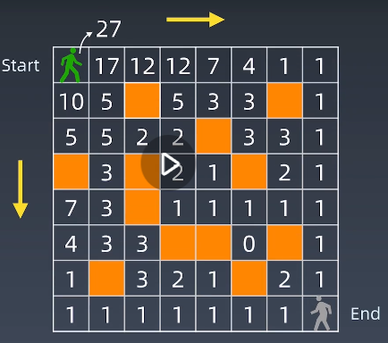

#第五周 
##一、学习笔记
###前半学期内容
####前半程:
#####成就表
推荐网站：Visualgo.net
Array/数组
Linked List/链表（动画）有复习:
Stack/栈
Queue/队列
HashTable/哈希表（动画）有复习:
Set、Map
Tree/二叉树
BST/二叉搜索树（动画）有复习：，左子树全部节点是小于根，右子树全部节点大于根，且对于左右子树同理可得，另外中序遍历是什么顺序的（递增），同时，空树也是二叉搜索树
Search/查询
Recursion/递归（动画）有复习：算n的阶乘（线性结构），Fibonacci数列（每一层调用，会调用两次，递归树每一层一分为二，就是二叉树，如果递归调用三次，那么就是三叉树以此类推。Fibonacci数列它的递归的状态树是什么样子？是一棵二叉树，同时的话每一层一分为二，所以节点数是乘2。整个它的状态空间是呈指数级增长，也就是它的时间复杂度是指数级的，这个就是递归的一种形式）
DFS/深度优先搜索
BFS/广度优先搜素
Divide & Conquer/分治
Backtracking/回溯
Greedy/贪心
Binary Search/二叉查找
####后半程：高级数据结构+高级算法
比如说有动态规划，以及有一些高级的分治算法，还有一些比如说是字典序、并查集和位运算
####坚持:
1. 五毒神掌
2. 脑图 + 笔记总结
3. 微信群里多交流
####失败只有一种，就是半途而废! 比别人多一点执着，你就会创造奇迹！
###前序知识
讲之前先复习这几个较为复杂的数据结构：分治+回溯+递归+动态规划，
伏笔：本质是将一个复杂的问题，分解成各种子问题，同时寻找它的重复性。不管是分治回溯递归还是动态规划，它们并没有本质上的非常大的不一样。很多时候就是一些小的细节的问题，这里先回顾一下分治、回溯和递归
递归：（代码模板）见7.1笔记
分治：其实也是递归 （代码模板）见8.1笔记
大家要形成这样一个
####感触：
1. 人肉递归低效、很累：人肉递归怎么弄，把递归树给画出来
2. 找到最近最简方法，将其拆解成可重复解决的问题(将复杂问题拆成最近子问题的合并结果，然后依次拆分，直到最后)
3. 数学归纳法思维（抵制人肉递归的诱惑）
####本质：寻找重复性->计算机指令
人肉递归怎么弄，把递归树给画出来：
例如：Fib(6) 状态树、重复子状态
###12.1动态规划Dynamic Programming
动态规划的话，英文名叫做dynamic programming，中文的翻译的话非常玄乎叫动态规划，那么其实它本质上要解决的问题就是一个递归问题或者是分治问题，但是它和普通的递归分治稍微有一点不一样，就是这里等一下要给大家讲的第三点，它拥有所谓的最优子结构，最优子结构的话翻译得也很玄乎，所以动态规划很多同学就经常会问，
超哥这个好难搞，或者是我经常看了很多遍，最后为什么。因为中文翻译的话比较玄学。
dynamic programming:programming其实和规划超哥觉得没有太大的关系，这里的programming，其实指的是一种写程序的办法，或者就是动态递推，programming很多时候在这里是推导的意思，所以你可以理解为动态递推即可
动态规划和最优子结构
1.Wiki定义: https://en.wikipedia.org/wiki/Dynamic_programming
2.Wiki定义最关键的一句话："Simplifying a complicated problem by breaking it down into simpler sub-problems"(in a recursive manner) 
指的是将一个复杂的问题，把它分解成简单的子问题，它的定义里面还会加了一个括号，就是in a recursive manner，指的是用一种递归的方式。
所以在Wiki的DP的定义里面，它就给大家明确说了，你需要进行分治，在这里可以看到，DP和分治它们是有内在联系的，它们并不是完全割裂的两个算法，
那么它和分治很多时候本质的一个区别，或者是明显的一个地方要注意的是什么，就是第三点在这里
一般来说动态规划的问题，它会是让你求一个最优解，或者求一个最大值，或者求一个最少的方式这样，
正是因为它有所谓的这种最优子结构存在的话，那么你在中间的每一步的话就不需要把所有的状态都保存下来，你只需要存最优的状态，
当然你还需要证明，如果我每一步都存着相当于最优的值，最后的话我就能够推导出一个全局的最优的值，
那么正式因为这样的话，就是引入了两个，一个的话就是有所谓的缓存了，或者是说状态的存储数组
第二个的话就是在每一步的话都会把次优的状态给淘汰掉，只保留在这一步里面最优或者是较优的一些状态来推导出最后的全局最优
3.Divide & Conquer + Optimal substructure 分治+最优子结构
####关键点：非常重要
动态规划和递归或者分治没有根本上的区别（关键看有无最优的子结构）
共性：找到重复子问题
差异性：最优子结构、中途可以淘汰次优解

动态规划Dynamic Programming，或者叫DP它的本质就是动态递推，那么根据它的概念和我们后面要讲的习题，大家慢慢会体会到动态规划和递归或者分治没有本质上的区别，关键是看有无最优的子结构。
如果没有最优的子结构说明什么？说明所有的子问题，你都需要计算一遍，同时把最后的结果给合并在一起，所以我们传统意义上就称之为分治（有些同学可能会问我非要叫动态规划行不行，其实也可以，就是因为你可以理解为每次的最优解就是当前解就行了，它没有所谓的每次比较和淘汰的一个过程，对吧，但一般传统意义上我们就称之为分治）
所以这里的共性就是找到重复的子问题，
那么差异是什么地方？就是动态规划和递归分治的差异是：动态规划一般我们认为就是有最优子结构的，中途的话可以淘汰次优解，当然也必须淘汰次优解，
如果你把次优解都保存下来的话，那么你会发现你要做的事情的复杂度，就会比淘汰次优解来得更多了。
那么因为这个原因的话，所以动态规划很多时候是复杂度更低的，或者是更加有效的。
那么后面大家见的题目多了，你就会发现如果你不进行淘汰的话，你傻递归，我们叫做啥递归或者傻分治的话，经常是指数级的时间复杂度，
但是如果你进行了所谓的淘汰次优解，那么经常会变成n的平方或者是O(n)的时间复杂度，也就是从指数级把复杂度降到了多项式级别
###12.2 DP例题解析
#### Fibonacci数组
a. 递归
int fib(int n){
  if(n<=0){
    return 0;
  }else if(n==1){
    return 1;
  }else{
    return fib(n-1)+fib(n-2);
  }
}
b. 记忆化搜索 //通过记忆化搜索，叫Memoization就变成了线性的时间复杂度O(n)。
int fib(int n,int[] memo){  //注意简洁代码right clean code
    if(n<=1) return n;  //递归终止条件
    if(memo[n]==0)   //memo[n]==0指的是memo[n]没有被计算过，那就只能重新开始计算，同时把计算出来的值存在memo[n]里面，然后return memo[n]。如果已经被计算过了，那么它就不等于0了，这是Fibonacci数组的特点都大于0，那么就不会走里面这一句，就直接return出去了。所以它就会把这些重复的结点全部都砍掉，时间复杂度从指数级降为O(n)的复杂度
       memo[n]=fib(n-1)+fib(n-2);
    return memo[n];
}
c. Bottom Up
//F[n]=F[n-1]+F[n-2]
a[0]=0,a[1]=1
for(int i=2;i<=n;i++){
  a[i]=a[i-1]+a[i-2];
}
a[n]
那么同时的话，在这里只要你写递归的话，后面你会发现，既然它的递推公式是这样，那么与其用一个递归再加记忆化搜索的这种形式，
那么不如我们就直接写一个循环，for的话就从最开始的初始值把它设好了之后，然后从第三个元素开始一直循环到最后我们要的，通过这么一个循环，最后结果就在a[n]里面，那么这个的话我们就叫做自底向上
怎么理解呢？
就是说一开始我们写递归的话，就是从最上面的这个问题开始一步一步向下探，最后探到它的叶子结点，这个叶子结点的话它的值是确定的，就是在这里小于等于n的时候直接return n即可,这种方法叫做自订向下，一般的话就是递归再加记忆化搜索，都是自顶向下
这也比较符合人脑的思维习惯，人脑的思维习惯是什么，我要解决Fib(6)，我就要接下来算Fib(5)和Fib(4)，...，然后每次中间结果都被算过来的话，那就直接复用，比如fib(2)就不用再算了，直接用它的，fib(3)直接用之前存下来的，fib(4)直接存下来的，最后就得到这个结果，比较符合人脑的思维习惯，也是所谓的额分治的算法，只是加了一个记忆化搜索
从计算机的思维角度来看的话，它会是什么情况，就是这里的话大家可以转变一下思维的习惯，就是说我的初始值已经有了，对吧。都是0和1，那么按照大家写Fibonacci数组的话就是，大家是怎么写的，就是给你第6项，给你第6项，让你写出来，很多人就会写0和1，然后这两个数相加（0+1,1+1,1+2,2+3），所以人脑的话很多时候这种简单的问题，
它觉得递推也是一种方法，那么递推的话就用循环直接来搞就好了，这就是所谓的额叫做自底向上，那自底向上的话就是直接从最下面开始，循环累加上去即可
对于初学者或者是对于你面试来说，这两种方法其实没有特别的偏好，你可以习惯先进行递归分治，然后进行记忆化搜索，再转换为自底向上的循环是没有问题的
但是对于熟练的一个选手，或者你要追求你的DP的功力比较深厚的话，尤其是在计算机竞赛的时候，那么只要开始写递归的话，所有的竞赛型选手全部都是直接开始进行for循环了，也就是全部就是自底向上的写循环开始进行递推了。
这也是为什么DP很多时候我们把它最好翻译成动态递推就是这个原因。
也就是说如果是面试或者大家初学的话，你习惯于哪种思维方式，就用你习惯的思维方式先进性分治和记忆化是没问题的，再转换成递推
但是你熟练了之后，或者是在竞赛的时候，因为要求快要求熟练，就直接是自底向上进行递推，这个的话是所谓的动态规划的一个较为终极的形态，或者是认为是它的模板
#### 路径计数/Count the path（经典题目）
##### 不同路径（https://leetcode-cn.com/problems/unique-paths/）
它和前面的问题不一样的是，前面的话是一维的DP对吧，也就一维数组进行动态递推，相对来说比较简单，而且它也没有所谓的取舍，这里面的话就是一个非常简单的傻递推，
那么我们来看复杂一点的DP的话是什么情况？
第一维度变化了，它的状态有时候是二维空间或者三维的，
第二的话就是什么，它中间会有所谓的取舍最优子结构了

注意不要人肉递归，就是养成习惯，用归纳法的思想，也就是找重复性的思想来解决，也就用分治的思想计算机思维来解决，而不是人肉递归
人肉递归是什么？是刚才演示的一步一步走
           paths(start,end) =
      paths(A,end)        +       paths(B,end) 
          ||                            ||
paths(D,end) + paths(C,end)   paths(C,end) + paths(E,end) 
这个问题就转换为一个分治的问题，Start到End就转换为从A到End再加上从B到End的走法，这就是找到了它的最近最简的重复性，同理可得其他的点。就是说这个是所谓的叫做分治的办法，同时可以加一个数组就变成记忆化搜索

这里讲动态规划的关键一点：
把它变成递推应该怎么弄？还是那一点，如果你变成递推的话，换种思路，自底向上推的话，先把靠近End的这些格子全部都推一遍，我们再看任何一个点，它的走法就等于右边的走法再加上下面这个的走法，再加在一起，就等于这个点的走法。同时有一个特殊情况，如果这个格子是障碍物的话，它的走法就是0。
接下来我们就得到
状态转移方程/动态规划方程/DP方程 optional(最优的)
opt[i,j]=opt[i+1][j]+opt[i][j+1]
完整逻辑：
if a[i,j] = '空地'
  opt[i,j]=opt[i+1][j]+opt[i][j+1]
else:
  opt[i,j]=0
由此可见，通过递推的话，一步一步你只要保证初始值是对的，同时你的逻辑是它加它，那么这里是17，你就大胆地相信这两个加载一起是17，那么从这个格子走过去就是17了
代码：
//从start开始
class Solution{
  public int uniquePaths(int m,int n){
     int[][] dp = new int[m][n]; //从(i,j)走到<end>的不同路径数
     for(int i=m-1;i>=0;i--){
        for(int j=n-1;j>=0;j--){
            if(i==m-1||j==n-1){
               dp[i][j]=1;
            }else{
               dp[i][j]=dp[i+1][j]+dp[i][j+1];
            }
        }
     }
     return dp[0][0];
  }
}
//从end开始
class Solution{
  public int uniquePaths(int m,int n){
     int[][] dp = new int[m][n];  //从<start>走到(i,j)的不同路径数
     for(int i=0;i<m;i++){
        for(int j=0;j<n;j++){
            if(i==0||j==0){
               dp[i][j]=1;
            }else{
               dp[i][j]=dp[i-1][j]+dp[i][j-1];
            }
        }
     }
     return dp[m][n];
  }
}

#####动态规划关键点
1. 最优子结构 opt[n]=best_of(opt[n-1],opt[n-2],...)
2. 储存中间状态: opt[i]
3. 递推公式（美其名曰：状态转移方程或者DP方程）
   Fib: opt[i]=opt[n-1]+opt[n-2]
   二维路径: opt[i,j]=opt[i+1][j]+opt[i][j+1] (且判断a[i,j]是否是空地)
那么要解决一个动态规划问题的话，以后就养成这三步骤的思路，
同时最重要的对于初学者来说，对我们解决面试的问题的话，最重要的其实是第二步
那么对于比较难的DP的话，最重要的其实是第三步，因为递推的方程也就DP方程不好找
那么对于初学者或者是面试题的话都不是一个很难的DP问题，那么你只要能够定义状态，且把状态定义对了，基本上都可以解决出来
#####不同路径||(https://leetcode-cn.com/problems/unique-paths-ii/)
一维数组int[] dp = new int[n+1]用于保存状态
优秀题解Sweetiee，甜姨
#####最小路径和
自己看
#### 最长公共子序列
回顾一下前面两个题目，
第一个题目是一维数组的简单DP，
第二个题目二维数据的相对简单的DP，
那么第三个的话想给大家讲的就是一个字符串来进行变化的DP，那么字符串进行变化的DP的话，这里最关键有一个思维层级上，要进行转变的一个地方，就是说当你进行DP的时候，这个就不是简单的字符串了，而会把它扩展成为一个而伟大额数组来定义状态，
所以你可以看前面两个题目的话，状态的定义其实相对比较简单，就是它本身的额数组的结构，以及棋盘的二维数组结构，就是你的状态空间了，就是你的状态数组就这么定义就行了

1. 暴力
枚举text1所有的子序列，看这个子序列，是不是也在text2里面也是一个子序列，所以你可以用一个办法，就是用所谓之前讲的对于text1中的每一个字母都是取和不取取和不取取和不取取和不取，就生成一个子序列，然后看这个子序列是否也在text2里面存在。怎么判断子序列在2里面是不是存在，就是一个一个字母比过去，可以有间隔，但是它的字母的顺序，而且字母都会出现一次。这种办法可以是2的n次方的时间复杂度。也就是枚举每一个就像括号问题左括号、右括号，那么这个字母就是可取可不取、可取可不取，就写一个递归生成它所有的子序列，生成完它所有的子序列之后，看这个子序列是否在text2里面存在，2的n次方的时间复杂度
2. 找重复性以及化简为之前讲的Fibonacci数列问题
   a. S1 =""
      S2 =任意字符串
      最长公共子序列的长度为0
   b. S1 ="A"
      S2 =任意
      最长公共子序列的长度为1
   c. S1 ="........A"
      S2 ="....A"
      因为这两个最后一个字母都是相同的，所以它的最长子序列的话肯定可以至少有A和A对吧。
      那么这个时候你就会发现你的思维习惯的话，这里首先有经验的一种成分，第一种经验就是说从最后这个字符开始看起，而不是从前面看起了，从最后字符开始看起，只能多训练多做题
      第二个经验就是你可以看出来，它其实就可以转换成一个子问题了，这个子问题就是说因为A和A是相同的，那么就S1和S2的子序列就转换成为求它的前面这个小的任意字符串和S2的前面的任意字符串，它的最长子序列的值再加1。
      对不对，因为A和A是相同的，所以要加1，对吧，然后就转换成求子序列前面这一串字符串和S2的前面这一串字符串，它的最长子序列，这个没问题，对吧。那么，整个最后怎么求？
      这里第三个经验，大家做多了之后就会发现，字符串的变化的问题的话，特别是两个字符串之间的变化问题，最后就要做成一个二维数组，二维数组的行和列，分别是两个不同的字符串

#####子问题
S1 = "ABAZDC"
S2 = "BACBAD"
if S1[-1] != S2[-1]: 
   LCS[s1,s2] = Max(LCS[s1-1,s2],LCS[s1,s2-1])
//   LCS[s1,s2] = Max(LCS[s1-1,s2],LCS[s1,s2-1],LCS[s1-1,s2-1])    LCS[s1-1,s2-1]已经在前面思考过了
if S1[-1] == S2[-1]: 
     LCS[s1,s2] = LCS[s1-1,s2-1]+1
//   LCS[s1,s2] = Max(LCS[s1-1,s2],LCS[s1,s2-1],LCS[s1-1,s2-1],LCS[s1-1,s2-1]+1)  最后肯定可以证明LCS[s1-1,s2-1]+1是最大者，所以前面的就不需要比较了
但是从思维逻辑的完备性来说，的确它整个问题的话其实要把所有的减字符都可以考虑
#####DP方程
if S1[-1] != S2[-1]: 
   LCS[s1,s2] = Max(LCS[s1-1,s2],LCS[s1,s2-1])
if S1[-1] == S2[-1]: 
     LCS[s1,s2] = LCS[s1-1,s2-1]+1
#####代码
class Solution(object):
   def longestCommonSubsequence(self,text1,text2):
       if not text1 or not text2:
           return 0
       m = len(text1)
       n = len(text2)
       dp = [[0]*(n+1) for _ in range(m+1) ]
       for i in range(1,m+1):
          for j in range(1,n+1):
             if text1[i-1] == text2[j-1]:
                dp[i][j] = 1 + dp[i-1][j-1]
             else:
                dp[i][j] = max(dp[i-1][j],dp[i][j-1])
       return dp[m][n]
我想之前第二个题目的话，做过的话，会发现这个题目的话和开始路径计算的题目，其实异曲同工之处
其实最关键的地方，能够把两个字符串求它的距离的问题，求它的类似于你可以认为是编辑距离的问题，把它转换成一个二维数组递递推的问题，这个是思维的关键
也就是我们前面讲的第二步，就是如何把一个动态规划的问题，定义出它的状态

可以看到，只要DP的方程列出来之后，程序逻辑其实并不复杂，关键在于什么呢？
第一，大家的经验和习惯。之前没做的话，会觉得很生涩这种题目，而且这种思维习惯大家很不熟悉，这个没有办法就是要多练，多过遍数
第二，要注意这个数组，有时候的话要定义m+1，有时候定义n+1，以及初始化要初始化好，同时的话，它的下标的位置要别越界，同时的话最后结果是在m和n这个位置，这种在写的时候一定要注意
有的时候你的边界要是不搞好的话，它就是会有数组越界的问题，还有就是结果最后也不对，类似于这样，这也是经验
虽然这个代码看起来短，但是如果你第一次写的话，你自己试一下多写几遍，把这种感觉找到对吧
#####优秀题解
张卓鹏

#### 动态规划小结
最后给大家讲了三个例题了之后，给大家说一个思维的小结，以及后面的话会有一些实战的面试题。
这里的思维的小结，大家一定要在脑子里面多记，同时最后先把它细节全部都记下来，再后来的话不断地反复，反复好了之后化繁为简，浓缩成就一点
1. 打破自己的思维惯性，形成机器思维：找重复性
2. 理解复杂逻辑的关键
3. 也是职业进阶的要点要领：不要人肉递归，亲力亲为，放权授权信任下面下属让下属去做，同时的话给予反馈，另外的话允许下属犯错，这样的话你只要做分治那一段，然后交给下属，下属最后把结果给你，你再把它合并再给上去
#### MIT algirithm course
B站搜索: mit动态规划
https://www.bilibili.com/video/av53233912?from=search&seid=2847395688604491997
1. define subproblems ，指的是进行分治，把当前的复杂问题转换为一个简单的子问题，相对比较简单的子问题
2. guess(part of solution)，递推方程应该怎么递推
3. relate subproblem solutions，指的是把子问题的解，把它合并起来，这里就是merge的意思
4. recurse & memoize or build DP table bottom-up，递归和记忆化，或者是把DP的状态表建立起来，自底向上进行递推
   该点讲的挺好，就是对于各位初学者的话，如果你觉得用递归的思维更能接受，递归转成记忆化搜索更能接受的话，那么不反对大家这么的，同时大家这样思考完后，再把DP的表格建立出来，从下面往上递推，这两个路径都练一下，我觉得是更加推荐给大家的
5. solve original problem，冗余
另外前面123步其实就是之前的分治的思想，123步找了这么多，其实最关键就是找它的重复性
所以五步化繁为简就是
第一，分治找它的重复性和子问题
第二，定义出状态空间，然后你可以用记忆化搜索递归，或者是从上到下进行DP的顺推，就自底向上进行推导，然后最后解决这个问题

动态规划的话题目就比较多，而且动态规划的思想的话相对比较容易，但最关键的就是有不同的题型，而且题型的话就是越来越难，逻辑越来越复杂，
所以最重要的就是练习这个题
##二、学习总结：
 ###1.效果、感受
 
 ###2.学习过程
 
 ###3.收获
 
 ###4.刷题笔记
 1. 如何避免人肉递归，转换为找重复性的思维？
 不要一种种情况、一步步傻傻的模拟，而是要从n=1、n=2、...n=3开始递推思考，以及相邻两个n之间是怎么从前一个n的值到达后一个n的值，得出递推公式，n中每一个值的情况的结果也别去人肉递归，而是每一步都转化为对子问题的求解，从而复现重复性。--用归纳法