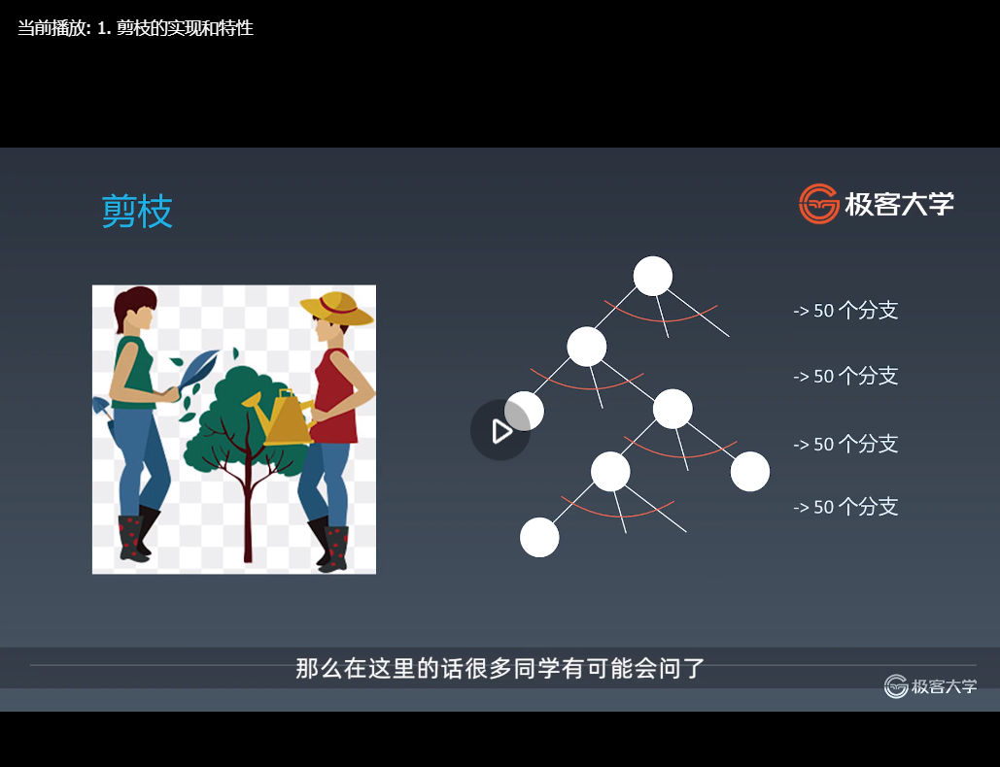
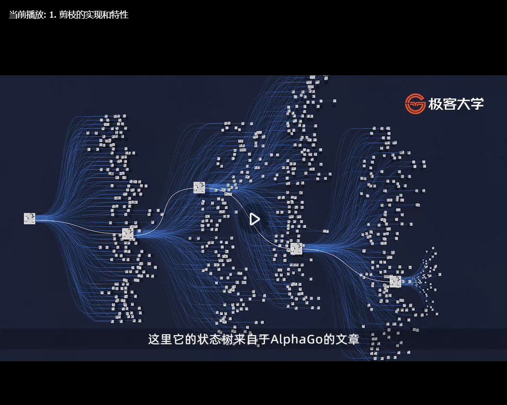

#第七周 
##一、学习笔记
###13.1 字典树（Trie树）的基本实现和特性
#### 本节内容
那么在这里的话，我们主要是分为三部分来给大家讲：
1. 字典树的数据结构：首先字典树这个数据结构到底是什么样子的，为什么它会存在。
2. 字典树的核心思想
3. 字典树的基本性质

#### 复习树（略）
那么我们首先来复习一下树
#####树Tree
1. 定义
   二叉树
2. 层序遍历
3. 深度优先搜索
#####二叉搜索树
1. 定义
   任何一个结点，它的左子树的所有的结点都要小于这个根结点，它的右子树的所有的结点都要大于根结点，且对于它的任何子树同样地以此类推，对于任何子树都满足这样的特性。这个就是所谓的二叉搜索树。
2. 特性：
   二叉搜索树如果是中序遍历（左根右）的话是一个升序的序列。
3. 二叉搜索树主要解决的一个问题就是查找的时候效率会更高。


#### Trie树
那么接下来我们看，还有一种情况，在现实中特别常见。但是在二叉搜索树来进行存储的话，并不是特别好解决这样的一个实际问题。
这个实际问题是什么？这样的一个实际问题，就是在搜索的时候，很多时候当你打了一个字母的前缀、或者你中文也类似，就比如说你打了一个周杰，一般人可能会觉得你是伦吗？对，就是周杰伦
同理英文的话就是you的话，就是有这么多可以感应出来的，
像这种所谓的词频的感应或者是由前缀来推后面的可能的词语这种形式的话。在现实中其实是用得非常多的，那么它应该用怎样的数据结构来表示？
接下来的话就来给大家讲所谓的字典树或者trie树了。它就是因为这样的一种情形来应运而生的。

那么我们首先看一下，各位可以先思考一下，如果你自己要来设计的话，应该会怎么设计，同时的话你自己来进行设计的话，你的数据结构应该怎么选？
这个比较难，你可以多想想，然后停一分钟左右，当然的话一般来说就是不求你得到最优解了，因为发明这些数据结构的人，都是世界上最顶尖的图灵奖获得者。

那么我们说完了，我们接下来看字典树它是怎么来进行设计的？
首先要实现这样的一种所谓的前缀感应出整个单词，这里的话我们就要改变，二叉树的结点里面的存储方式了。
在之前我们介绍不管是二叉树二叉搜索树的话，这个结点里面存的是全部的值，这每个结点存的就是整个一个数字也好、一个单词一个字符串也好，就是全部的字符串。
但是在这里的话，字典树一个最关键的点的话，就是每个结点不再是存这里的单词本身，就是没有一个结点存youtube、或者是youbank这样的东西，
而是把这个字符串拆成单个单个的字母，每个字母存在这个结点里面去了，
从这一点的话，大家就首先要打破之前对树的认识，就是说它的存储是相对来说比较巧妙的，那么有了这个概念之后，接下来我把它整个定义先给大家叙述一遍。
####基本结构
字典树，即Trie树（多叉树），又称单词查找树或键树，是一种树形结构。典型应用是用于统计和排序大量的字符串（但不仅限于字符串），所以经常被搜索引擎系统用于文本词频统计。
它的优点是：最大限度地减少无谓的字符串比较，查询效率比哈希表高。
####基本性质
1. 结点本身不存完整单词：只存你下一个字符是什么，可以去到相应的路径；
2. 从根结点到某一结点，路径上经过的字符连接起来，为该结点对应的字符串；
3. 每个结点的所有子结点路径代表的字符都不相同：如果你两个是相同的话，你再下一步开始查找的话，程序就错乱了。

####结点的内部实现

我们再来看一下结点里面的内部的它显示的结构，每个结点的话如果你是英文的话，那么毫无疑问它就会存到了下一个结点去的话，指向下一个结点的不同的指针，
这里的话它存储不再是用left和right来表示左右结点了，它就直接用什么，用相应的字符来指向下一个结点，比如说a的话表示如果你第一个字符是a的话，那么应该走到这个结点去，这里就是a这是英文，同时的话它除了abcdefg小写的，还有大写的所谓ABCDEFG，同时的话如果还有存在一些特殊符号的话，也可以放在这里，
所以的话如果是简单单词的话，同时不分大小写，你可以认为这里是26个分叉，就从a一直分到z对吧，abcdef一直到z，26个分叉出去，当然的话如果你要包含大小写，或者包括其他的话，可能是更多，同时如果是整个字符串的话，它的ASCII域的话是255，所以是255分叉。
一般来说的话，这里的话你可以认为是26分叉的一棵多叉树，到最后的话，如果它是叶子结点的话，相应这个字符就指向空，表示它这里的话就没有儿子结点了，对吧。
从这里你可以看出这棵树的话至少是一个26叉树，对吧。
当然的话你在这里的话可以动态来分配，一开始都是0叉的，出来一个单词的话就分叉出去一个，那么在最坏情况下的话，在最大可能的情况下的话会变成一个26叉树，所以的话它的空间是相对来说比较大的消耗。一层出去就是26，
那么我们再看它单词的长度，就是它的深度，在这种情况下，所以一般来说它查询是很快的，因为它要查多少次，各位，它要查的次数就是这个单词到底有多少个字符，它就查多少次，对吧。如果它单词只有两个字符，比如说to的话，它就只要从t走到这里，再走到这里，它只要走两次，最后就查到了to这个单词它所代表的，比如说它的频次到底是什么，那么单词len一般来说都不长，最多是10这么单词这么长，所以在整个字典里面，你们一般来说最多就查十多次，碰到就是长度为十几的这样一个单词，就一直查下来，这样的话就比，
比如说to你去整个字典里面去查，就算你排好序了，用二分查找的话，它的查找的时间也会比用排序，再用二分搜索来得快以及快不少，

####结点存储额外信息
数字：表示相应到这个结点所代表的单词，它的统计的技术就放在这个地方，后续的话可以给用户做相应的推荐
布尔（isEnd）：指的是到这个点为止，是不是有相应的单词存在。
当然了它的结点上可以存其他的额外的信息

####结点的核心思想
Trie树的核心思想是空间换时间。
利用字符串的公共前缀来降低查询时间的开销以达到提高效率的目的。

另外的话想这里提一点，正是因为它用了公共前缀，来表示这样一个路径的话，就可以非常天然地来解决，你只输了前缀的前几个字母的话，它就会把所有的以这个为前缀的候选词，都给你很方便地找出来。
从这里的话，其实就是比如说you就在这里，表示you这个东西，那么它下面所有的子树就代表了它所有单词，可以候选的单词，每个单词它的频次，你只要取出比如说前十大的频次对吧，然后就可以放在这个地方。那么这个业务功能，其实就相对来说可以比较好地解决。

####Tire 树代码模板
//leetcode
class Trie {
    class TrieNode {
        private TrieNode[] links;
        private boolean isEnd;
        public TrieNode(){
           links = new TrieNode[26];
           isEnd = false;
        }
        public boolean containsKey(char c){
               return links[c-'a']!=null;
        }
        public TrieNode get(char c){
               return links[c-'a'];
        }
        public void put(char c, TrieNode node){
               links[c-'a']=node;
        }
        public void setEnd(){
               isEnd = true;
        }
        public boolean getEnd(){
               return isEnd;
        }
    }
    private TrieNode root;  
    /** Initialize your data structure here. */
    public Trie() {
        root = new TrieNode();
    }
    /** Inserts a word into the trie. */
    public void insert(String word) {
        TrieNode node=root;
        for(char c : word.toCharArray()){
            if(!node.containsKey(c)){
                node.put(c,new TrieNode());
            }
            node = node.get(c);
        }
        node.setEnd();
    }
    /** Returns if the word is in the trie. */
    public boolean search(String word) {
        TrieNode node=searchPrefix(word);
        return node !=null && node.getEnd();
    }    
    /** Returns if there is any word in the trie that starts with the given prefix. */
    public boolean startsWith(String prefix) {
         TrieNode node = searchPrefix(prefix);
        return node !=null;
    }
    public TrieNode searchPrefix(String prefix){
        TrieNode node=root;
        for(char c : prefix.toCharArray()){
            if(node.containsKey(c)){
                node = node.get(c);
            }else{
                return null;
            }
        }
        return node ;
    }
}

/**
 * Your Trie object will be instantiated and called as such:
 * Trie obj = new Trie();
 * obj.insert(word);
 * boolean param_2 = obj.search(word);
 * boolean param_3 = obj.startsWith(prefix);
 */


####应用
1. 自动补全：谷歌的搜索建议
2. 拼写检查：文字处理软件中的拼写检查
3. IP 路由 (最长前缀匹配)：使用Trie树的最长前缀匹配算法，Internet 协议（IP）路由中利用转发表选择路径。
4. T9 (九宫格) 打字预测： T9（九宫格输入），在 20 世纪 90 年代常用于手机输入
5. 单词游戏：Trie 树可通过剪枝搜索空间来高效解决 Boggle 单词游戏

###13.2 Trie树实战题目解析
####1. https://leetcode-cn.com/problems/implement-trie-prefix-tree/solution/  实现 Trie (前缀树)
https://leetcode-cn.com/problems/design-add-and-search-words-data-structure/  添加与搜索单词 - 数据结构设计
####2. https://leetcode-cn.com/problems/word-search-ii/  单词搜索 II（讲解）
word search 有1和2都是非常经典的搜索题目.
word search的话在之前DFS的话都给大家说过，接下来我们看word search 2以及怎么能够优化这样的代码

网格里面的单词必须是通过相邻的单元格里的字母构成，所谓的相邻就是上下或者是水平方向是相邻的。
那么这里的相邻表示什么，表示所谓的专业术语叫做四联通，比如说和a相邻的话就是上面的a、下面的k、左面的t、右边的e，所以是上下左右四联通。
如果把斜线也包含进来，比如说a和a、n和a也说可以相邻的，那么就叫做八联通图。
那么一般情况下，像这个题目的话，它给你说明了，反正就是四联通就行了。八联通和四联通的话，写法都差不多。后面的话代码会给大家讲。

1. words 遍历 --> board search:先写一层循环，然后每一个元素word看oath，o在这里面什么位置找到了之后，看它附近的ath是不是可以在这里找到。然后再看p这样一个东西,然后又去board里面先查一遍，p有没有，p在哪：没有，这种方式是可以写的。
   这种方式的复杂度是多少呢？O(N*m*m*4^k)
   首先的话它要循环整个words里面的对吧，我们就认为words里面是O(n)的话，那就放在这里n来了，
   board我们就直接是认为它是m*m的好了，同时的话你需要做的一件事情，就是对它的首字符去这里面进行深度优先的查找，看它有没有存在，那么它要做的一件事情，在这个地方的话，它会再去里面搜索一遍就变成m*m，每个的话都会在这个里面遍历一遍它相应的字符，最后看它有没有，这用这种办法写的话，就是所谓的O(n*m*m)的一种办法，
   而且它最坏的情况下的话，因为它每次首字母要这么查一遍，其他的字符的话会每次向不同的通路再分散出去，分散四次，所以这里的话其实还要再*4^k，这里的4表示它的通路为四个通路，k次方指的是单词，这个单词的平均的长度是多少
   所以它的总复杂度是这样子O(N*m*m*4^k)的
   这个方式大家要做的话，就做它的word search 1，把这个地方的-II的话就不要了，你去做word search 1，word search 1的话，那个题目的话数据没那么复杂，它的数据规模没那么大，你用任何傻搜的办法都可以解决，你直接做那个题目就行。
2. Trie：直接说Trie这种做法，以及我们来理解一下为什么它会更好
   首先Trie这个做法应该怎么弄？
   它的本质就是你在这里看，你与其通过这里开始来找和回溯，
   这里有个最关键的一个问题，就是说你所有不断地从任何一个字符开始查找的时候，都要判断它，比如说我从任何一个地方，从k开始好了，k的话，往上走到a就变成ka，
   关键是你要让搜索怎么快的话，就是你能够最高效地知道，而且最早地知道ka是不是在这些候选单词里面存在，且是任何一个单词的前缀，如果ka不是任何一个单词的前缀，那么ka找到这里就不用找了，那就直接找kn或者找ki或者kr或者是找kl对不对，
   同理从t这个单词假设向外开始搜索的话，t往上走到ta这时候可以很方便的一点看到，ta不是任何单词的前序，那就不用找了，对吧，
   就找te假设te是前序、也不是，那就不用找了，假设从e这里开始，en不是任何单词的前序，但是ea是这个单词的前序，那么我们就可以继续再往下找，同时找ea的话，其他的单词的前序就直接在这个单词里面，看它的剩下的前序是不是也照样去符合这么一种思路，
   所以用Trie的话就变成这样：
   a. 首先第一步所有的words全部放到一个Trie里面去，构建起这样一个字典树，当然这就可以让prefix全部可以高效地查询了，
   b. 接下来就是对于board对于二维的字母矩阵，所谓的进行一次DFS，它的起点的话就是遍历每一个字符，通过这个起点的位置开始做一个DFS，
      DFS产生了任何的字符串，去这里面查，看是不是它的子串，如果是它的子串且最后存在的话，那么就输出，不然的话就不输出 
      你后来的话我们可以证明它这个时间复杂度的话，在现实中会快很多，大部分情况下，它的子串，它的前序串的话不在这里面存在，所以就直接可以抹掉了，
   c. 它的时间复杂度怎么算：在这里的话我不把答案直接告诉大家，你用类似的这种方法，去找一次它的时间复杂度是多少，当然你可以先写，因为这个好处的话，它已经帮你提示了，就要Trie就写。你可以先写，写完了之后你看这个程序对吧。
      你看到你的代码去分析它的时间复杂度是什么，然后你最后放在你的作业和总结里面去。
      因为像这种分析时间复杂度的话，像类似于这种样子分析时间复杂度的话，算是面试题中已经是要求最高的一种情况了。要是你自己可以琢磨出来的话，那么所有在面试题中，在面试的时候让你分析时间复杂度，你都是没有问题的，所以你们自己去完成这个。
   d. 代码:
      你首先的话把Trie的之前那个题目，上一个题目实现Trie的代码先要复制过来。
      因为的话你至少要用Trie对吧，然后循环这个words，把里面的全部单词都加到Trie里面去，
      接下来的话就开始遍历二维的字符矩阵，以它里面的每一个字符作为起点，开始做DFS，做DFS的话就是上下左右开始进行扩散，扩散出来的每一个中间的单词串的话，都去Trie里面查找，看它是否存在，是否有前序，然后最后的话就得出一个结论。
   e. 优秀题解: https://leetcode-cn.com/problems/word-search-ii/solution/dan-ci-sou-suo-ii-by-leetcode/  官方题解
####3. Search suggestion - system design

###13.3 并查集(Disjoint Set)的基本实现、特性和实战题目解析
并查集的部分的话讲的内容其实不多，并查集属于一种怎么说，比较跳跃式的数据结构，也就是说你不会就是你压根都不会，你要是一会的话就会用就行了。它没有太多让你在上面进行发展的空间，或者是需要像动态规划或者是之前的那种各种搜索一样，有非常强的随机应变和在上线进行自由发挥的空间，
所以我们这里的话主要就是把它的情景和它的实现的代码告诉大家，那么大家主要就是调用现成的代码，就是把模板记号之后直接套上去用即可，也就是说这类题目基本上比较死。

我们来看并查集用的一个东西是什么，如果没听过的同学的话，肯定就觉得这个名字很玄乎吗
####适用场景
它解决的场景就是组团和配对的问题，也就是说在有些现实的问题中，你需要很快地判断这两个个体是不是在一个集合当中，当然我这么讲的话是有点抽象的。
很多时候就是说你和他是不是朋友这么一个问题，如果是在社交网络里面以及判断两个群组之间是不是一个群组以及很快地合并群组，所以需要用这样的数据结构。
那么在这里的话希望大家可以暂停一分钟，假设让你们自己来实现，比如说实现微信上的好友和所谓的朋友圈的功能，以及分析这两个人是不是好友这么一个问题，你们应该如何实现？
大概你们先思考一下，可以暂停一分钟在这里，让你非常快地能够判断a和b到底是不是朋友，以及可以支持一些操作，比如说把a变成b的朋友，类似于这样一个问题，
假设我们有n个人好了，从0到n-1，你可能会想到比如说用一个set或者用一个dictionary表示这里面的人都是朋友，类似于这样的问题，这时候你会发现你就会出现一种问题，就是你可能要建多个set，
比如说他两两一个朋友，但是互相的话不是朋友的情况，以及在后来的话你要合并set之类的这样的操作，以及你很难分辨，比如说这一堆朋友的一个群组，它是属于比如说第几个群之类的问题，
这样的话基于这种原因，当时就发明了一种数据结构，这个数据结构的话叫做并查集，专门来解决这个问题。
- 组团、配对问题
- Group or not?
- 连通性的问题，即将一个图中连通的部分划出来。
####基本操作
我们首先看并查集，也就是要解决的这类场景，主要有三个要实现的函数：
一个实现的函数就是新建一个集合，新建一个集合，其中包括s个单元素的集合。它要做的一件事情就是说，我随时都可以创建一个集合，这个是毋庸置疑的，不管你用数组还是用set，反正一开始肯定要支持一个操作，创建一个集合。
接下来要做的一件事情就是你可以指定两个元素，然后第二个操作就是能够很方便地将两个元素，组成到一个集合里面去，如果x和y分别属于不同的集合的话，实际上就是要把x和y所在的集合进行合并。那么经常会碰到的问题就是说我属于其中群a，另外一个y属于另外一个群b，然后我们两个群合并了，x和y现在就可以变成是同一个群了。
第三个的话就是来判断给定任何一个元素，find(x)就是来判断它应该属于哪一个集合，以及找到集合的老大，或者叫做集合的代表。
那么这三种操作加在一起就是并查集常见的一个操作。
- makeSet(s):建立一个新的并查集，其中包含s个单元素集合。
- unionSet(x,y):把元素x和元素y所在的集合合并，要求x和y所在的集合不相交，如果相交则不合并。
- find(x):找到元素x所在的集合的代表，该操作也可以用于判断两个元素是否位于同一个集合，只要它们各自的代表比较一下就可以了。
并查集的思想就是，同一个连通区域内的所有点的根节点是同一个。将每个点映射成一个数字。先假设每个点的根节点就是他们自己，然后我们以此输入连通的点对，然后将其中一个点的根节点赋成另一个节点的根节点，这样这两个点所在连通区域又相互连通了。
#### https://leetcode-cn.com/problems/number-of-provinces/  朋友圈（已下线）
以朋友圈来讲解，见习题
####实现
那么并查集是什么呢？我们接下来就给大家非常详细系统地来介绍一下，并查集这个数据结构。
#####初始化

并查集它本身它的实现的一种形式如此，首先的话我们首先从图形上面给大家说一下整个并查集它的原理，一开始的话每一个元素，它拥有一个parent数组指向自己，每一个元素，它都有一个所谓的parent这么一个数组，它指向自己表示它自己的话就是自己的集合或者自己是自己的老大，就这个意思，
#####查询、合并

接下来所谓的合并和查询的一个操作，如何查询对任何一个元素，看它的parent再看它的parent就一直往上，直到它的parent等于它自己的时候，说明找到了它的领头元素，就是它的集合的代表元素，那么就表示这个集合是谁。
如何合并？比如说我们要把这个集合和这个集合进行合并，对不对。把这两个集合进行合并，要做的一件事情就是找出集合的领头元素，在这里是a，和另外一个集合，它的领头元素在这里的话就是e对吧。
e就在这个地方，然后将parent[e]特意指向a，或者将parent[a]指向e，这两个都是一样的操作。要么把e的parent指向a，或者是把a的parent指向e都行。那么假设我们把e的parent指向a的话，那么就这么指过去，最后的话就把这两个进行所谓的合并了。
#####路径压缩

还有一个叫做所谓的路径压缩，这里的话我们看到d的parent是c，c的parent是b，b的parent是a的话，那么我们可以直接把这条路上的所有的元素，它的parent都指向a，这样的话还是和原来的表是一样的，但是它的查询的时间的话会快不少。原来的话a你要查它的集合的领头元素是谁，要往上走一步走两步走三步，在这里的话就只要一步即可了。
那么关于路径压缩的话，大家记下来就可以了，以及它在图形上是怎么表示的，在这里大家先记住。
####并查集代码模板
我们接下来就看代码，看代码的话理解起来就更加全面了一点。本身的话首先给大家讲一个，这个的数据结构，本身的话就是有所谓的跳跃性的，也就是说你不用太多的思考，就是它怎么想到用这种办法来做的。因为的话它是当时根据实际情景的话，想了很多不同的办法，最后不断地优化，而且的话也是好多年进行的积累。
接下来的话还有一点就是说本身话它的实现的话也相对比较巧妙，所以的话最关键就是大家首先理解，同时的话把它的代码多看几遍记熟练了。
因为我自己在学的时候，对于并查集本身的话其实是相当于上了一个比较大的一个台阶，但它最后用起来的话是相对来说比较明显的，就是说使用场景或者哪些题要用并查集，基本上是一看这个题目意思就知道。
它要判断两两的元素是不是在一个集合，就用并查集就行了，然后把并查集的代码打过去，然后就可以这么解决这个问题了。
// Java
class UnionFind { 	
    private int count = 0; //集合或组的个数
	private int[] parent; 	
	public UnionFind(int n) { 		
	   count = n; 		
	   parent = new int[n]; 		
	   for (int i = 0; i < n; i++) { 			
	      parent[i] = i;		
	   }	
	} 	
	public int find(int p) { 		
	    /*
	    *路径压缩
	    */
	    while (p != parent[p]) { p不是代表结点		
	      parent[p] = parent[parent[p]];//将p的祖父结点作为p与p的父亲结点的共有父结点，该步实现了路径压缩
	      p = parent[p];//将指针指向p的新父结点
	      //重复上述过程，将所有结点指向公共的父结点，直到p指向代表结点即跳出循环
	    }		
	    return p; 	
	}	
	public void union(int p, int q) { 		
	     int rootP = find(p); 		
	     int rootQ = find(q); 		
	     if (rootP == rootQ) return; 		
	     parent[rootP] = rootQ; 		
	     count--;	//每次合并
	}
}

####实战题目
##### 1. https://leetcode-cn.com/problems/number-of-provinces/  朋友圈（已下线）
   a.DFS，BFS （类似 岛屿问题）
   b.并查集
##### 2. https://leetcode-cn.com/problems/number-of-provinces/ 省份数量
##### 3. https://leetcode-cn.com/problems/number-of-islands/ 岛屿数量
##### 4. https://leetcode-cn.com/problems/surrounded-regions/ 被围绕的区域


###高级搜索
搜索是一个所谓的状态树的问题
高级搜索的话，其实是前面讲的搜索内容的一个进阶。这里的进阶内容的话，一般来说可能要求大家对之前的话要比较熟悉，所以这里的话我先给大家进行复习。
如果大家在看我后面要讲的复习的部分的话，还是对之前我们讲的简单的搜索，比如BFS、DFS不是特别了解的话，我鼓励大家回去再看一遍。
####目录
- 剪枝
- 双向BFS
— 启发式搜索（A*)
而且同时的话，这里要讲的接下来，剪枝、双向BFS和启发式搜索，都是比较烧脑或者是高阶的一些内容，所以大家的话一定要记得可能要多看几遍，然后平时多想想把笔记都记下来。
另外的话如果大家对一些知识点的话，发现理解起来特别难的话，我给大家建议就是不用花很多的时间进行所谓的死磕，更加重要的是过遍数，也就是说一个知识点反复看起来，
比如说启发式搜索的话，我在第一次在大学中看的时候一直都没有看懂，到了我大学快毕业的时候，一个机缘巧合的关系，我平时有时候在想，想到了之后，就发现一下子就理解了。当然的话我在这里尽量给大家讲的深入浅出一点。
###14.1 剪枝的实现和特性
接下来我们来看之前讲过的搜索部分的话叫什么？之前讲过的搜素的话，其实我们都可以认为是所谓的初级搜索
####初级搜索
1. 朴素搜索
优化搜索
所谓的初级搜索的话就是傻搜或者暴力搜索。它主要可以优化的方向，或者是怎么把它变高级，主要是这两个领域，
第一个领域就是不重复和所谓的剪枝，这两者是相辅相成的，那么不重复剪枝，大家可以想就是第一Fibonacci问题，Fibonacci问题大家可以想到那个状态树是什么。
          如果你只是简单地写一个递归程序，没有进行任何判重的话，那么它有大量的重复的结点的计算，那么时间复杂度沦为指数级的。这个不清楚的话，都非常鼓励大家回过去自己再看一下。
      那么可以用的办法就是所谓的用数组来存它的中间值，或者是在这里可以看直接用顺推的办法，就是避免重复中间重复的状态，这就是把它的重复性给去掉。
      另外的话就是还有其他的更加高级的剪枝，我们在生成括号问题时候给大家来说。你也可以认为在Fibonacci的问题处理上，我们也进行了所谓的剪枝，这都是异曲同工的。
           所谓的剪枝就是整个状态树，这一个分支是没有必要的时候，那么我们就把它剪掉，不进行搜索，这种没有必要性是来自一个是重复，当然也有可能是我每次要找最优解对不对，那么有一个分支是次优或者不够优的，我们觉得肯定是不行的，那就把它剪掉。
那么另外一个优化的方向就在这里，它的搜索方向上还可以进行优化，之前已经讲过了，它的搜索方向的话主要是深度优先搜索和广度优先搜索两个方向。
          在这里的话，那么有经验的同学或者是练过不少题目的朋友，这时候你会发现它所谓的深度优先和广度优先，只是因为计算机数据结构里面有个所谓的先入后出的栈和先入先出的队列，导致了整个搜的时候是这两方面，
          但是你细想的话就是说广度优先可能还好一点，广度优先一般扩散到的都是距离最近的，但是深度优先的话其实就是傻搜，或者就是一路不回头，直到撞到南墙才回头继续对吧。
          那么它这种的话并没有所谓的按照优先级，或者是没有任何的智能性，那么在这里的话，我在接下来这个章节会给大家介绍优化的高级搜索的另外两种，
     一种是双向搜索，双向搜索你可以理解为，它从起点和终点分别做一个广度优先，然后在中间相遇，这样的话它的时间更快。
     另外一个就是启发式搜索，启发式搜索就不再是用栈，或者用队列了这种先入先出先入后出的形式，而是用一个优先队列放在这里面。而优先队列的话，它是按照这个结点，所谓它的优先级，也就是有些结点更可能会达到我们需要的结果的话，就先把它从队列里面拿出来进行搜索，我们这个就叫做启发式搜索，也叫作A*算法或者叫做优先级搜索。
2. 优化方式：不重复（fibonacci）、剪枝（生成括号问题）
3. 搜索方向：
   DFS: depth first search 深度优先搜索：傻搜
   BFS：breath first search 广度优先搜索：广度优先一般扩散到的都是距离 最近的
优化的高级搜索的另外两种
双向搜索：它从起点和终点分别做一个广度优先，然后在中间相遇，这样的话它的时间更快
启发式搜索：不再是用栈或者用队列了，这种先入先出先入后出的形式，而是用一个优先队列放在这里面。而优先队列的话，它是按照这个结点，所谓它的优先级，也就是有些结点更可能会达到我们需要的结果的话，就先把它从队列里面拿出来进行搜索，我们这个就叫做启发式搜索，也叫作A*算法或者叫做优先级搜索。
#####Coin change(零钱置换) 的状态树
的状态树.png)
先给大家说一下这张图，这张图我想每个人都要记在脑子里面。当你在做一个搜索问题的时候，这个时候你一定要一下子在脑子里面会想到，大概有这么一个搜素树，这个题目是零钱置换问题。
零钱置换问题说的是什么？就是你有面值为125这样的零钱，去凑成一个总值为11（十一）的面值，问你不同的凑法有多少种吗？
那么它的递归树的话就是我先用面值为1的话，抽出来的话，剩下还需要出10一个子问题，它的分支在这里（视频圈了10的结点），
    当然我可以用面值为2的，它剩下就是9，9的话它的子分支在这个地方（视频圈了9的结点），
    或者我用5，剩下的话就是6，6的话分支就在右侧，
那么接下来递归树就是不断地向下展开了，
这时候你会发现所谓的搜索问题其实就是在它的整个状态树里面，做深度优先也好，广度优先也好，或者是优先级优先也好，
    最后找到我们要的比如说最优解，
    或者是统计它的分支的个数，也就是说所谓的到叶子的路径的个数，这就是所谓它的什么，总共有多少种不同的钱币的拼法，对不对。
    在这里一定要记得大家把这种数形结合的思想给利用起来。一想到搜索问题，在脑海里面就把这个图形给大家画出来，看到图形大家就想到，这是一个所谓的状态树的问题。
#####DFS代码
  -递归写法    
    见视频代码
  -非递归写法：用stack手动模拟
    见视频代码
#####BFS代码：用队列
    见视频代码
    
####剪枝
前面引语的话：所谓的剪枝就是整个状态树，这一个分支是没有必要的时候，那么我们就把它剪掉，不进行搜索，这种没有必要性是来自一个是重复，当然也有可能是我每次要找最优解对不对，那么有一个分支是次优或者不够优的，我们觉得肯定是不行的，那就把它剪掉。

我们现在就开始来讲高级搜索的第一个部分，所谓的剪枝。
剪枝的话就是前几页给大家讲的状态树了，大家在状态树进行搜索的时候，如果发现这个分支是已经处理过的，那么我们就把它暂存在缓存里面，整个分支的话就可以剪掉，不需要再手动进行计算。
    当然有些时候是分支的话不够好，所谓的叫做比较差的分支或者是次优的分支，我们也可以把它剪掉，这就是所谓的这种剪枝。
    之所以有这种枝条的形态，就是因为整个状态树的话是一种所谓的树和枝叶的形态。

那么在这里的话很多同学有可能会问了，那么现在计算机速度这么快的话，哪些问题状态空间还需要剪呢？
    这里想给大家讲第一Fibonacci问题，它其实状态空间就比较繁复了。
    另外的话就是很不幸在人类生活世界当中，具体的问题，它的状态树的空间大小一般来说都是比较恐怖的。
#####国际象棋
我给大家举一个例子，这就是国际象棋。当年的话，这一仗就是人类选手卡斯帕罗夫和计算机深蓝进行的一场对决，这个对决的话在90年代初那时候名噪一时。当时的话就是用普通的笔记本，用最基本的搜索再加剪枝和一些优化的算法，最后的话就战胜了卡斯帕罗夫，当然是险胜。
这个棋本身的话就是用的最朴素的搜索办法，本身的话它最后赢的棋谱，这一仗是1996年在费城2月10号，深蓝对阵卡斯帕罗夫。
这个是棋谱1指的是每个人走了一步，第2每个人走了两步，最后的话你会发现是每个人走了37步之后决出了胜局。
所谓的走37步就是这个状态树，它什么，它的深度是37，所以你可以看到就算它每一层深度的分叉就是两个分叉罢了，那就是2^37也是非常大的，当然这里不止两个分叉。比如说你可以走卒，你可以走这个卒或者是走马或者走象，那么它每次的分叉就接近在10左右了，所以你可以看到它的状态树空间是非常大的。
正是因为深蓝的话，就是进行了大量的剪枝，也说了一般来说比如说皇后走这个位置，最后皇后送掉了，那就是不好的位置，那么这个分支的话就直接被砍掉了。   

    我们来看一下象棋本身，象棋本身之所以有37层，这是一个复杂度，另外一个复杂度的话，它每一层的分治的话之前讲了是接近于10的。正是因为这样的话，它的程序就是异常复杂。到了90年代那个时候的话，随着计算机本身的发展，以及后来的话剪枝用得越来越好了，那么后来慢慢就攻克了这个棋。

#####三子棋
为了更好地给大家说整个剪枝的一种办法，给大家说一下整个三子棋这块。
  
    三子棋的话，我想大家上课的时候或者课间的时候，大家可能都玩过，初中的时候或者小学的时候就画一个3x3的棋盘，两个人玩，一个人是走O，一个人是走X，对吧，最后看谁是连在一起的，三个连成一排，可以是横的，可以是竖的，也可以是斜的，那么依照这个样子的话就可以走出来，它这样的一个状态树了。
    走出了这个状态树的话，你会发现当X走在这个地方，O走在这个地方的话，那么最后结局已经注定了，肯定X就赢了。那唯一一种可能就是走到这个分支的话，它可能是平局，最后走到这边是平局。其他的分支的话，走这里X赢了，走这里X也赢了，所以当它走了这两步的时候，已经判断至少X是不败的。
    也就是说你把整个状态树，都之前已经遍历过一次的话，这时候你基本上属于一种开天眼的状态，也就是开挂的状态，也就是一个不败的状态。
    所以关键就在于这个状态树的深度，你能不能搞定，以及你有没有什么很好的办法去剪枝，
    这就是三子棋的话，因为状态空间太简单了，所以你随便怎么写程序都可以搞定，也就是在最开始计算机搜索出来的时候，三子棋基本上就是必胜了，对人类对吧。
 
#####围棋
在这里的话基于兴趣给大家拓展一下复杂度非常高的围棋：
这里你会发现我们回到这一盘棋（国际象棋）的它的棋谱，每个人走了37步，最后决出了。

而在围棋这里你会发现，它最后走的步数是276步在这个地方，而且棋牌异常的大。所以的话它的状态空间的话，比国际象棋其实要大不少的。
它这里还有一个复杂度的来源，就是在于它每一层的分支的个数也非常的多。为什么？原因就是围棋的落子的话只要空地你都可以落上去，当然有一些是特别傻的位置，那么我们就直接剪枝点剪掉了。但是它可以落子的位置的话，其实是没有任何明显的限制的，而且可以落子的选择性非常多。

正是因为这个原因的话，这里它的状态树来自于AlphaGo的文章，它的状态树是异常的复杂的，以至于开始用朴素简单的这种搜索没法有效地处理它所谓的状态树，找到最优的情况。
第一，它cover不了这么深的深度，另外的话分支太多了之后，直接又把它搜索空间给打爆掉了。因为这个原因的话，直到最近的几年才是由深度学习的一种方法，把它最后解决。
用深度学习的办法也是同样的思路，在这个状态树里面进行更加有效地评估，哪个分支更好以及更加及时地给剪枝出去，所以的话这时候你会发现虽然是用了深度学习，但是它的整个思想和之前是异曲同工的。
#####AlphaZero
https://nikcheerla.github.io/deeplearningschool/2018/01/01/AlphaZero-Explained/
见文章，略
#####棋类复杂度
https://en.wikipedia.org/wiki/Game_complexity
见链接，略
####回溯法：回溯=分治+试错
然后在这里的话再给大家为了内容的完整性，说一下回溯。
其实回溯本身的话没有和递归有太多本质上的区别。只不过它是采用一种试错的思想，尝试分布去解决一个问题。
这里其实它就是所谓的分治再加所谓的试错。
在分步解决问题过程中，当它尝试发现现有的分步答案，不能得到有效的结果的时候，它就会取消上一步或者上几步的计算，再通过其他的可能的分步解答，再次去尝试寻找问题的答案。
这个的话人类的话经常用，就是你在下象棋的时候就会想，我下这步行不行，再算对方可能干嘛，然后我再干嘛，可能你多算了三四步，最后发现我这步棋可能是个臭棋，然后再想那我不走这步了，我走其他步。
     你们在做问题决策的时候也会是这样，假设我今天想去玩的话会干嘛，然后我不玩的话，其他地方干嘛，就在脑子里面去不断地试，试完发现找一个最优解出来。
其实和人类很像，但是这里的话更加重要的是和人类的区别，或者是擅长点是什么？
这里的话我明确给大家之前指出过，
  人脑的一个问题，就是说它回溯的深度不够，因为它的短期记忆的话比较模糊，或者是说短期记忆不准，你经常回溯了一两层之后，你就不太记得这个字到底是不是我刚才走的这个位置怎么的。
  第二的话人类的话比较懒，或者是当你多回溯了几步之后特别累，这时候你就算了直接走了，就不再想了，对吧。
那么机器就擅长做，第一做重复的递归特别快，第二的话它的记忆肯定是无敌的，因为这个原因的话，所以机器在做回溯的话，特别是这种有重复性的回溯的话就是厉害的。
正是因为这个原因的话，我们才会搞出很多这种递归式的搜索以及所谓的这种回溯法。
那么回溯本身它定义在这个地方，定义没有什么巧的，关键是后面给大家讲具体题目的时候，大家可以再次理解一下整个回溯的思路。
#####定义
回溯法/试探法采用试错的思想，它尝试分步的去解决一个问题。在分步解决问题的过程中，当她通过尝试发现现有的分步答案不能得到有效的正确的解答的时候，
 它将取消上一步甚至是上几步的计算，再通过其它的可能的分步解答再次尝试寻找问题的答案。
 回溯法通常用最简单的递归方法来实现，在反复重复上述的步骤后可能出现两种情况：
 - 找到一个可能存在的正确的答案；
 - 在尝试了所有可能的分步方法后宣告该问题没有答案。
 在最坏的情况下，回溯法会导致一次复杂度为指数时间的计算。
##########其实它本身的话就是一种递归和分治，只是它要不断地进行试错的环节。
###14.2 剪枝实战题目解析
#### 1. https://leetcode-cn.com/problems/climbing-stairs/  爬楼梯
所谓的爬楼梯问题和凑零钱问题？
爬楼梯问题怎么转换为Fibonacci的，以及爬楼梯问题可以转换为零钱兑换问题，也就是Coin Change那个问题，
你爬楼题可以每次爬一步两步，就类似于你有面值为1和面值为2的钱币，最后 要组成什么，一百块钱或者第n块钱，总值为n，你应该怎么走？
##### 零钱兑换II和爬楼梯问题到底有什么不同？ https://leetcode-cn.com/problems/coin-change-2/solution/ling-qian-dui-huan-iihe-pa-lou-ti-wen-ti-dao-di-yo/
在LeetCode上有两道题目非常类似，分别是
- https://leetcode-cn.com/problems/climbing-stairs/ 70.爬楼梯：排列数
- https://leetcode-cn.com/problems/climbing-stairs/ 518. 零钱兑换 II：组合数
如果我们把每次可走步数/零钱面额限制为[1,2], 把楼梯高度/总金额限制为3. 那么这两道题目就可以抽象成"给定[1,2], 求组合成3的组合数和排列数"。

接下来引出本文的核心两段代码，虽然是Cpp写的，但是都是最基本的语法，对于可能看不懂的地方，我加了注释。
````
//那就是对于金额i, 我们选择硬币的方案。
class Solution1 {
public:
    int change(int amount, vector<int>& coins) {
        int dp[amount+1];
        memset(dp, 0, sizeof(dp)); //初始化数组为0
        dp[0] = 1;
        for (int j = 1; j <= amount; j++){ //枚举金额
            for (int coin : coins){ //枚举硬币
                if (j < coin) continue; // coin不能大于amount
                dp[j] += dp[j-coin];
            }
        }
        return dp[amount];
    }
};

//必须选择第k个硬币时，凑成金额i的方案
class Solution2 {
public:
    int change(int amount, vector<int>& coins) {
        int dp[amount+1];
        memset(dp, 0, sizeof(dp)); //初始化数组为0
        dp[0] = 1;
        for (int coin : coins){ //枚举硬币
            for (int j = 1; j <= amount; j++){ //枚举金额
                if (j < coin) continue; // coin不能大于amount
                dp[j] += dp[j-coin];
            }
        }
        return dp[amount];
    }
};

````
如果不仔细看，你会觉得这两个Solution似乎是一模一样的代码，但细心一点你会发现他们在嵌套循环上存在了差异。这个差异使得一个求解结果是排列数，一个求解结果是组合数。

因此在不看后面的分析之前，你能分辨出哪个Solution是得到排列，哪个Solution是得到组合吗？

在揭晓答案之前，让我们先分别用DP的方法解决爬楼梯和零钱兑换II的问题。每个解题步骤都按照DP三部曲，a.定义子问题，b. 定义状态数组，c. 定义状态转移方程。

######70. 爬楼梯
问题描述如下:

假设你正在爬楼梯。需要 n 阶你才能到达楼顶。

每次你可以爬 1 或 2 个台阶。你有多少种不同的方法可以爬到楼顶呢？

这道题目子问题是，problem(i) = sub(i-1) + sub(i-2), 即求解第i阶楼梯等于求解第i-1阶楼梯和第i-2阶楼梯之和。

状态数组是 DP[i], 状态转移方程是DP[i] = DP[i-1] = DP[i-2]

那么代码也就可以写出来了。
````
class Solution {
public:
    int climbStairs(int n) {
        int DP[n+1];
        memset(DP, 0, sizeof(DP));
        DP[0] = 1;
        DP[1] = 1;
        for (int i = 2; i <= n; i++){
            DP[i] = DP[i-1] + DP[i-2] ;
        }
        return DP[n];

    }
};
````
由于每次我们只关注DP[i-1]和DP[i-2]，所以代码中能把数组替换成2个变量，降低空间复杂度，可以认为是将一维数组降维成点。

如果我们把问题泛化，不再是固定的1，2，而是任意给定台阶数，例如1,2,5呢？

我们只需要修改我们的DP方程DP[i] = DP[i-1] + DP[i-2] + DP[i-5], 也就是DP[i] = DP[i] + DP[i-j] ,j =1,2,5

在原来的基础上，我们的代码可以做这样子修改
````
class Solution {
public:
    int climbStairs(int n) {
        int DP[n+1];
        memset(DP, 0, sizeof(DP));
        DP[0] = 1;
        int steps[2] = {1,2};
        for (int i = 1; i <= n; i++){
            for (int j = 0; j < 2; j++){
                int step = steps[j];
                if ( i < step ) continue;// 台阶少于跨越的步数
                DP[i] = DP[i] + DP[i-step];
            }
        }
        return DP[n];

    }
};
````
后续修改steps数组，就实现了原来问题的泛化。

那么这个代码是不是看起来很眼熟呢？我们能不能交换内外的循环呢？也就是下面的代码

````
for (int j = 0; j < 2; j++){
    int step = steps[j];
    for (int i = 1; i <= n; i++){
        if ( i < step ) continue;// 台阶少于跨越的步数
         DP[i] = DP[i] + DP[i-step];
    }
}
````
大家可以尝试思考下这个问题，嵌套循环是否能够调换，调换之后的DP方程的含义有没有改变？
######零钱兑换II
问题描述如下:
给定不同面额的硬币和一个总金额。写出函数来计算可以凑成总金额的硬币组合数。假设每一种面额的硬币有无限个。

定义子问题: problem(i) = sum( problem(i-j) ), j =1,2,5. 含义为凑成总金额i的硬币组合数等于凑成总金额硬币i-1, i-2, i-5,...的子问题之和。

我们发现这个子问题定义居然和我们之前泛化的爬楼梯问题居然是一样的，那后面的状态数组和状态转移方程也是一样的，所以当前问题的代码可以在之前的泛化爬楼梯问题中进行修改而得。
````
class Solution {
public:
    int change(int amount, vector<int>& coins) {
        int dp[amount+1];
        memset(dp, 0, sizeof(dp)); //初始化数组为0
        dp[0] = 1;
        for (int j = 1; j <= amount; j++){ //枚举金额
            for (int i = 0; i < coins.size(): i++){ 
                int coin = coins[i]; //枚举硬币
                if (j < coin) continue; // coin不能大于amount
                dp[j] += dp[j-coin];
            }
        }
        return dp[amount];
    }
};
````
这就是我们之前的Solution1代码。

但是当你运行之后，却发现这个代码并不正确，得到的结果比预期的大。究其原因，该代码计算的结果是排列数，而不是组合数，也就是代码会把1,2和2,1当做两种情况。但更加根本的原因是我们子问题定义出现了错误。

正确的子问题定义应该是，problem(k,i) = problem(k-1, i) + problem(k, i-k)

即前k个硬币凑齐金额i的组合数等于前k-1个硬币凑齐金额i的组合数加上在原来i-k的基础上使用硬币的组合数。说的更加直白一点，那就是用前k的硬币凑齐金额i，要分为两种情况开率，一种是没有用前k-1个硬币就凑齐了，一种是前面已经凑到了i-k，现在就差第k个硬币了。

状态数组就是DP[k][i], 即前k个硬币凑齐金额i的组合数。

这里不再是一维数组，而是二维数组。第一个维度用于记录当前组合有没有用到硬币k，第二个维度记录现在凑的金额是多少？如果没有第一个维度信息，当我们凑到金额i的时候，我们不知道之前有没有用到硬币k。

因为这是个组合问题，我们不关心硬币使用的顺序，而是硬币有没有被用到。是否使用第k个硬币受到之前情况的影响。

状态转移方程如下

````
if 金额数大于硬币
    DP[k][i] = DP[k-1][i] + DP[k][i-k]
else
    DP[k][i] = DP[k-1][i]
````
因此正确代码如下:
````
class Solution {
public:
    int change(int amount, vector<int>& coins) {
        int K = coins.size() + 1;
        int I = amount + 1;
        int DP[K][I];
        //初始化数组
        for (int k = 0; k < K; k++){
            for (int i = 0; i < I; i++){
                DP[k][i] = 0;
            }
        }
        //初始化基本状态
        for (int k = 0; k < coins.size() + 1; k++){
            DP[k][0] = 1;
        }
        for (int k = 1; k <= coins.size() ; k++){
            for (int i = 1; i <= amount; i++){  
                if ( i >= coins[k-1]) {
                    DP[k][i] = DP[k][i-coins[k-1]] + DP[k-1][i]; 
                } else{
                    DP[k][i] = DP[k-1][k];
                }
            }
        }
        return DP[coins.size()][amount];
    }
};
````
我们初始化的数组大小为coins.size()+1* (amount+1), 这是因为第一列是硬币为0的基本情况。

此时，交换这里面的循环不会影响最终的结果。也就是
````
for (int i = 1; i <= amount; i++){  
    for (int k = 1; k <= coins.size() ; k++){ 
        if ( i >= coins[k-1]) {
            DP[k][i] = DP[k][i-coins[k-1]] + DP[k-1][i]; 
         } else{
             DP[k][i] = DP[k-1][k];
         }
     }
}
````
之前爬楼梯问题中，我们将一维数组降维成点。这里问题能不能也试着降低一个维度，只用一个数组进行表示呢？

这个时候，我们就需要重新定义我们的子问题了。

此时的子问题是，对于硬币从0到k，我们必须使用第k个硬币的时候，当前金额的组合数。

因此状态数组DP[i]表示的是对于第k个硬币能凑的组合数

状态转移方程如下
````
 DP[[i] = DP[i] + DP[i-k]
 ````
于是得到我们开头的第二个Solution。
````
class Solution {
public:
    int change(int amount, vector<int>& coins) {
        int dp[amount+1];
        memset(dp, 0, sizeof(dp)); //初始化数组为0
        dp[0] = 1;
        for (int coin : coins){ //枚举硬币
            for (int i = 1; i <= amount; i++){ //枚举金额
                if (i < coin) continue; // coin不能大于amount
                dp[i] += dp[i-coin];
            }
        }
        return dp[amount];
    }
};
````
好了，继续之前的问题，这里的内外循环能换吗？

显然不能，因为我们这里定义的子问题是，必须选择第k个硬币时，凑成金额i的方案。如果交换了，我们的子问题就变了，那就是对于金额i, 我们选择硬币的方案。

同样的，我们回答之前爬楼梯的留下的问题，原循环结构对应的子问题是，对于楼梯数i, 我们的爬楼梯方案。第二种循环结构则是，固定爬楼梯的顺序，我们爬楼梯的方案。也就是第一种循环下，对于楼梯3，你可以先2再1，或者先1再2，但是对于第二种循环

参考资料
https://leetcode-cn.com/problems/coin-change-2/solution/518-ling-qian-dui-huan-ii-you-hua-dong-tai-gui-hua/
背包问题9讲:https://raw.githubusercontent.com/tianyicui/pack/master/V2.pdf
labuladong的算法小抄: https://labuladong.gitbook.io/algo/di-ling-zhang-bi-du-xi-lie/xue-xi-shu-ju-jie-gou-he-suan-fa-de-gao-xiao-fang-fa

#### 2. https://leetcode-cn.com/problems/generate-parentheses/  括号生成
在这里的话，那么我希望大家就是自己回去一下，再练一遍这样的题目以及感受它所谓的剪枝的思想。
首先的话就是其中有一个办法的话，就是说你在这个地方把它当成6个格子2n个格子。
每个格子可以放左括号和右括号，这是我们之前让它写的办法。
那么在写的时候，如果你只是简单地生成的话，这个时候你会发现有很多最后是无效的括号。
那么在这里的话就进行了所谓的剪枝，
当时的剪枝的条件就是左括号始终都可以放，但是它的个数它的配额只有n个，右括号的配额也只有n个，右括号必须在前面有左括号的时候才能放，
用这样的一个条件，最后就剪枝成功了。

#####随堂练习：用DP来解决括号生成问题
#### 3. https://leetcode-cn.com/problems/n-queens/  N皇后
八皇后问题的代码，所谓的用columns和撇和捺在这里，这种方式来进行判重，大家一定要后来的话做各种搜索，一定要滚瓜烂熟。
几节课之前我们在讲的时候就说这里进行判重，而它的本质的思想是什么。其实就是剪枝。
只要是columns被占了，或者是撇被占了，或者是捺被占了之后，我们就马上进行剪枝。就说这个地方不能再填皇后了
不然的话我们的话就会在每一行都加，加了之后，最后再判断有没有皇后互相吃对方，那么所谓的用columns和不同的set来进行剪枝的这种方式的话，在这里的给大家回顾一下。
大家一定要把它弄得非常的熟悉
#### 4. https://leetcode-cn.com/problems/valid-sudoku/description/  有效的数独
官方题解: https://leetcode-cn.com/problems/valid-sudoku/solution/you-xiao-de-shu-du-by-leetcode/
代码本身的话，这个题目其实并不复杂。
关键就是考验你怎么做这个棋盘的表示，那么怎么做？

棋盘的表示（box_index = (row / 3) * 3 + columns / 3）其实就是除以3然后再乘以3或者是模3之类的，就把左上角、中上角和右上角，3X3的格子给抽出来了，这就是来进行所谓的判重的问题。
好的，这也可以在这个地方，大家自己的话去模拟地写一下。
这个题目没有任何所谓的回溯或者剪枝，就是写循环进行判断，看这个行或者列，是否这个数字只出现一次。
大家一定要自己写一遍，自己练，主要是练你的基本功。
如果你的代码非常的长，或者你个人觉得非常的冗余的话，看一下别人怎么做的，看一下别人到底是怎么做的，把自己的代码写清晰。
````
class Solution {
   public boolean isValidSudoku(char[][] board) {
        if (board == null || board.length > 9 || board[0].length > 9 ) {
            return false;
        }

        return backTrace(board, 0, 0);
    }

    public boolean backTrace(char[][] board, int row, int col) {
        //如果col越界，那么重新指向下一行
        if (col == 9) {
            return backTrace(board,row+1,0);
        }
        //如果row越界，说明遍历完成，那么当前返回true
        if (row == 9) {
            return true;
        }

        //如果当前位置没有显示数字，直接跳向下一个位置
        if (board[row][col] == '.') {
            return backTrace(board,row,col+1);
        }
        // 这个位置数字已给出，需要试探，
        if (board[row][col] != '.') {
            //如果在当前位置上不成立直接返回false
            if (!isValid(board, row, col)) {
                return false;
            }
            //如果这个位置上成立。直接试探下一个位置
            return backTrace(board,row,col+1);
        }

        //如果全部遍历之后，没有false那么就返回true
        return true;
    }

    
    
    /**
    * 看当前位置是否有效，非常重要
    */
    private boolean isValid(char[][] board, int row, int col) {
        char ch = board[row][col];
        // 三个方向，任一方向，其它8个位置上的数和当前位置ch不能相同
        for (int k = 0; k < 9; k++) {
            // 同一行九个位置已出现 ch
            if (board[row][k] == ch) {
                if (k != col) {
                    return false;
                }
            }
            // 同一列九个位置中已出现 ch
            if (board[k][col] == ch){
                if (k != row) {
                    return false;
                }
            }

            //看其他8个位置是否出现ch
            // 同一个子数独九个位置中已出现 ch
            if (board[(row / 3) * 3 + k / 3][(col / 3) * 3 + k % 3] == ch){
                if ((row / 3) * 3 + k / 3 != row && (col / 3) * 3 + k % 3 != col) {
                    return false;
                }
            }
        }
        return true;
    }
}
````
#### 5. https://leetcode-cn.com/problems/sudoku-solver/#/description  解数独
https://leetcode-cn.com/problems/sudoku-solver/solution/jie-shu-du-by-leetcode-solution/
我们来看数独的真正在剪枝和搜索上面的运用就是这个题目。
#####讲解：
接下来就给大家讲解这个题目的话如何搜索以及如何剪枝，对不对。
这时候你会发现这个题目本身的话，其实和八皇后问题差不多，它每个格子和八皇后问题一样，每个格子可以填皇后，对不对，你要判断填了之后这个皇后是否位置合法。所谓的合法就是，皇后的话就是不和其他皇后发生攻击。
这里的话同理可得，每一个位置可以放123456789，关键就看是否合法。所谓的合法就是看横竖以及所在的3X3的块不会出现重复数字，对不对。那么怎么做？
我们就直接看题解里面这个图，我结合它画的这个图来讲。
1.蛮力法：蛮力法就不说了，就是狂写循环来判断就行了。但是最关键的话就是要干嘛，尽早地把不用的枝条给剪掉，所谓的剪枝越快越好。
2.递归+回溯
  那么我们来看这个棋盘，第一个空的格子。如果你是先扫第一行。然后第一行里面的每一个空位的话，这个是第一个考虑的。
  这时候的话在这里第一个考虑的时候，我们就会发现什么，第一个格子里面我们就可以拿123456789进去判断，在判断的时候，这时候我们就会发现什么，这个地方到底可不可以放。第一时间我们就检查它所在的行和列以及这个block能不能放，能放的话我们就继续看下一行，直到发现后面不行的话，我们再回过来把这个替换成2、替换成3（3的话直接就不行了）、替换成4，我们都去查找一下，这就是所谓我们的思想。
  其实这里和八皇后一样，我们需要三个set分别来记录行有没有重复的数字或者哪些数字已经占了，列哪些数字已经占了，以及3X3的块，哪些数字已经占了。就不断地这么就是递归和回溯下去即可
  这里有一个块的索引的话：box_index = (row / 3) * 3 + columns / 3。为什么是这个的话，大家看一下，通过这个方式的话，就012345678这么一个技术处理，大家一定要记得就和撇和捺那个差不多，一个是x+y x-y类似于。
  这里3X3block怎么弄，就是方块索引=(行/3)*3+列/3，就这么的话就会把九个block标成012345678，标下来了。然后就开始回溯即可。
  
#####JAVA代码1：
  https://leetcode.com/problems/sudoku-solver/discuss/15752/Straight-Forward-Java-Solution-Using-Backtracking
````
public class Solution {
    public void solveSudoku(char[][] board) {
        if(board == null || board.length == 0)  //判断棋盘是否合法
            return;
        solve(board);  //合法的话调solve来进行解决
    }
    
    public boolean solve(char[][] board){
        for(int i = 0; i < board.length; i++){  
            for(int j = 0; j < board[0].length; j++){  //solve来进行解决的话就干嘛，遍历整个棋盘，这个就是做一个简单的二维数组的遍历。遍历整个棋盘
                if(board[i][j] == '.'){
                    for(char c = '1'; c <= '9'; c++){//trial. Try 1 through 9   //对于棋盘有空位的地方开始1到9去试图填这个格子里面去，对吧
                        if(isValid(board, i, j, c)){  //每次填了之后就来判断整个棋盘是否合法，这个函数本身它怎么实现我们再看，但这个函数其实就是判断整个棋盘是否合法，而这个函数的话就是上一个题目给大家说的。数独的合法验证问题的代码就可以拿过来用即可
                            board[i][j] = c; //Put c for this cell：如果合法的话就把格子上试着填上c就填进去了，
                            
                            if(solve(board)) //填进去了之后，然后再递归调用solve，再递归调用。各位这个solve就直接调上来了。因为它已经填了，所以就递归调用solve。
                                return true; //If it's the solution return true ：如果这个solve能解决的话就，说明整个棋盘已经解决了，return true就行了
                            else
                                board[i][j] = '.'; //Otherwise go back：不然的话要把这个状态给恢复，这里的else可以不用写，而把board[i][j]='.'写到这上面来即可
                        }
                    }
                    
                    return false;  //如果实在什么都不行的话，就return false就行了
                }
            }
        }
        return true;  //如果整个棋盘也可以搞完的话，最后也是return true在这个位置
    }
    
    private boolean isValid(char[][] board, int row, int col, char c){  //那我们再看棋盘怎么判断它是否合法非法，这就是上一个题目的代码。其实就是写一个循环，看整个它列行还有block里面是否没有重复的元素，对吧，没有重复的c，用这个条件来判断它到底是否是合法的。只要任何一个地方碰到重复了，就说明非法，不然的话就是合法的。
        for(int i = 0; i < 9; i++) {
            if(board[i][col] != '.' && board[i][col] == c) return false; //check row
            if(board[row][i] != '.' && board[row][i] == c) return false; //check column
            if(board[3 * (row / 3) + i / 3][ 3 * (col / 3) + i % 3] != '.' && 
board[3 * (row / 3) + i / 3][3 * (col / 3) + i % 3] == c) return false; //check 3*3 block
        }
        return true;
    }
}

这就是它这个代码主要的主干：整个DFS、你也可以认为是回溯和它的整个判重的逻辑就是这样的。大家一定要自己体会一下。
我想大家可能自己试着写过，一想这个代码可能巨复杂无比。那么看了这个之后，马上是不是觉得自己蠢蠢欲动，自己也想动手撸一把，那自己现在就开始写起来，写起来这样的代码，自己来看一下自己是不是写的代码就很长，然后如何简化，如何把自己的代码驾驭的能力提高。就开始自己动手。
````
#####JAVA代码2：
https://leetcode.com/problems/sudoku-solver/discuss/15911/Less-than-30-line-clean-java-solution-using-DFS
````
public class Solution {
    public void solveSudoku(char[][] board) {
        dfs(board,0);//入口在这个地方
        //d从0开始
    }
    private boolean dfs(char[][] board, int d) {
    //进来之后，这时候你会发现多了一个参数，叫做所谓的第二个0，就是叫d。前面的话就是传进来board没什么好说的
    //这里多了一个d，它是要干嘛的：解释一下，之前不是说这有个棋盘吗，这时候你会发现它是9*9的，所以它总共有9*9=81个格子
    //9*9=81格子，每个格子它可以填1到9，你就可以认为它递归总共有多少：81层。这里是第一层第二层第三层第四次呢个第五层，一直走下去，走到第九九八十一层的时候，就说明它全部格子都扫完了
    //所以它在这里就搞了一个所谓的level，它的层级
    //也就是说把格子整个编号012345678然后910这么一直编到81，就这么一个过程。这就是所谓的d
        if (d==81) return true; //found solution：当level==81的时候，这就是所谓的递归终止条件。
        int i=d/9, j=d%9; //从每次得到d之后，我们就可以算它的横坐标和纵坐标是多少：横坐标=d/9, 纵坐标=d%9。这么一个整除和膜的关系，在后面判断也同样用到，判断block的时候int r=i/3*3+k/3，int c=j/3*3+k%3这个一个关系
        if (board[i][j]!='.') return dfs(board,d+1);//prefill number skip：如果当前坐标board的值，假设它不是点说明什么，如果它这时候不是点的话。就说明这个格子已经被占了，已经有数字在里面了。如果已经有数字在里面就直接下一层就行了。当前层就不用考虑，直接下一层就行
                                                    //同时还要注意，这上面在这里的话，不用就是恢复递归的状态了
        //关键就是如果这一层是点的话，就要干嘛
        boolean[] flag=new boolean[10]; 
        validate(board,i,j,flag); //开始validate board i,j，用flag进去validate，同时它会更新flag里面的值，用flag进去validate，同时它会更新flag里面的值，
        for (int k=1; k<=9; k++) {//如果validate通过了之后，我们就把这个flag存起来之后，
            if (flag[k]) { 
                board[i][j]=(char)('0'+k); //接下来它就尝试在board i,j里面，和上一个代码类似，在board i,j里面填上1到9所有的值，1到9所有的值填上之后再继续dfs,
                if (dfs(board,d+1)) return true;  //这个时候同样也是把d+1放进去，就相当于下钻到新的一层去，所以是d+1                              
            }
        }
        board[i][j]='.'; //if can not solve, in the wrong path, change back to '.' and out  ：但是因为我们在这里validate之后进行了这样一个操作（ board[i][j]=(char)('0'+k)），所以在这里的话，我们要把board[i][j]='.'，这样的话才可以继续回溯起来
        return false; //这个代码就在这里结束
    }
    private void validate(char[][] board, int i, int j, boolean[] flag) {//用flag进去validate，同时它会更新flag里面的值，flag里面的值就是来存所谓的1到9是否有重复的这样一个过程
        Arrays.fill(flag,true);
        for (int k=0; k<9; k++) {
            if (board[i][k]!='.') flag[board[i][k]-'0']=false;
            if (board[k][j]!='.') flag[board[k][j]-'0']=false;
            int r=i/3*3+k/3;
            int c=j/3*3+k%3;
            if (board[r][c]!='.') flag[board[r][c]-'0']=false;
        }
    }
}
```` 
#####python代码：见优秀题解之Python https://leetcode-cn.com/problems/sudoku-solver/solution/pythonsethui-su-chao-guo-95-by-mai-mai-mai-mai-zi/
````
    def solveSudoku(self, board: List[List[str]]) -> None:
        row = [set(range(1, 10)) for _ in range(9)]  # 行剩余可用数字
        col = [set(range(1, 10)) for _ in range(9)]  # 列剩余可用数字
        block = [set(range(1, 10)) for _ in range(9)]  # 块剩余可用数字

        empty = []  # 收集需填数位置
        for i in range(9):
            for j in range(9):
                if board[i][j] != '.':  # 更新可用数字
                    val = int(board[i][j])
                    row[i].remove(val)
                    col[j].remove(val)
                    block[(i // 3)*3 + j // 3].remove(val)
                else:
                    empty.append((i, j))

        def backtrack(iter=0):
            if iter == len(empty):  # 处理完empty代表找到了答案
                return True
            i, j = empty[iter]
            b = (i // 3)*3 + j // 3
            for val in row[i] & col[j] & block[b]:
                row[i].remove(val)
                col[j].remove(val)
                block[b].remove(val)
                board[i][j] = str(val)
                if backtrack(iter+1):
                    return True
                row[i].add(val)  # 回溯
                col[j].add(val)
                block[b].add(val)
            return False
        backtrack()
````
######启发式搜索的伏笔
在这里的话，既然我已经在这里把这个代码拎出来给大家专门讲了之后，我给大家埋下一个伏笔。
就是说这时候你会发现它有empty的各种格子，对不对，同时的话按照人脑的进行处理，
人脑的思考方式是什么，就是说你先找的话就看哪个格子可选的数较少，越是可选数较少的格子，我们就可能先填或者先回溯，因为你先试这个格子和先试这个格子或者是先试这个格子它没有任何的区别。
你随便可以先试哪个都行，那么我们应该尽量干嘛，尽量从格子候选项少的格子，就是这个格子要是已经确定要填一个数，那就直接填上就行了。
这样来开始搜索，也就是会导致后面的更高级的搜索叫启发式搜索。
启发式搜索的话就按照优先级来，这里的优先级就是这个格子里面可填的数越少，那就越先搜对吧，越先搜越加上了之后，就会影响其他这些空格的话，可填的数也进一步变少，这样的话就更加地优化了。
所以这里给大家埋一个伏笔，通过这样的预处理，我们就可以得到所有的空格数。
同时进一步在下一章我们会告诉大家，在这个格子里面我们可以进一步预先算出来，然后它可以填的数是哪些，那么这个格子能够预先填的数越少的格子，我们就越先进行所谓的处理，这样的话我们的搜索就不再是深度优先，也不再是广度优先了，就变成一种所谓的优先级优先，这里的优先级就代表你可填的候选数越少，那么你就越优先。
这就是给后面的启发式搜索或者是A* search打下了一个伏笔在这里。

#####优秀题解：
  python 
     https://leetcode-cn.com/problems/sudoku-solver/solution/pythonsethui-su-chao-guo-95-by-mai-mai-mai-mai-zi/
  java 
     https://leetcode-cn.com/problems/sudoku-solver/solution/jie-shu-du-by-leetcode-solution/


###14.3 双向BFS的实现、特性和题解
#### BFS

#### Two-ended BFS / 双向BFS
那么双向BFS是什么样子呢？也很容易，与其从A开始一步一步扩散，我们直接这样做吧，既从A（起点）向右边一层一层扩散，也从L（终点）向左边一层一层一层地扩散。
所以这边第1层、第2层、第3层，同理对于L向左进行扩散，也是第1层、第2层、第3层、第4层，上面这个数字的话，就只针对A，对L的话就把它反过来：第1层、第2层、第3层，当它扩散的两层的结点有重合的时候，第1次重合的地方就是A和L两者之间的最短路径，把这边扩散的步数再加上右边扩散的步数，最后的话和就是最后的总的步数。
这就类似于我们要火车高铁要经过高山的时候，会打一个山洞，那么你要穿这个山的话，你从A点开始打洞，一直打到B点，那么更好的方式就是A和B同时往中间打就行了，最后在中间相遇的时候，那么更快，就是这么一个思路。
作业：总结双向BFS模板


#### 实战题目
##### 1. https://leetcode-cn.com/problems/word-ladder/ 单词接龙

##### 2. https://leetcode-cn.com/problems/minimum-genetic-mutation/ 最小基因变化

###14.4 启发式搜索(Heuristic Search(A*))的实现、特性和题解


###15. 红黑树和AVL树

####树Tree

####二叉树Binary Tree

#####二叉树遍历Pre-order/In-order/Post-order

####二叉搜索树Binary Search Tree
之前给大家已经提示过，或者是已经打过一个伏笔的，就是树和链表没有本质上的区别，
当一个链表的话，当它分出两个next的话，我们就把它称为树，你可以这么认为。
所以它的数据结构的一个本质就是从一维空间扩散到二维空间了。

#####如何查找

#####极端情况
这种极端情况的话就是在你维护二叉搜索树的时候，没有特殊处理的话，在极端情况下，它会变成一根棍子，这根棍子的话就是你在插入的时候始终插在左边，始终插在左边，当这根棍子出现的时候，二叉搜索树的话就退化成一个链表，就类似于链表的查询的时间复杂度了

#####保证性能的关键
1. 保证二维维度！ -> 左右子树结点平衡（recursively）:左右子树高度尽量是平衡的，且左右子树以此类推下去都尽量是平衡的
2. Balanced：所以这里引入了一个平衡二叉树的概念
3. https://en.wikipedia.org/wiki/Self-balancing_binary_search_tree 维基百科：平衡树
2-3 tree掌握
AA tree
AVL tree掌握
B-tree掌握
Red-black tree掌握
Scapegoat tree
Splay tree了解
Treap了解
Weight-balanced tree

所有的平衡二叉树有很多种，在面试的时候一般喜欢给大家出AVL和红黑树以及比如说treap以及splay叫伸展树，以及后面的话还会有B+树（主要在数据库的索引结构里面用得很多）和二三树，
那么一般来说面试的时候喜欢出这些，但是它整个的话平衡二叉树有很多
#####思考：如何保证一棵树的平衡

####AVL树
1. 发明者 G.M.Adelson-Velsky 和 Evgenii Landis
2. Balance Factor（平衡因子）：
   是它的左子树的高度减去它的右子树的高度（有时相反）。
   balance Factor = {-1,0,1}
注意：记住这里是高度并不是左子树的结点树或者是右子树的结点树，只是它的高度。
      因为查询二叉搜索树的效率只与高度有关，和它这个结点的个数是没有关系的。
      那么就得到了它的平衡因子取值的范围只有-1、0和1这三种。
3. 通过旋转操作来进行平衡（四种）
4. https://en.wikipedia.org/wiki/Self-balancing_binary_search_tree 
#####记录左右子树高度  


#####旋转操作
1. 左旋
子树形态：右右子树->左旋
2. 右旋
子树形态：左左子树->右旋
3. 左右旋
子树形态：左右子树->左右旋
4. 右左旋
子树形态：右左子树->右左旋
######带有子树的旋转
参考动画： https://zhuanlan.zhihu.com/p/63272157

######代码：
不要求掌握

#####AVL总结
1. 平衡二叉搜索树
2. 每个结点存balance factor ={-1,0,1}
3. 四种旋转操作
不足：结点需要存储额外信息、且调整次数频繁

正是这个原因的话，我们就会引入了其它的一些树，这些树的话我们就叫做近似平衡二叉树。
所谓叫近似平衡二叉树就是不需要每次非常严格地来平衡
近似平衡二叉树：
####红黑树
#####Red-Black Tree
红黑树是一种近似平衡的二叉搜索树（Binary Search Tree），它能够确保任何一个结点的左右子树的高度差小于两倍。
具体来说，红黑树是满足如下条件的二叉搜索树：
- 每个结点要么是红色，要么是黑色
- 根结点是黑色
- 每个叶结点（NIL结点，空结点/叶结点即指树尾端NIL指针或NULL结点）是黑色的
- 不能有相邻接的两个红色结点/如果一个结点是红的，那么它的俩个儿子都是黑的
- 从任一结点到其每个叶子的所有路径都包含相同数目的黑色结点/对于任一结点而言，其到叶结点树尾端NIL指针的每一条路径都包含相同数目的黑结点

#####对比
有待翻译（见视频）
- AVL trees provide FASTER LOOKUPS than Red Black Trees because they are MORE STRICTLY BALANCED
- Red Black Trees provide FASTER INSERTION AND REMOVAL operations than AVL trees as fewer rotations are done due to relatively relaxed balancing 
- AVL trees store balance FACTORS OR HEIGHTS with each node, thus requires storage for an integer per node whereas Red Black Tree requires only 1 bit of information per node
- Red Black Trees are used in most of the LANGUAGE LIBRARIES LIKE MAP, MULTIMAP. MULTISETIN C++ whereas AVL trees are used in DATABASES where faster retrievals are required


##二、学习总结：
###1.效果、感受
 本周进度有所延迟，视频中高级搜索没有来得及看、其他两课虽然看了但是笔记没有做全，感觉第7周开始每周的时长比上半学期要多出一课的时长。
 ###2.学习过程
 先看录播，边看录播边做笔记，把笔记和每周的学习总结放到一个markDown文档里面，然后着手习题，用习题来检验学习效果。
 ###3.收获
 这七周对数组、链表、队列、栈、堆、图、递归、分治、回溯、dfs、bfs、贪心算法、二分查找、动态规划、Trie树、并查集、高级搜索、AVL树、红黑树均有一定掌握，但是由于底子较薄，只是建立初步印象，需要花更多时间去掌握。
 ###4.刷题笔记
 略