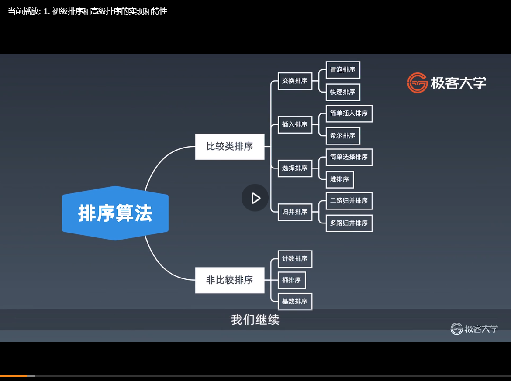

#第八周 
##一、学习笔记

###16.1位运算基础及实战要点
有待补充
####目录
1. 位运算符以及位运算的含义
2. 算数移位与逻辑移位/移位和相应的移位操作，它们在算法题中具体有哪些常用的操作
3. 位运算的应用
####为什么需要位运算以及位运算它本质上是什么
- 机器里的数字表示方式和存储格式就是二进制
那么计算机的话，因为大部分都是高电位和低电位，所以就010101，它本身任何的一个整型或者是十进制的数，在计算机里面的数字表示方式和存储形式都是二进制。
- 十进制<——>二进制：如何转换？
https://zh.wikihow.com/%E4%BB%8E%E5%8D%81%E8%BF%9B%E5%88%B6%E8%BD%AC%E6%8D%A2%E4%B8%BA%E4%BA%8C%E8%BF%9B%E5%88%B6
https://jingyan.baidu.com/article/597a0643614568312b5243c0.html
4(d):0100
8(d):01000
5(d):0101
5(d):0110
给你任何一个十进制数，你怎么把它转化成二进制数？或者是任何一个二进制数，你怎么把它转回到十进制数，应该怎么弄呢？
十进制—>二进制：把上面的链接，点进来之后直接看这个下面就行了。比如说156，要求它的二进制的表示形式就不断地除以2，把模出来的余数写在右边，一步一步一步一步一步写下来之后，写下来完了之后。你知道，最开始除以2得到的余数是它的最低位，越到后面的话说明什么，说明位数越高，所以把所有的余数从下到上，把它列出来，就等于它的二进制了。最开始除的这个东西肯定是最低位的，所以156就是10011100，这就是它的二进制。
二进制—>十进制：整数二进制转换为十进制：首先将二进制数补齐位数，首位如果是0就代表是正整数，如果首位是1则代表是负整数。
                先看首位是0的正整数，补齐位数以后，将二进制中的位数分别将下边对应的值相乘，然后相加得到的就为十进制，比如1010转换为十进制
####位运算符
|         含义         |       运算符      |         示例        |        运算规则      |
|        :-----:       |     :----:        |       :----:        |       :----         |
| 左移 | << | 0011=>0110 |按二进制形式把所有的数字向左移动对应的位数，高位移出（舍弃），低位的空位补零 |
| 带符号右移 | \>\> | 0110=>0011 |按二进制形式把所有的数字向右移动对应位数，低位移出（舍弃），高位的空位补符号位，即正数补0，负数补1 |
| 逻辑右移/无符号右移 | \>\>\> | 0110=>0011 |按二进制形式把所有的数字向右移动对应位数，低位移出（舍弃），高位的空位补零。其他结构和>>相似 |
| 按位或 | \ | 0011\1011 => 1011 |参加运算的两个对象，按二进制位进行“或”运算。(两个位都为0时，结果才为0) |
| 按位与 | & | 0011&1011 => 0011 |参加运算的两个数据，按二进制位进行“与”运算。(两个位都为1时，结果才为1 )|
| 按位取反 | ~ | ~0011=>1100 |参加运算的一个数据，按二进制进行“取反”运算。(0变1，1变0)|
| 按位异或（相同为0不同为1） | ^ | 0011^1011=>1000 |参加运算的两个数据，按二进制位进行“异或”运算。 (两个位相同为0，相异为1) |
####XOR-异或
异或：相同为0，不同为1.也可用“不进位加法”来理解。
异或运算满足自反性，交换律，结合律。
异或操作的一些特点：
x^0 = x:： 只要x和0相同的那就是0，不同的就是1，那x异或0的话就是x本身
x^1s = ~x //注意1s = ~0，指的是全1，可以转换为x^(~0)=~(x^0)=~x： x异或全1等于x取反
x^(~x)=1s：x异或~x所有的二进制位都是不同的，那么异或出来的结果就是全1
x^x=0：x异或x所有的二进制位都是相同的，那么异或出来的结果就是0
后面两个了解即可
c=a^b => a^c = b, b^c =a //交换两个数：证明b=a^a^b=a^c,a=a^b^b=c^b
或
//位与操作
void swap(int &a, int &b) {
  a ^= b;
  b ^= a;
  a ^= b;
}
a^b^c = a^(b^c) = (a^b)^c //associative，结合律

####指定位置的位运算(有待补充说明)
经常我们在操作一个数，它的位运算的时候，需要对这个数某几个二进制位进行置1的操作或者是清零的操作，或者是将它的指定的二进制位挪动，那么我们在程序里面经常会用到这么几个事情：
1. 将x的最右边的n位清零：x&(~0<<n)
2. 获取x的第n位值(0或者1):(x>>n)&1
3. 获取x的第n位的幂值:x&(1<<n)
4. 仅将第n位置为1:x|(1<<n)
5. 仅将第n位置为0:x&(~(1<<n))
6. 将x最高位至第n位(含)清零: x&((1<<n) - 1)
####实战位运算要点
- 判断奇偶
  x%2==1 ->(x&1)==1
  x%2==0 ->(x&1)==0
- x>>1 -> x/2
  即: x=x/2  -> x=x>>1
  mid = (left +right)/2 -> mid=(left+right)>>1
- x=x&(x-1)： 清零最低位的1
- x&-x =>得到最低位的1
- x&~x=>0

###16.2位运算实战题目解析
#### 1. https://leetcode-cn.com/problems/number-of-1-bits/  位1的个数（简单）
1. for loop: 0 --> 32
2. %2, /2
3. &1, x = x>>1; (32)
4. while(x != 0) {count++; x = (x-1); }
5. Integer.bitCount(n)
#### 2. https://leetcode-cn.com/problems/power-of-two/      2 的幂（简单）
 return n>0 && (n &(n-1)) == 0;
#### 3. https://leetcode-cn.com/problems/reverse-bits/      颠倒二进制位
1. int --> "010101" string --> reverse --> int
2. int --> for loop 位运算，练习熟
3. 位运算加分治，不建议用奇技淫巧
#### 4. https://leetcode-cn.com/problems/n-queens/description/  N 皇后（关键）
1. 用数组记录cols(列)、pie(撇)、na(捺)
2. 用位运算代替cols(列)、pie(撇)、na(捺)
#### 5. https://leetcode-cn.com/problems/n-queens-ii/description/  N皇后II
// Java
class Solution {
	private int size; 	
	private int count;	
	private void solve(int row, int ld, int rd) { 		
	if (row == size) { 			
	count++; 			
	return; 		
	}		
	int pos = size & (~(row | ld | rd)); 		
	while (pos != 0) { 			
	int p = pos & (-pos); 			
	pos -= p; // pos &= pos - 1; 			
	solve(row | p, (ld | p) << 1, (rd | p) >> 1); 		
	} 	
	} 
	public int totalNQueens(int n) { 	
	count = 0; 	
	size = (1 << n) - 1; 	
	solve(0, 0, 0); 	
	return count;   
	} 
}
// Python
def totalNQueens(self, n):
 	if n < 1:
      return []
 	self.count = 0
 	self.DFS(n, 0, 0, 0, 0) 	
    return self.count
def DFS(self, n, row, cols, pie, na): 	// recursion terminator 	
    if row >= n: 		
       self.count += 1 		
       return	
    bits = (~(cols | pie | na)) & ((1 << n) — 1)  // 得到当前所有的空位
    while bits: 		
         p = bits & —bits // 取到最低位的1		
         bits = bits & (bits — 1) // 表示在p位置上放入皇后		
         self.DFS(n, row + 1, cols | p, (pie | p) << 1, (na | p) >> 1)         
         //不需要revert  cols, pie, na 的状态
//C/C++
class Solution {
public:
    int totalNQueens(int n) {
        dfs(n, 0, 0, 0, 0);
        return this->res;
    }
    void dfs(int n, int row, int col, int ld, int rd) {
        if (row >= n) {
                  res++;
                  return;
               }                
               // 将所有能放置 Q 的位置由 0 变成 1，以便进行后续的位遍历
               int bits = ~(col | ld | rd) & ((1 << n) - 1);
               while (bits > 0) {
                    int pick = bits & -bits; // 注: x & -x
                   dfs(n, row + 1, col | pick, (ld | pick) << 1, (rd | pick) >> 1);
                   bits &= bits - 1; // 注: x & (x - 1)        
               }
        }
private:
        int res = 0;
};
// Javascript
var totalNQueens = function(n) {
  let count = 0;
  void (function dfs(row = 0, cols = 0, xy_diff = 0, xy_sum = 0) {
    if (row >= n) {
      count++;
      return;
    }
    // 皇后可以放的地方
    let bits = ~(cols | xy_diff | xy_sum) & ((1 << n) - 1);
    while (bits) {      // 保留最低位的 1
      let p = bits & -bits;
      bits &= bits - 1;
      dfs(row + 1, cols | p, (xy_diff | p) << 1, (xy_sum | p) >> 1);
    }
  })();
  return count;
};
#### 6. https://leetcode-cn.com/problems/counting-bits/description/ 比特位计数：自己做
北美公司出现的概率高
位运算再结合DP来做，DP的话其实就是动态规划，就是动态递推。但是在动态递推的时候，有些时候我们的下标可以不用012345这种整型，而是用位运算来表示。
怎么做？就是这个题目。大家可以自己看一遍，然后的话自己想想怎么做，你可以先用最挫的办法做，也就是最传统的办法做，和位运算其实没有太多的关系，
也可以用直接位运算来进行DP的办法来做

###17.1布隆过滤器

###17.2LRU Cache

###18.1初级排序、高级排序、特殊排序的实现和特性
####排序算法
排序算法总共来说的话分为两类，一类的话叫做比较类排序，另外一类的话叫做非比较类排序。
那么比较类排序如何理解？就是在高级语言里面，大家直接调用系统自带的排序函数的话，你可以传进去一个叫comparator，如果是java的话，或者是其他语言的话叫做cmp之类的函数，也就是说它比较的元素不一定非的是实数或者是int之类的类型，它可以是任何结构体或者是类的对象，你只要给它传一个可以比较两个object之间的前后关系的话，它都可以帮你排序排出来。像这种通过比较来决定元素间的相对次序，那么时间复杂度不能突破logn，在数学上可以被证明了，而大部分在我们要用到的排序的话，都是这种比较类排序。
那么非比较类排序指的是不用比较两个元素之间互相的关系，这种的话一版是对于整型的元素来做，也就是说这里的话可以用线性时间直接来完成，像是这意思，它可以突破基于比较排序的时间下界，以线性时间运行，但是的话它的缺点是，一般来说只能用于整型相关的数据类型，也就是说对于一些比如说字符串的排序、或者是对象之间的排序就无能无力了，同时的话它一版要辅助用额外的内存空间。
1. 比较类排序
通过比较来决定元素间的相对次序，由于其时间复杂度不能突破O(nlogn)，因此也称为非线性时间比较类排序
2. 非比较类排序
不通过比较来决定元素间的相对次序，它可以突破基于比较排序的时间下界，以线性时间运行，因此也称为非线性时间比较类排序

###18.2实战题目详解
####1. https://leetcode-cn.com/problems/relative-sort-array/ 数组的相对排序(比较容易，自己看题解)
####2. https://leetcode-cn.com/problems/valid-anagram/ 有效的字母异位词
1. 调系统的函数把字符进行排序，这个排序的话就是用快排
2. 如果写过计数排序，也就是把它的char放在map里面去排，或者是放在一个数组里面，它的下标反正是0到255之间嘛，然后来计数你字母出了多少次，另外一个字母出现多少次，这个就所谓的计数排序
这就是之前各位写过的题目，只是没有给大家用专业的排序的名词给大家定义好
####3. https://leetcode-cn.com/problems/design-a-leaderboard/ 力扣排行榜(此题选做，会员才能做)
####4. https://leetcode-cn.com/problems/merge-intervals/ 合并区间(高频、不复杂，自己做一下)
1. 排序加一次扫描：推荐
2. 连通块：晦涩、代码冗长
3. 官方题解
####5. https://leetcode-cn.com/problems/reverse-pairs/ 翻转对(详细讲解):逆序对
1. 暴力法:两个循环嵌套： O(n^2)
2. merge-sort：O(nlogn)
3. 树状数组：竞赛
##二、学习总结