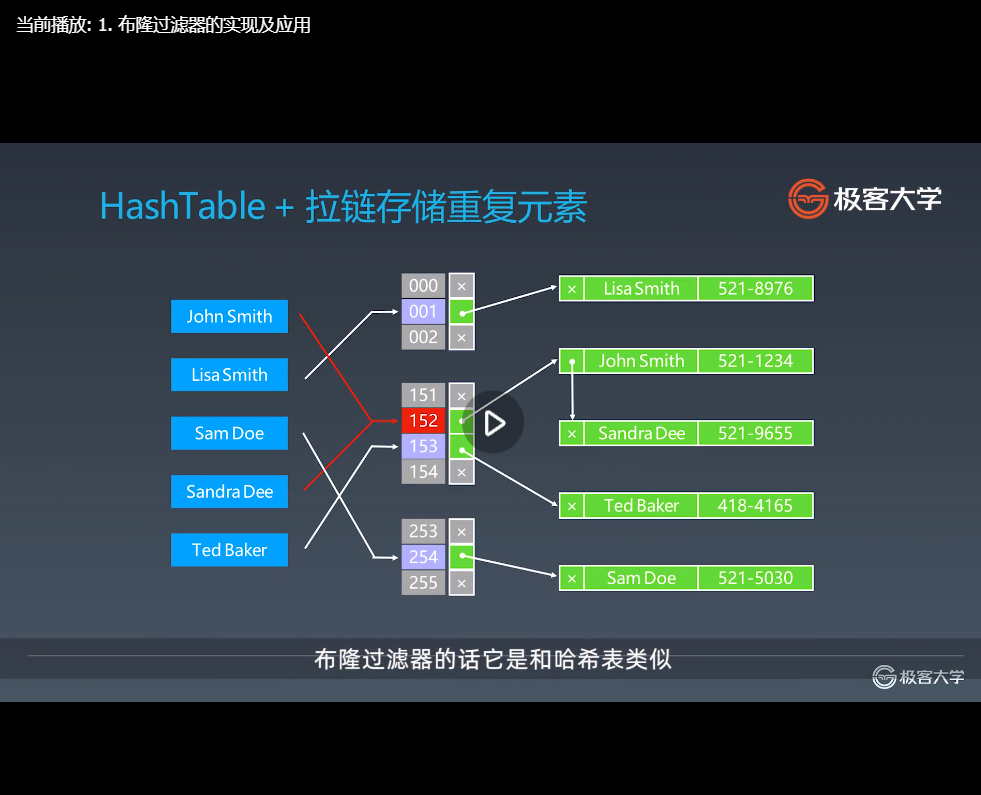
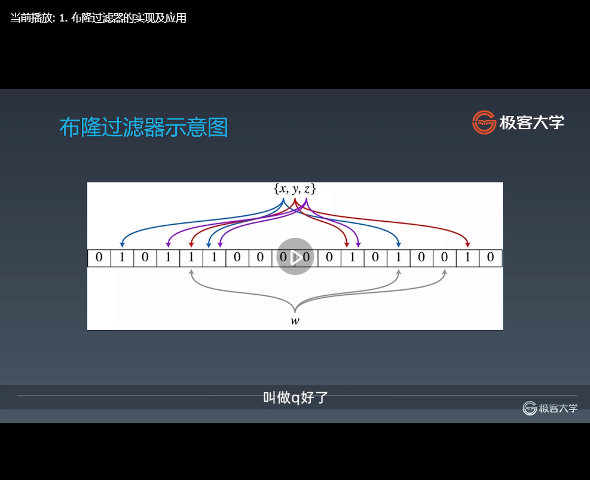
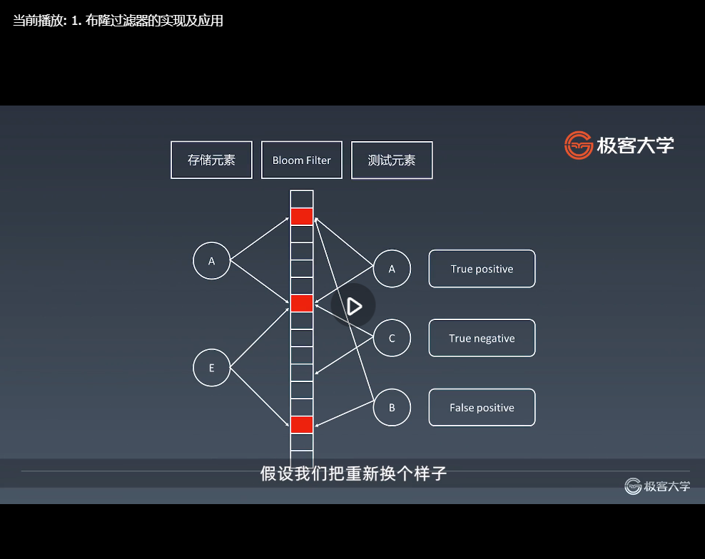

#第八周 
##一、学习笔记

###16.1位运算基础及实战要点
这一章的话总共有三节的内容，分别是位运算符以及位运算的含义，然后是移位和相应的移位操作、它们在算法题中，具体的话有哪些常用的操作，第三的话就是位运算的应用、主要是通过面试题来给大家讲解。
####目录
1. 位运算符以及位运算的含义
2. 算数移位与逻辑移位/移位和相应的移位操作，它们在算法题中具体有哪些常用的操作
3. 位运算的应用，主要是通过面试题来给大家讲解

首先我们来看基础，
####为什么需要位运算以及位运算它本质上是什么
- 机器里的数字表示方式和存储格式就是二进制
那么计算机的话，因为大部分都是高电位和低电位，所以就010101，它本身任何的一个整型或者是十进制的数，在计算机里面的数字表示方式和存储形式都是二进制。
- 十进制<——>二进制：如何转换？
https://zh.wikihow.com/%E4%BB%8E%E5%8D%81%E8%BF%9B%E5%88%B6%E8%BD%AC%E6%8D%A2%E4%B8%BA%E4%BA%8C%E8%BF%9B%E5%88%B6
https://jingyan.baidu.com/article/597a0643614568312b5243c0.html
4(d):0100
8(d):01000
5(d):0101
5(d):0110
给你任何一个十进制数，你怎么把它转化成二进制数？或者是任何一个二进制数，你怎么把它转回到十进制数，应该怎么弄呢？
十进制—>二进制：把上面的链接，点进来之后直接看这个下面就行了。比如说156，要求它的二进制的表示形式就不断地除以2，把模出来的余数写在右边，一步一步一步一步一步写下来之后，写下来完了之后。你知道，最开始除以2得到的余数是它的最低位，越到后面的话说明什么，说明位数越高，所以把所有的余数从下到上，把它列出来，就等于它的二进制了。最开始除的这个东西肯定是最低位的，所以156就是10011100，这就是它的二进制。
二进制—>十进制：整数二进制转换为十进制：首先将二进制数补齐位数，首位如果是0就代表是正整数，如果首位是1则代表是负整数。
                先看首位是0的正整数，补齐位数以后，将二进制中的位数分别将下边对应的值相乘，然后相加得到的就为十进制，比如1010转换为十进制
####位运算符
|         含义         |       运算符      |         示例        |        运算规则      |
|        :-----:       |     :----:        |       :----:        |       :----         |
| 左移 | << | 0011=>0110 |按二进制形式把所有的数字向左移动对应的位数，高位移出（舍弃），低位的空位补零 |
| 带符号右移 | \>\> | 0110=>0011 |按二进制形式把所有的数字向右移动对应位数，低位移出（舍弃），高位的空位补符号位，即正数补0，负数补1 |
| 逻辑右移/无符号右移 | \>\>\> | 0110=>0011 |按二进制形式把所有的数字向右移动对应位数，低位移出（舍弃），高位的空位补零。其他结构和>>相似 |
| 按位或 | \ | 0011\1011 => 1011 |参加运算的两个对象，按二进制位进行“或”运算。(两个位都为0时，结果才为0) |
| 按位与 | & | 0011&1011 => 0011 |参加运算的两个数据，按二进制位进行“与”运算。(两个位都为1时，结果才为1 )|
| 按位取反 | ~ | ~0011=>1100 |参加运算的一个数据，按二进制进行“取反”运算。(0变1，1变0)|
| 按位异或（相同为0不同为1） | ^ | 0011^1011=>1000 |参加运算的两个数据，按二进制位进行“异或”运算。 (两个位相同为0，相异为1) |
####XOR-异或
异或：相同为0，不同为1.也可用“不进位加法”来理解。
异或运算满足自反性，交换律，结合律。
异或操作的一些特点：
x^0 = x:： 只要x和0相同的那就是0，不同的就是1，那x异或0的话就是x本身
x^1s = ~x //注意1s = ~0，指的是全1，可以转换为x^(~0)=~(x^0)=~x： x异或全1等于x取反
x^(~x)=1s：x异或~x所有的二进制位都是不同的，那么异或出来的结果就是全1
x^x=0：x异或x所有的二进制位都是相同的，那么异或出来的结果就是0
后面两个了解即可
c=a^b => a^c = b, b^c =a //交换两个数：证明b=a^a^b=a^c,a=a^b^b=c^b
或
//位与操作
void swap(int &a, int &b) {
  a ^= b;
  b ^= a;
  a ^= b;
}
a^b^c = a^(b^c) = (a^b)^c //associative，结合律

异或操作的一些特点，那么这些特点的话相当于是稍微高阶一点的，大家就把它记住就好了。 当然的话你看得多了之后也非常地熟练，你可以理解式地记忆也是一样的。
####指定位置的位运算
经常我们在操作一个数，它的位运算的时候，需要对这个数某几个二进制位进行置1的操作或者是清零的操作，或者是将它的指定的二进制位挪动，那么我们在程序里面经常会用到这么几个事情：
1. 将x的最右边的n位清零：x&(~0<<n)
   怎么弄？就是把要做的一个事情就是把0取反了之后，全部都是1，全部都是1之后向左移n位了之后，你可以想象为就变成11111，最后的话有n个0
   和x与在一起，指的是什么，将x的右边n位全部清零，只留下最左边的那些高位，右边的话低位的n全部都是清零的
2. 获取x的第n位值(0或者1):(x>>n)&1
   怎么做，就是把x先右移n次，那么x第n位就变成最后一位了，然后再与上一个1，就得到了第n位是到底是0还是1对吧
3. 获取x的第n位的幂值:x&(1<<n)
   同理可得就是把一个1往左移移到高位去，然后和x与一下
4. 仅将第n位置为1:x|(1<<n)
5. 仅将第n位置为0:x&(~(1<<n))
6. 将x最高位至第n位(含)清零: x&((1<<n) - 1)

如果你第一次见的话，你可能要想一想，然后在纸上的画把它画出来。
特别是每次像比如说这里，我们把全1（~0:0取反即可以得到全1）左移n或者把一个单个的1左移n，
它做的，你就可以想象成为一个塞子，
塞子里面的话有一个1要把它左移n位的话，就是把它挪到第n位去，整个这一块的话就变成00000100000，后面的话总共有n个0，
其他的话都是这样同理可得
####实战位运算要点
同时实战的时候在面试的时候位运算主要是这一页里面讲得最多的就是这一页，不管是在布隆过滤器，还是在N皇后问题讲得最多的话，用得最多的就是这样一些位运算的技巧。
- 判断奇偶
  x%2==1 ->(x&1)==1
  x%2==0 ->(x&1)==0
- x>>1 -> x/2
  即: x=x/2  -> x=x>>1
  mid = (left +right)/2 -> mid=(left+right)>>1
- x=x&(x-1)： 清零最低位的1
- x&-x =>得到最低位的1
- x&~x=>0

###16.2位运算实战题目解析
#### 1. https://leetcode-cn.com/problems/number-of-1-bits/  位1的个数（简单）
1. for loop: 0 --> 32
2. %2, /2
3. &1, x = x>>1; (32)
4. while(x != 0) {count++; x = (x-1); }
5. Integer.bitCount(n)
#### 2. https://leetcode-cn.com/problems/power-of-two/      2 的幂（简单）
 return n>0 && (n &(n-1)) == 0;
#### 3. https://leetcode-cn.com/problems/reverse-bits/      颠倒二进制位
1. int --> "010101" string --> reverse --> int
2. int --> for loop 位运算，练习熟
3. 位运算加分治，不建议用奇技淫巧
#### 4. https://leetcode-cn.com/problems/n-queens/description/  N 皇后（关键）
1. 用数组记录cols(列)、pie(撇)、na(捺)
2. 用位运算代替cols(列)、pie(撇)、na(捺)
#### 5. https://leetcode-cn.com/problems/n-queens-ii/description/  N皇后II
// Java
class Solution {
	private int size; 	
	private int count;	
	private void solve(int row, int ld, int rd) { 		
	if (row == size) { 			
	count++; 			
	return; 		
	}		
	int pos = size & (~(row | ld | rd)); 		
	while (pos != 0) { 			
	int p = pos & (-pos); 			
	pos -= p; // pos &= pos - 1; 			
	solve(row | p, (ld | p) << 1, (rd | p) >> 1); 		
	} 	
	} 
	public int totalNQueens(int n) { 	
	count = 0; 	
	size = (1 << n) - 1; 	
	solve(0, 0, 0); 	
	return count;   
	} 
}
// Python
def totalNQueens(self, n):
 	if n < 1:
      return []
 	self.count = 0
 	self.DFS(n, 0, 0, 0, 0) 	
    return self.count
def DFS(self, n, row, cols, pie, na): 	// recursion terminator 	
    if row >= n: 		
       self.count += 1 		
       return	
    bits = (~(cols | pie | na)) & ((1 << n) — 1)  // 得到当前所有的空位
    while bits: 		
         p = bits & —bits // 取到最低位的1		
         bits = bits & (bits — 1) // 表示在p位置上放入皇后		
         self.DFS(n, row + 1, cols | p, (pie | p) << 1, (na | p) >> 1)         
         //不需要revert  cols, pie, na 的状态
//C/C++
class Solution {
public:
    int totalNQueens(int n) {
        dfs(n, 0, 0, 0, 0);
        return this->res;
    }
    void dfs(int n, int row, int col, int ld, int rd) {
        if (row >= n) {
                  res++;
                  return;
               }                
               // 将所有能放置 Q 的位置由 0 变成 1，以便进行后续的位遍历
               int bits = ~(col | ld | rd) & ((1 << n) - 1);
               while (bits > 0) {
                    int pick = bits & -bits; // 注: x & -x
                   dfs(n, row + 1, col | pick, (ld | pick) << 1, (rd | pick) >> 1);
                   bits &= bits - 1; // 注: x & (x - 1)        
               }
        }
private:
        int res = 0;
};
// Javascript
var totalNQueens = function(n) {
  let count = 0;
  void (function dfs(row = 0, cols = 0, xy_diff = 0, xy_sum = 0) {
    if (row >= n) {
      count++;
      return;
    }
    // 皇后可以放的地方
    let bits = ~(cols | xy_diff | xy_sum) & ((1 << n) - 1);
    while (bits) {      // 保留最低位的 1
      let p = bits & -bits;
      bits &= bits - 1;
      dfs(row + 1, cols | p, (xy_diff | p) << 1, (xy_sum | p) >> 1);
    }
  })();
  return count;
};
#### 6. https://leetcode-cn.com/problems/counting-bits/description/ 比特位计数：自己做
北美公司出现的概率高
位运算再结合DP来做，DP的话其实就是动态规划，就是动态递推。但是在动态递推的时候，有些时候我们的下标可以不用012345这种整型，而是用位运算来表示。
怎么做？就是这个题目。大家可以自己看一遍，然后的话自己想想怎么做，你可以先用最挫的办法做，也就是最传统的办法做，和位运算其实没有太多的关系，
也可以用直接位运算来进行DP的办法来做


欢迎来到算法训练营第十七课：布隆过滤器和LRU Cache。我们来开始，这一章内容，主要就分为两节，
这两节的话都是讲两个比较高级的数据结构，而且它们在面试中以及在工业级的应用上面都较为广泛。
所以我们一起来学习这两个数据结构。
###17.1布隆过滤器/Bloom Filter--最外层缓存/快速查询的缓存
布隆过滤器的话它是和哈希表类似，很多时候我们经常把它去和哈希表进行对比。
为了讲解的方便起见的话，我们先来回顾一下哈希表。
####HashTable+拉链存储重复元素

哈希表的话以及如果有重复元素的话，采用拉链存储法的话可以看到本身的话任何一个元素进来的话，会经过一个哈希函数。
那么这里的话我们假设进来的元素，就是一个String，它经过一个哈希函数之后，就映射到一个整数的下标位置，叫整数的index好了。
比如说这个叫Lisa Smith就映射到001，然后存在001这个位置，这儿就有一个Lisa Smith对吧，然后她的电话就是5218976；
同时John Smith的话就哈希到152的位置，然后放过来，
这时候你们会发现这儿有个叫Sandra Dee，也被哈希到152的位置，那么所采用的解决冲突的办法就是在152这个位置开一个链表，把多个元素都存在相同的位置的链表处，往后面不断地积累，这就是哈希表的一种存储形式。
这里你会发现一个怎样的特点？
就是说对于哈希表的话，它不仅有哈希函数来得到这么一个index值，且它会把整个要存的元素，全部都放在哈希表里面去，这是一个没有误差的数据结构，且有多少的元素，每个元素有多大，那么所有的这些元素需要占的内存空间，在哈希表里面都要找相应的内存的大小给存进来。

那么，在很多时候我们在工业级应用的时候，发现我们并不需要存所有的元素本身，而只需要存一个信息，就是说这个元素在我这个表里面，到底是有还有没有。
在这种情况下的话，如果只要查询有还是没有的时候，这个时候我们就需要一种更高效的数据结构。
更高效的数据结构可以导致的一个结果，就是这里有很多元素要存的话，但是我们这个表的话所需要的内存空间很少，同时的话我们不需要把元素本身，就不需要把它String（Lisa Smith）这些东西全部存起来，我们只需要说这个东西到底是有还是没有，那么我们看这个东西是怎么来设计出来的。


####Bloom Filter vs Hash Table
一个很长的<b>二进制向量</b>和一系列<b>随机映射函数</b>。布隆过滤器可以用于检索一个元素是否在一个集合中。
优点是<b>空间效率和查询时间都远远超过一般的算法</b>，
缺点是有一定的误识别率和删除困难。

#####构成
于是这个时候的话，一个叫Bloom Filter应运而生了。
它是由一个很长的二进制向量和一系列的随机映射函数构成，布隆过滤器可以用来检索一个元素是否在一个集合中。

#####vs Hash Table
所以在这里它和哈希表一个最大的区别就是说哈希表不仅可以判断它是否在集合中。
也就是说你想哈希表的话就是map，我们在用map的时候，不仅可以判断它是否在其中，而且可以再存很多冗余的信息，比如说这里存它他的电话号码存在map也就是哈希表当中。
所以哈希表的话不只是判断是否在集合，同时还可以存元素本身和元素的各种额外信息。
但是布隆过滤器的话只是用于检索一个元素是否在还是不在，它只能存在和不在的信息，而不能存其它的额外的信息，就是这样。

#####优点
它的优点是什么？就是空间效率和查询时间都远远高于一般的算法，这里注意了是远远高于一般的算法。
为什么能达到这个，一方面它是用了二进制向量来表示，所以它很节省空间，另外一个方面的话，后面我们会讲，它是一种模糊的查询方式。

#####缺点
它的缺点的话就是有一定的误识别率和删除困难这两个。

####布隆过滤器示意图
我们来看一下它的整个原理是什么？
- 插入
  它的整个原理的话，对于任何一个元素，这里假设要存三个元素依次存进来，这里xyz的话不是同时往里面灌，就是一个一个依次往里面灌。 每一个元素的话，它会分配到一系列的二进制位中。
  假设x它就分配到三个二进制位，用蓝色的线表示的话这一位这一位和这一位，x的话就会把它分配成这三个位，那么x插入到布隆过滤器的话，就表示把x对应的这三个位置置为1就可以了。
  那么接下来y插入进来的话，那么y根据它的哈希函数的话，就分为红色的这三条线所对应的二进制位也置为1。
  同理z的话也分成三个，就是置为1对吧。
  二进制的数组的话就用来表示所有的已经存入的xyz是否已经在索引里面了。

- 查询
  这时候的话重新给你一个元素x的话就会对应于这蓝色的，始终x会对应于这三个蓝色的二进制位，那么去这个表里面查，就查到这三个皆为1，所以的话我们可以认为x是存在的。
  另外的话w一个陌生的元素进来，w进来之后，它把它分配给，通过布隆过滤器的二进制索引的函数的话，w的话就得到灰色的这三个二进制位，这时候我们发现这三个二进制位的话是1、1、0，有一个二进制位为0，说明什么，说明w未在索引里面。 
  
- 特点
  这时候你会发现一个什么特点，如果一个元素它所对应的二进制位，只要有一个为0，就说明这个元素不在布隆过滤器的索引里面且我们是可以肯定它不在的。
  但是当一个元素，比如说又来了一个新的元素，叫做q好了。它刚好分配的三个二进制位都为1的话，我们不一定能说是在的。
  

- 索引二进制位都为1但元素不在
  我们来看一种形式就在这里，假设我们把重新换个样子。
  这个是布隆过滤器在这个地方，我们存储的元素分别是A和E对吧。
  A的话分配到这两个对应的二进制位，把它置为1，表示A的话，加入到布隆过滤器里面来了。
  E的话这个元素也是添加进来的，分别是对应于这两个对不对，然后E的话也加进来。
  
  接下来我们对于测试元素，分别是ACB这三个测试元素。
  A的话，一查它的二进制位，的确都为1，都为红色，那么我们就查到了A的话应该是有的，只是说可能。
  C的话，我们一查这个位是有的，但是这一个二进制位为0，所以的话，我们可以肯定C肯定不在我们的布隆过滤器里面去。
  然后我们再看B本身，B的话一进来之后它分配到这个位，另外的话还分配到上面这个二进制位，这两个二进制位的话恰好都为1，但是B我们在一开始的时候，在左边这里存错元素的时候，从来没有存入过B，只不过B分配出来的二进制的位的话，刚好和之前的若干个元素所占的二进制位是有重合的，
     所以这时候我们就会判断B在索引里面，在这个时候你就会发现，对于B的判断其实是有误差的。
  
- 结论
  最后得出一个结论是什么？
  结论就是当布隆过滤器，把元素全部都插入完了之后，
  对于测试元素，就是对于新来的一个元素，要来验证它是否存在的话，当它验证这个元素所对应的二进制位是1的时候，我们只能说它可能存在在布隆过滤器里面。
  但是当这个元素所对应的二进制位，只要有一个不为1的话，那么我们可以百分之百肯定它不在。
  也就是说前言万语汇做一句话，就是说这个元素去布隆过滤器里面查，如果查到它不在的话，那么它肯定就是不在的，如果查这个元素，比如说B查到布隆过滤器里面，它的二进制位都是1为存在的一个状态的话，那么我们只能说它可能是存在的。
  
  那么这时候有人可能会问了，既然是这样的话，它查不准，当B这种元素在里面查到的时候，
  那么我们接下来要怎么判断它到底是否存在？布隆过滤器只是放在最外面来当一个缓存使的，也就是说来当一个很快速的判断使的。当B查到了之后，布隆过滤器里面是存在的，那么B的话就会继续在这台机器上的DB，也就是说放在数据库里面去查，到时候的话会查出来B是不存在的，是这个情况。
  
  当然的话C元素就直接打到布隆过滤器里面，就会发现在这台机器的数据库里面肯定是不存在了，C就不用查了，这样的话就节省下来访问数据库的时间了，而且我们可以肯定C肯定也未添加进数据库里面来的。
  这个时候你会发现布隆过滤器，只是挡在一台机器前面的快速查询的缓存，真正要确定元素一定存在的话，它必须再访问这个机器里面的一个完整的存储数据结构，一般来说就是数据库了，在工业上应用的话。
####案例
1. 比特币网络
2. 分布式系统（Map-Reduce） - Hadoop、search engine
3. Redis缓存
4. 垃圾邮件、评论等的过滤
- 科普文章：https://www.cnblogs.com/cpselvis/p/6265825.html 布隆过滤器(Bloom Filter)的原理和实现
          https://blog.csdn.net/tianyaleixiaowu/article/details/74721877 使用BloomFilter布隆过滤器解决缓存击穿、垃圾邮件识别、集合判重
          它去解释了在真正的现实应用当中的话，我们怎么来应用布隆过滤器的。
接下来我们来看它现实中的应用，
比特币网络里面用得很多，因为比特币的话是分布式系统，所以在分布式系统的话，一个地址是否在这个结点里面，以及这个地址的话transaction是否在node里面的话，经常会要用到所谓的布隆过滤器来进行快速查询。
第二的话其他的分布式系统，也就是我们用的最多的，像Hadoop、search engine之类的东西以及Google用得很多的话都会是这样的。
   比如说搜索引擎经常做的很多事情，就是把大量的网页信息还有图片信息都存在它的整个服务器里面，那么一般来说的话，不同的网页是存在不同的集群里面的，当我在search的时候查到一个东西之后，它就会根据索引，就会知道它应该是在这个集群，它就先在集群的布隆过滤器里面去查一下，看是否存在。如果存在的话它再去集群的DB里面进行访问，如果不存在的话，那就直接略过了。
   所以在大型分布式系统里面，很多地在使用布隆过滤器
同时的话Redis缓存
以及垃圾邮件，就是来了一个邮件或者一个评论，它到底是不是比如说涉黄的、涉黑的以及不正当的言论之类的，它也可以用一个布隆过滤器，然后很快地来判断，不是的话肯定不是，是的话它再去DB里面查一下 和那些涉黄涉黑的规则是否相符合，类似于这样。
####代码实现
接下来我们再看用程序是如何实现一个简单的布隆过滤器的。
- python
  首先我们来看一个最简单的版本，就是用Python实现了一个版本。
  它用到了系统的一个数据结构叫bitarray，bitarray的话就是一个数组，数组里面存的都是二进制位，那么就是模拟这一坨二进制位，所以用了一个叫bitarray的，就是二进制数组。
````
from bitarray import bitarray
import mmh3

class BloomFilter:
  def _init_(self, size, hash_num): #初始函数有个size，总共的话有多少个元素放里面；同时还有个hash_num指的是一个元素进来，它分成多少个二进制位。之前我们举的例子，像的话就是分成两个，所以它的hash_num就是2；像的话hash_num就是3，这里一个元素会分到三个二进制位去。所以hash_num指的是一个元素分多少个二进制位
     self.size = size
     self.hash_num = hash_num
     self.bit_array = bitarray(size) #bitarray直接先初始化起来，然后再把它全部设成0。所以开始的时候二进制数组的索引全部为0
     self.bit_array.setall(0)
  
  def add(self, s): #那么接下来我们来看一个元素s进来，s进来的话，我们循环hash_num次，假设hash_num是3的话，就是生成三个二进制位。那么每次的话就把seed和元素s进行一次哈希再模上bitarray的size。因为你不能让下标超出去，就得到了一个相应的下标的位置，这里叫result，其实就是index，然后把相应的index所在的二进制位  置为1。这就是布隆过滤器添加元素的时候，我们刚才讲的原理
     for seed in range(self.hash_num):  #比如说分成三个，那就循环三次，那么每一次的话就把seed和元素s哈希一下再模上二进制数组的总长度，就得到了它所对应的二进制位的索引，然后把相应的二进制位  置为1
        result = mmh3.hash(s, seed) % self.size
        self.bit_array[result] = 1
  
  def lookup(self, s): #那么我们再看lookup是什么样子的？同理可得和上面一样，也是循环hash_num次，每一次的话就找到了所对应的下标，叫result，我们来判断，只要result等于等于0，那么我们就什么，确定它肯定是不存在的是Nope，如果它全部都为1，我们输出什么呢，注意这里不能输出Yes，因为我们没法百分之百确定它肯定在，我们只能说出这里说的是Probably，指的是很有可能在，就这么一个过程。怎么查询的怎么调用，就这么调就行了。
     for seed in range(self.hash_num):
        result = mmh3.hash(s, seed) % self.size
        if self.bit_array[result] == 0
           return "Nope"
     return "Probably"
     
 bf = BloomFilter(500000, 7)
 bf.add("dantezhao")
 print (bf.lookup("dantezhao")
 print (bf.lookup("yyj"))
````
- java
````
//Java
public class BloomFilter {
    private static final int DEFAULT_SIZE = 2 << 24;    
    private static final int[] seeds = new int[] { 5, 7, 11, 13, 31, 37, 61 };    
    private BitSet bits = new BitSet(DEFAULT_SIZE);    
    private SimpleHash[] func = new SimpleHash[seeds.length];    
    
    public BloomFilter() {    
        for (int i = 0; i < seeds.length; i++) {         
           func[i] = new SimpleHash(DEFAULT_SIZE, seeds[i]);        
        }    
    }    
    
    public void add(String value) {    
        for (SimpleHash f : func) {       
             bits.set(f.hash(value), true);        
        }    
    }    
    
    public boolean contains(String value) {     
       if (value == null) {       
            return false;        
       }        
       boolean ret = true;        
       for (SimpleHash f : func) {      
             ret = ret && bits.get(f.hash(value));    
       }        
       return ret;    
    }    
    
    // 内部类，simpleHash    
    public static class SimpleHash {    
        private int cap;        
        private int seed;        
        
        public SimpleHash(int cap, int seed) {      
              this.cap = cap;      
              this.seed = seed;        
        }        
        
        public int hash(String value) {       
             int result = 0;       
             int len = value.length();      
             for (int i = 0; i < len; i++) {         
                    result = seed * result + value.charAt(i); 
             }            
             return (cap - 1) & result;        
        }    
    }
}
````
  2 https://github.com/lovasoa/bloomfilter/blob/master/src/main/java/BloomFilter.java
````
package com.github.lovasoa.bloomfilter;

import java.util.BitSet;
import java.util.Random;
import java.util.Iterator;

public class BloomFilter implements Cloneable {
  private BitSet hashes;
  private RandomInRange prng;
  private int k; // Number of hash functions
  private static final double LN2 = 0.6931471805599453; // ln(2)

  /**
   * Create a new bloom filter.
   * @param n Expected number of elements
   * @param m Desired size of the container in bits
   **/
  public BloomFilter(int n, int m) {
    k = (int) Math.round(LN2 * m / n);
    if (k <= 0) k = 1;
    this.hashes = new BitSet(m);
    this.prng = new RandomInRange(m, k);
  }

  /**
   * Create a bloom filter of 1Mib.
   * @param n Expected number of elements
   **/
  public BloomFilter(int n) {
    this(n, 1024*1024*8);
  }

  /**
  * Add an element to the container
  **/
  public void add(Object o) {
    prng.init(o);
    for (RandomInRange r : prng) hashes.set(r.value);
  }
  /** 
  * If the element is in the container, returns true.
  * If the element is not in the container, returns true with a probability ≈ e^(-ln(2)² * m/n), otherwise false.
  * So, when m is large enough, the return value can be interpreted as:
  *    - true  : the element is probably in the container
  *    - false : the element is definitely not in the container
  **/
  public boolean contains(Object o) {
    prng.init(o);
    for (RandomInRange r : prng)
      if (!hashes.get(r.value))
        return false;
    return true;
  }

  /**
   * Removes all of the elements from this filter.
   **/
  public void clear() {
    hashes.clear();
  }

  /**
   * Create a copy of the current filter
   **/
  public BloomFilter clone() throws CloneNotSupportedException {
    return (BloomFilter) super.clone();
  }

  /**
   * Generate a unique hash representing the filter
   **/
  public int hashCode() {
    return hashes.hashCode() ^ k;
  }

  /**
   * Test if the filters have equal bitsets.
   * WARNING: two filters may contain the same elements, but not be equal
   * (if the filters have different size for example).
   */
  public boolean equals(BloomFilter other) {
    return this.hashes.equals(other.hashes) && this.k == other.k;
  }

  /**
   * Merge another bloom filter into the current one.
   * After this operation, the current bloom filter contains all elements in
   * other.
   **/
  public void merge(BloomFilter other) {
    if (other.k != this.k || other.hashes.size() != this.hashes.size()) {
      throw new IllegalArgumentException("Incompatible bloom filters");
    }
    this.hashes.or(other.hashes);
  }

  private class RandomInRange
      implements Iterable<RandomInRange>, Iterator<RandomInRange> {

    private Random prng;
    private int max; // Maximum value returned + 1
    private int count; // Number of random elements to generate
    private int i = 0; // Number of elements generated
    public int value; // The current value

    RandomInRange(int maximum, int k) {
      max = maximum;
      count = k;
      prng = new Random();
    }
    public void init(Object o) {
      prng.setSeed(o.hashCode());
    }
    public Iterator<RandomInRange> iterator() {
      i = 0;
      return this;
    }
    public RandomInRange next() {
      i++;
      value = prng.nextInt() % max;
      if (value<0) value = -value;
      return this;
    }
    public boolean hasNext() {
      return i < count;
    }
    public void remove() {
      throw new UnsupportedOperationException();
    }
  }
}
````
  3 https://github.com/Baqend/Orestes-Bloomfilter
- C++
  当然的话如果你写C++，在google上面，直接搜C++ Bloom Filter implementation，然后马上就可以得到相应的代码了。
````
#include <iostream>
#include <bitset>
#include <cmath>
 
using namespace std;

typedef unsigned int uint; 
const int DEFAULT_SIZE = 1 << 20;
const int seed[] = { 5, 7, 11, 13, 31, 37, 61 };


class BloomFilter {
public:	
      BloomFilter() : hash_func_count(3) {}    
      BloomFilter(int bitsize, int str_count) {     	
          hash_func_count = ceil((bitsize / str_count) * log(2));	
      }    
      ~BloomFilter() {}		
      
      uint RSHash(const char *str, int seed);	
      void Add(const char *str);	
      bool LookUp(const char *str); 

private:	
      int hash_func_count;	
      bitset<DEFAULT_SIZE> bits;
};

uint BloomFilter::RSHash(const char *str, int seed) {  
    uint base = 63689;
    uint hash = 0;
         
    while (*str) {      
      hash = hash * base + (*str++);      
      base *= seed;    
    }         

    return (hash & 0x7FFFFFFF);
    }     
void BloomFilter::Add(const char* str) {
	int index = 0;	
	for(int i = 0; i < hash_func_count; ++i) {	
		index = static_cast<int>(RSHash(str, seed[i])) % DEFAULT_SIZE;	
		bits[index] = 1;	
	}		
	return ;
} 

bool BloomFilter::LookUp(const char* str) {	
     int index = 0;	
     for(int i = 0; i < hash_func_count; ++i) {		
        index = static_cast<int>(RSHash(str, seed[i])) % DEFAULT_SIZE;		
        if (!bits[index]) return false; 	
     } 	
     
     return true;
}
````
- javascript
````
// JavaScript
class BloomFilter {  
  constructor(maxKeys, errorRate) {    
     this.bitMap = [];   
     this.maxKeys = maxKeys;    
     this.errorRate = errorRate;    
     // 位图变量的长度，需要根据maxKeys和errorRate来计算    
     this.bitSize = Math.ceil(maxKeys * (-Math.log(errorRate) / (Math.log(2) * Math.log(2))));    
     // 哈希数量    
     this.hashCount = Math.ceil(Math.log(2) * (this.bitSize / maxKeys));    
     // 已加入元素数量    
     this.keyCount = 0;  
  }  
  
  bitSet(bit) {    
     let numArr = Math.floor(bit / 31);    
     let numBit = Math.floor(bit % 31);    
     this.bitMap[numArr] |= 1 << numBit;  
  }  
  
  bitGet(bit) {    
     let numArr = Math.floor(bit / 31);    
     let numBit = Math.floor(bit % 31);    
     return (this.bitMap[numArr] &= 1 << numBit);  
  }  
  
  add(key) {    
     if (this.contain(key)) {      
       return -1;    
     }    
     
     let hash1 = MurmurHash(key, 0, 0),      
         hash2 = MurmurHash(key, 0, hash1);    
         
     for (let i = 0; i < this.hashCount; i++) {      
         this.bitSet(Math.abs(Math.floor((hash1 + i * hash2) % this.bitSize)));    
     }    
     
     this.keyCount++;  
  }  
  
  contain(key) {    
      let hash1 = MurmurHash(key, 0, 0);  
      let hash2 = MurmurHash(key, 0, hash1);    
      
      for (let i = 0; i < this.hashCount; i++) {      
          if (!this.bitGet(Math.abs(Math.floor((hash1 + i * hash2) % this.bitSize)))) {        
            return false;      
          }    
      }    
      
      return true;  
  }
}


/** * MurmurHash 
* 
* 参考 http://murmurhash.googlepages.com/ 
* 
* data：待哈希的值 
* offset： 
* seed：种子集 
* 
*/
function MurmurHash(data, offset, seed) {
  let len = data.length,    
     m = 0x5bd1e995,    
     r = 24,    
     h = seed ^ len,    
     len_4 = len >> 2;  
  
  for (let i = 0; i < len_4; i++) {  
    let i_4 = (i << 2) + offset,  
        k = data[i_4 + 3];    
    k = k << 8;    
    k = k | (data[i_4 + 2] & 0xff);    
    k = k << 8;    
    k = k | (data[i_4 + 1] & 0xff);    
    k = k << 8;    
    k = k | (data[i_4 + 0] & 0xff);    
    k *= m;    
    k ^= k >>> r;    
    k *= m;    
    h *= m;    
    h ^= k;  
  }  
  
  // avoid calculating modulo  
  let len_m = len_4 << 2,   
   left = len - len_m,   
   i_m = len_m + offset;  
   
  if (left != 0) {   
   if (left >= 3) {    
     h ^= data[i_m + 2] << 16;    
   }    
   
   if (left >= 2) {    
     h ^= data[i_m + 1] << 8;    
   }    
   
   if (left >= 1) {    
     h ^= data[i_m];    
   }    
   
   h *= m;  
  }  
  
  h ^= h >>> 13;  
  h *= m;  
  h ^= h >>> 15;    
  return h;
}

let bloomFilter = new BloomFilter(10000, 0.01);

bloomFilter.add("abcdefgh");
console.log(bloomFilter.contain("abcdefgh"));
console.log(bloomFilter.contain("abcdefghi"));
````
###17.2LRU Cache
我们继续学习第二个高级数据结构就是LRU Cache。
####Cache缓存
这里的话想先给大家说一下cache以及cache在现实中的应用。
cache的话中文就叫做缓存。
我想大家从第一天来上这个课的时候，就已经接触了Fibonacci数列以及比如说爬楼梯问题.
那个时候的话就要做一个所谓的记忆化的搜索，当时的话我们就建了一个cache。当然你可以用数组来表示，python的话也可以直接用@LRU Cache来写。
那么缓存到底是什么？
在现实中其实用得很多，
1. 记忆：比如说我们人类的记忆，其实很多时候就是一个缓存。很多东西我们会记在纸上，写在书籍里面，就是因为我们怕我们记不住。好处就是说在书上那些东西的话永远会存在，但是它问题就在于，你要把它载入到你的脑子里面来，需要花不少的时间。那么经常用的东西，我们肯定就记在我们脑子里面，它的话速度就特别得快，但是问题就是说经常会有误，或者是说会遗忘，这就是人脑记忆所做成一个缓存的问题。
2. 钱包-储物柜：同时还有你平时用的钱包，以及你的家里面的储物柜，你钱包的话因为要随身携带，那么你就要放一些经常用的东西，但是它的容量就有限了。其他那些东西全部的东西，你肯定放在家里面专门的储物柜里面去。
3. 代码模块：当然代码模块里面经常也用的cache
####CPU Cache
科普链接：https://www.sqlpassion.at/archive/2018/01/06/understanding-the-meltdown-exploit-in-my-own-simple-words/
Cache本身的话从CPU里面的话就讲了很多了。我想大家在年轻的时候，在可能刚开始接触计算机，比如说小时候、初中、高中、本科的时候，刚开始玩计算机的话，可能是对硬件特别感兴趣。
当时特别出名的就是英特尔的处理器，它当时就L1的cache、L2的cache、L3的cache，它就有所谓的三级缓存嘛。

像这么一个架构的话，在这里它是四核的一个CPU。每一个核里面就有L1 D-cache、L1 L-cache、L2的cache、L3的cache，指的是什么，
最常用的数据，马上要给CPU的计算模块进行计算处理的，就放在L1里面，
另外的话更多一点的淘汰下来、次之不太常用的放在L1 l-cache，
再次之就放在L2里面，
最后的话就放在L3里面。
当然外面的话就是内存了。
它的速度的话一个比一个快，它的速度的话这个快于它、这个快于它，慢慢就慢下来了，
但它的体积也就是能存的数据的多少肯定是L3是最大的，L1这边的话是最小的，这就是它所谓的缓存机制。
####基本特性
- 两个要素：大小、替换策略

那么说到缓存的话，主要是有两点，它的基本特性：
1. 第一点的话就是缓存总体的大小是多少。如果缓存非常大的话，就类似于CPU的缓存抵一个内存，我有1G的缓存的话，那么我很多东西就只管往里面存就行了。
   对于人的话就是这个人的记性特别好，过目不忘，可能他不需要一个手抄本，把一些常见的东西抄在本子上，不需要。他就是记忆力大
2. 第二个的话它替换策略，也就是说我L1最快的，但是因为容量有限，不够装了。那么我们要把哪一些不常用的把它放在后面来了以及我们怎么鉴别哪些信息是不常用的，这就是要得到所谓的替换算法了。
####LRU Cache：更新原则：最近被使用的元素永远被翻新到最上面去。
- Hash Table + DoubleLinkedList
  那么基于LRU Cache的话，它的替换算法的话，就是LRU这三个字代表着它的含义（下一页PPT专门讲）。
  那么它指的是什么，就是least recent use，指的是最近最少使用的就把它放在最后去淘汰。
  它一版来说，它的实现的话最后的话是用哈希表（查询）再加一个双向链表（修改、更新）来实现。
-  O(1)查询
   O(1)修改、更新
   这样的话一个结构，会是O(1)的查询的时间复杂度，也就是说这个元素到底是否存在直接可以在哈希表里面，在哈希表O(1)的时间可以查到。
   同时的话你要进行修改和更新的话，具体存元素是存储在Double LinkedList里面去，也可以用O(1)的时间去进行修改和更新。
#####LRU Cache工作示例
我们来看一下它整个工作的示例是怎样的？
这个是LRU Cache，LRU Cache的话，就是这么一段内存放在这个地方。
当然它底层的数据结构就是前面所说的是一个双向链表，当然还要配一个哈希表在这个地方，具体实现的代码的话，、
等一下我们LeetCode上有个题目会给大家具体说。

我们来看假设这是最开始头在这个地方，尾在这个地方，
- put A：A元素放进来，A元素第一次放进来的话，那么这个缓存是空的，直接把A往里面放即可。
- put B：接下来B再放进来，B放进来的时候，这个时候它的替换算法指的是什么，指的是A的话，用的时间比B稍微要老了一点，也就是说B是最近刚用的，所以B的话就放在最前面。因为它很可能马上又要会被用到，所以的话B就替换了A的位置，A往下，B的话放在最前面，取起来就更加的方便。
- put C: 这时候C又过来了，那么C的话也占领了最新的位置，那么B和A的话依次往后挪。
- put D: 那么同理可得D进来也是这样，
- put E: E进来也是这样，
- put F（同时remove A）: 这个时候发现F进来了，F进来了之后，发现F和缓存里面所有元素都不一样，所以F不是一个重复的元素，但这时候缓存已经不够用了怎么办，F是最新的元素，F肯定需要插进来放到这里，那么我们就把最后一个元素，也就是最近最少被使用的元素A直接从这个cache里面移除掉了（链表的删除操作）。
- put C：这个时候又来了一个元素C，C的话，我们来看缓存里面已经存在，在倒数第二个位置，说明什么呢，说明我们虽然是要把C放进来，但是C原来占的这个位置就可以空出来了，所以相当于你就把C再挪到了最前面的这个位置。因为C最近被使用了，所以的话C的位置就挪上来了，然后接下来的位置就是之前排序好的位置FEDB，所以就是CFEDB，
  最近被使用的元素永远被翻新到最上面去。
- put G：那么再下来了个G，G的话和这里面所有元素都没有任何的关联，所以的话G进来之后放在最前面，剩下的元素往前挪，最下面这个元素B就被移除掉了。
这就是整个LRU Cache它的更新的原则。
####替换策略
- LFU - least frequently used
  那么LRU的话指的是least frequently used，就是最少最近被使用的元素的话就被淘汰出去。
- LRU - least recently used
  当然还有其他的替换算法，有LFU的F表示frequently，它还要统计每个元素被使用到的频次，频次最少的就放在最下面，最先被淘汰掉。
#####替换算法总揽https://en.wikipedia.org/wiki/Cache_replacement_policies
这里的话为了完整起见以及严谨，我就在这里把cache它的替换算法放在这里。
这时候你会发现它其实很多的，
从最开始最朴素的那种FIFO（先入先出）、LIFO（先入后出），
然后到稍微智能一点的叫LRU（最近最少使用），
以及在后面的话像LFU（最近最少频次被使用）的话
以及到后面还有一些相对高级一点的，还有所谓的multi queue(MQ)，
全部都在这个地方。
然后，它wiki里面介绍了一下每个算法是什么，同时还比较里面的到底好还是坏。
当然的话替换算法的话，内存的替换算法，到了后来肯定是越来越智能了。
####结论
其他本质上它的替换算法的话和现在的推荐系统有异曲同工之妙。本质上它的推荐算法就是根据之前的元素被使用的频次和使用的时间来预测新来的一个元素，它是某个老元素的概率是多少。
这就类似于好像什么推荐系统里面的，我自己读了很多老的新闻，或者是我自己浏览了很多老的短视频，那么推荐系统就通过我之前看过的东西来给我推荐我可能最感兴趣的新的内容。
所以的话，在现代的计算机里面替换算法就变得越来越使用人工智能来做，而不是这种简单的基于逻辑式的很简单的这种公式的。
####实战题目
这个已经讲完了之后，毕竟本身的话替换算法和cache的性能提高的话，并不是我们这一章节给大家重点讲的，关键就是LRU cache的话在面试中出现的频次比较多，主要是这个cache。
我们就直接来讲相应的题目，主要是大家如何来实现。
##### 1. https://leetcode-cn.com/problems/lru-cache/#/   LRU (最近最少使用) 缓存机制
LRU Cache的话基本上就让你实现，不会有其他的就是很变态的运用题目。
######讲解
这个题目本身的话，没有任何巧的地方。
那么如果碰到这样的面试题目的话，就直接说LRU Cache先给面试官解释一下，它是最少最近使用的算法的意思，然后主要是实现它的API。有三个API嘛，然后这里面的话就写就行了。
````
class LRUCache {

    public LRUCache(int capacity) {

    }
    
    public int get(int key) {

    }
    
    public void put(int key, int value) {

    }
}

/**
 * Your LRUCache object will be instantiated and called as such:
 * LRUCache obj = new LRUCache(capacity);
 * int param_1 = obj.get(key);
 * obj.put(key,value);
 */
````
本身的话大家的话怎么做可以看题解来做。因为它本身的额话没有任何巧的地方，主要是实现，实现本身的话就是考大家的代码功底，怎么来把它做好，把代码功底写得更好。

类似于用python的话就稍微简单一点，可以直接用它的OrderedDict/有序的字典放在里面。

当然，最朴素也就是最正统的实现就是全部你都自己实现的话，就是哈希表再加双向链表。这样的话你就训练一下自己双向链表怎么写，主要是双向链表写起来稍微来说比较繁琐一点。
下面代码实现中的java版本是最简洁的版本，超哥觉得它写得不错，这样看起来也不是特别多。
你自己可以尝试着写，经常会写乱，那么就一定要注意了。
那么像这种双向链表或者单向链表的题目的话，没有巧就大家多练即可。但是面试有些公司想练大家的基本功，大家就多练一下就好了。
个人觉得调用api实现也行，java直接用LinkedHashMap来实现也是可以的。

另外一个精选的题解（https://leetcode-cn.com/problems/lru-cache/solution/shu-ju-jie-gou-fen-xi-python-ha-xi-shuang-xiang-li/），它这里的话也写了一下到底是怎么做的，你可以看一下，它本身的话是怎么弄的。
首先它图画得很好，用哈希表的话来存相应一个元素它所指的链表所在的位置，不然的话你必须从head一个一个过来就慢了，所以在哈希表里面HashMap的话就把它的node所对应的位置全部都一开始就置好了，
置好了之后node假设要删除怎么办：找到它的前驱和找到它的后继，直接前驱的next指向后继，后继的前驱放到这里来，那么node就没了，
你要插入也很简单，你插入反正从head这里插进去即可，
主要是要替换的时候以及一个老的元素又被访问了一次，那么这个元素要干嘛：假设node2代表的元素又马上被访问了一次，那么把node2要提到最前面来即可。
所以的话你看这里的话，它会把整个操作全部都重新实现了一遍，而且把注释都写得挺清楚的。

自己如果之前没写过双向链表的话，那就自己试着把全部都自己做一遍，自己做一遍。

用LinkedHashMap实现的没有官方题解的好，直接看官方题解，然后再实现的时候有各种语言版本，手动要实现整个双向的链表和map的话，也有一个java的版本在这里，主要是训练大家对于双向链表的操作使用
######代码实现
````
//java
class LRUCache {
    /**   
      * 缓存映射表     
      */    
      private Map<Integer, DLinkNode> cache = new HashMap<>();    
      /**    
       * 缓存大小   
         */    
       private int size;    
       /**    
        * 缓存容量     
        */    
        private int capacity;    
        /**     
        * 链表头部和尾部    
         */    
         private DLinkNode head, tail;    
         
         public LRUCache(int capacity) {        
             //初始化缓存大小，容量和头尾节点        
             this.size = 0;        
             this.capacity = capacity;        
             head = new DLinkNode();        
             tail = new DLinkNode();        
             head.next = tail;        
             tail.prev = head;    
         }    
         
         /**    
          * 获取节点    
          * @param key 节点的键    
          * @return 返回节点的值   
          */   
           public int get(int key) {        
              DLinkNode node = cache.get(key);        
              if (node == null) {         
                 return -1;        
                 }        
               //移动到链表头部         
               (node);        
               return node.value;    
            }    
            
            /**    
             * 添加节点   
             * @param key 节点的键  
             * @param value 节点的值  
             */    
             public void put(int key, int value) {    
                 DLinkNode node = cache.get(key);        
                 if (node == null) {            
                     DLinkNode newNode = new DLinkNode(key, value);            
                     cache.put(key, newNode);            
                     //添加到链表头部            
                     addToHead(newNode);            
                     ++size;            
                     //如果缓存已满，需要清理尾部节点            
                     if (size > capacity) {             
                        DLinkNode tail = removeTail();                
                        cache.remove(tail.key);                
                        --size;            
                     }
                 } else {        
                     node.value = value;            
                     //移动到链表头部            
                     moveToHead(node);        
                 }    
              }    
              
              /**    
               * 删除尾结点  
               *     
               * @return 返回删除的节点    
               */    
               private DLinkNode removeTail() {      
                 DLinkNode node = tail.prev;        
                 removeNode(node);        
                 return node;   
               }   
                
                /**    
                 * 删除节点   
                 * @param node 需要删除的节点   
                 */    
                 private void removeNode(DLinkNode node) {     
                    node.next.prev = node.prev;        
                    node.prev.next = node.next;    
                 }    
                 
                 /**    
                  * 把节点添加到链表头部   
                  *    
                  * @param node 要添加的节点  
                  */    
                  private void addToHead(DLinkNode node) {     
                     node.prev = head;        
                     node.next = head.next;        
                     head.next.prev = node;        
                     head.next = node; 
                  }    
                  
                  /**    
                   * 把节点移动到头部   
                   * @param node 需要移动的节点  
                   */    
                   private void moveToHead(DLinkNode node) {   
                        removeNode(node);        
                        addToHead(node);
                   }    
                   
                   /**   
                     * 链表节点类   
                     */    
                    private static class DLinkNode {        
                       Integer key;        
                       Integer value;        
                       DLinkNode prev;        
                       DLinkNode next;        
                       
                       DLinkNode() {}        
                       
                       DLinkNode(Integer key, Integer value) {        
                           this.key = key;            
                           this.value = value;        
                       }    
                   }
}
````
````
# Python 
class LRUCache(object):
 	def __init__(self, capacity):
 		self.dic = collections.OrderedDict()
 		self.remain = capacity	

    def get(self, key):
 		if key not in self.dic:
 			return -1
 		v = self.dic.pop(key)
 		self.dic[key] = v   # key as the newest one
 		return v 	
     
     def put(self, key, value):
      		if key in self.dic:
      			self.dic.pop(key)
      		else:
      			if self.remain > 0:
      				self.remain -= 1
      			else:   # self.dic is full
     				self.dic.popitem(last=False)
     		self.dic[key] = value
````
````
//C/C++

struct CacheNode {
    int key, value;
    CacheNode *pre, *next;      

    CacheNode(int key_ = 0, int value_ = 0)
         : key(key_), value(value_), pre(NULL), next(NULL) {}
};

class LRUCache {
public:    
    LRUCache(int capacity)      
       : _capacity(capacity), _head(new CacheNode()), _tail(_head) {}        
     
     int get(int key) {    
         auto it = _cache.find(key);    
         if (it == _cache.end()) return -1;
                 
         moveToTail(it->second);    
         return it->second->value;    
     }        
     
     void put(int key, int value) {      
       auto it = _cache.find(key);              
       if (it != _cache.end()) {        
         it->second->value = value;       
         moveToTail(it->second);      
        }      
        else if ((int)_cache.size() < _capacity) {        
          auto node = new CacheNode(key, value);        
          addToTail(node);                  
          _cache[key] = node;      
        }      
        else {        
          // Reuse existing node        
          _cache.erase(_head->next->key);       
          moveToTail(_head->next);         
          _tail->key = key; _tail->value = value;          
          _cache[key] = _tail;        
         }
      }        
      
      ~LRUCache() {      
        auto pCurr = _head;      
        while (pCurr != NULL) {       
           auto next = pCurr->next;        
           delete pCurr;        
           pCurr = next;        
         }   
       }    
       
private:    
    const int _capacity;    
    CacheNode *const _head, *_tail;    
    unordered_map<int, CacheNode*> _cache;        
    
    void moveToTail(CacheNode *node) {        
        if (node == _tail) return;                
        
        node->pre->next = node->next;        
        node->next->pre = node->pre;                
        
        addToTail(node);   
    }        
    
    void addToTail(CacheNode *node) {     
       node->next = _tail->next;      
       _tail->next = node;      
       node->pre = _tail;      
       _tail = node;                       
     }
 };
````
````
// JavaScript
class LRUCache {
  constructor(capacity) { 
     this.capacity = capacity;
     this.cache = new Map();  
  }  
  
  get(key) {    
   if (!this.cache.has(key)) return -1;        
   
   let value = this.cache.get(key);    
   this.cache.delete(key);    
   this.cache.set(key, value);  
   }  
   
   put(key, value) {   
    if (this.cache.has(key)) {     
     this.cache.delete(key);    
     } else {    
       if (this.cache.size >= this.capacity) {        
       // Map 中新 set 的元素会放在后面        
       let firstKey = this.cache.keys().next();        
       this.cache.delete(firstKey.value);      
       }   
     }    
     this.cache.set(key, value);  
   }
}
````
##### 2. https://leetcode-cn.com/problems/lfu-cache/  最不经常使用（LFU）缓存

###18.1初级排序、高级排序、特殊排序的实现和特性
####排序算法
排序算法总共来说的话分为两类，一类的话叫做比较类排序，另外一类的话叫做非比较类排序。
那么比较类排序如何理解？就是在高级语言里面，大家直接调用系统自带的排序函数的话，你可以传进去一个叫comparator，如果是java的话，或者是其他语言的话叫做cmp之类的函数，也就是说它比较的元素不一定非的是实数或者是int之类的类型，它可以是任何结构体或者是类的对象，你只要给它传一个可以比较两个object之间的前后关系的话，它都可以帮你排序排出来。像这种通过比较来决定元素间的相对次序，那么时间复杂度不能突破logn，在数学上可以被证明了，而大部分在我们要用到的排序的话，都是这种比较类排序。
那么非比较类排序指的是不用比较两个元素之间互相的关系，这种的话一版是对于整型的元素来做，也就是说这里的话可以用线性时间直接来完成，像是这意思，它可以突破基于比较排序的时间下界，以线性时间运行，但是的话它的缺点是，一般来说只能用于整型相关的数据类型，也就是说对于一些比如说字符串的排序、或者是对象之间的排序就无能无力了，同时的话它一版要辅助用额外的内存空间。
1. 比较类排序
通过比较来决定元素间的相对次序，由于其时间复杂度不能突破O(nlogn)，因此也称为非线性时间比较类排序
2. 非比较类排序
不通过比较来决定元素间的相对次序，它可以突破基于比较排序的时间下界，以线性时间运行，因此也称为非线性时间比较类排序

那么在大学的时候，大家都学过冒泡快速简单插入希尔排序，在这张列表的最右边这里，那么，把比较类排序和非比较类排序的话画在这里的。
那么比较类的话，它的相应的大类的话可以分为交换、插入、选择和归并，
而非比较类排序的话，这三类后面我们会说，基本上就是放在一个数组里面来统计每个数出现的次序，
那么后面这一排的话，它的相关的特性和时间复杂度的话，在这一页我会给大家重点讲解。

重点：堆排序、快速排序、归并排序
次要：插入排序、希尔排序、选择排序、冒泡排序
最后：计数排序、桶排序、基数排序
首先，我们看这一页关键的内容，从优先级来分析的话，最重要的排序的话肯定是比较类的排序，因为它才是泛型的，工业编程实践的话用得最多的。而面试来说，或者是说真正你们在去一个公司的话，它考你技术能力的话，它考的肯定是nlogn的排序，也就是说从优先级来讲的话，大家重点花时间和精力看nlogn的排序，也就是三个：堆排序、快速排序和归并排序。
但是，为了内容的完整性的话，我等下会从最简单的n平方的开始给大家讲，但是这些你一定要心里面留一个心眼，就是说这些n平方的排序的话，尽量快速解决，然后以了解为主，就算你程序写得不好的话，也就是说你没法手写n平方的话也没有什么太大问题，
关键是你能够手写nlongn的三个排序，同时的话把这三个排序的原理弄得很明白，特别是比如说快速排序，它用到了分治的思想，当然归并也是，而且归并排序可以用在其它的，解决一些算法面试题上面一定要了解。
那么后面三者（计数排序、桶排序、基数排序）的话，主要的话给大家也是了解为主。其中有一个就是基数排序的话，在后面的题目的话也会给大家进行讲解。
####初级排序 - O(n^2)
1. 选择排序(Selection Sort)
   每次找最小值，然后放到待排序数组的起始位置：就是说首先的话整个数组扫描一遍，取得它的数组的最小值，这个的话就用最简单的办法，就是O(n)的时间复杂度可以解决，把最小值放到最前面去，然后接下来把剩余的数组，也就n-1个元素的数组，也取得最小值，放在第2个位置，然后n-2的数组，取最小值放在第3个位置，这么每次往前挪。
2. 插入排序(Insertion Sort)
   从前到后逐步构建有序序列；对于未排序数据，在已排序序列中从后向前扫描，找到相应位置并插入。
3. 冒泡排序(Bubble Sort)
    嵌套循环，每次查看相邻的元素，如果逆序则交换。
这三者之间其实没有一个非常大的区别，我个人觉得三者的话其实就是异曲同工的原理。


###18.2实战题目详解
####1. https://leetcode-cn.com/problems/relative-sort-array/ 数组的相对排序(比较容易，自己看题解)
####2. https://leetcode-cn.com/problems/valid-anagram/ 有效的字母异位词
1. 调系统的函数把字符进行排序，这个排序的话就是用快排
2. 如果写过计数排序，也就是把它的char放在map里面去排，或者是放在一个数组里面，它的下标反正是0到255之间嘛，然后来计数你字母出了多少次，另外一个字母出现多少次，这个就所谓的计数排序
这就是之前各位写过的题目，只是没有给大家用专业的排序的名词给大家定义好
####3. https://leetcode-cn.com/problems/design-a-leaderboard/ 力扣排行榜(此题选做，会员才能做)
####4. https://leetcode-cn.com/problems/merge-intervals/ 合并区间(高频、不复杂，自己做一下)
1. 排序加一次扫描：推荐
2. 连通块：晦涩、代码冗长
3. 官方题解
####5. https://leetcode-cn.com/problems/reverse-pairs/ 翻转对(详细讲解):逆序对
1. 暴力法:两个循环嵌套： O(n^2)
2. merge-sort：O(nlogn)
3. 树状数组：竞赛
##二、学习总结
###1.效果、感受
本周进度有所滞后，视频中排序算法、布隆过滤器、LRU缓存有看但是笔记没有做完。
###2.学习过程
先看录播，边看录播边做笔记，把笔记和每周的学习总结放到一个markDown文档里面，然后着手习题，用习题来检验学习效果。
###3.收获
这八周对数组、链表、队列、栈、堆、图、递归、分治、回溯、dfs、bfs、贪心算法、二分查找、动态规划、Trie树、并查集、高级搜索、AVL树、红黑树、位运算、布隆过滤器、LRU缓存、排序算法均有一定掌握，但是由于底子较薄，只是建立初步印象，需要花更多时间去掌握。
###4.刷题笔记
略