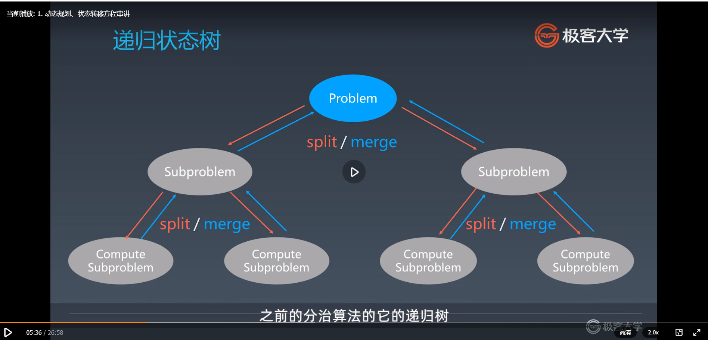
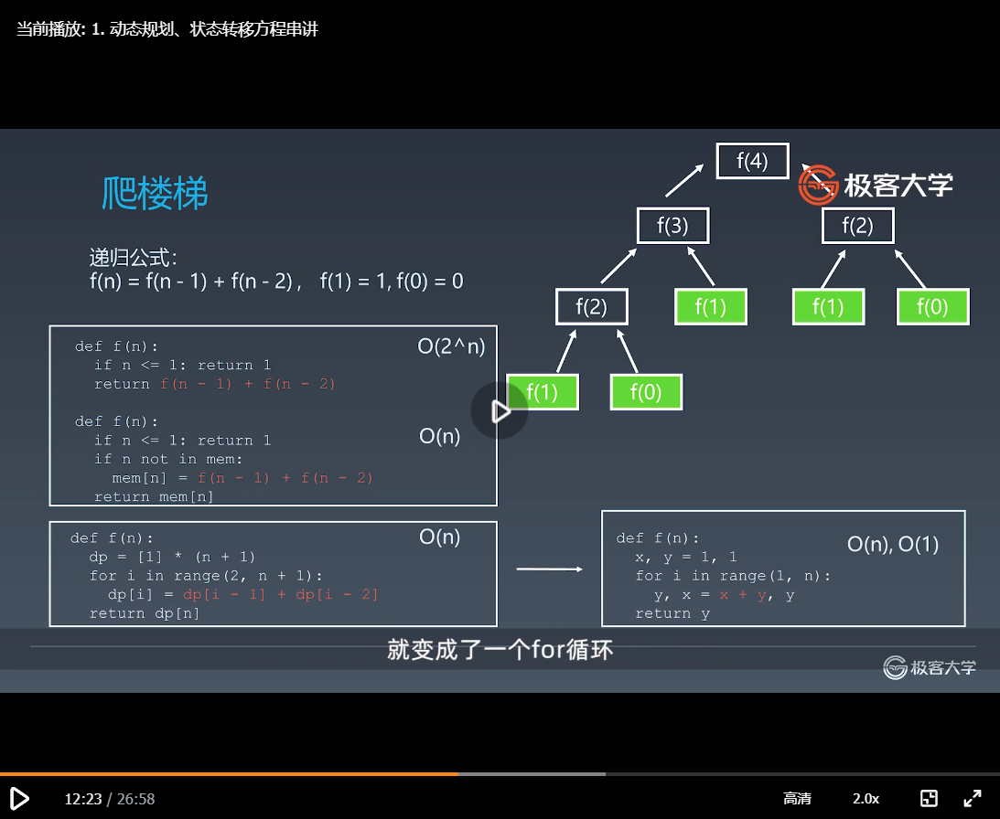
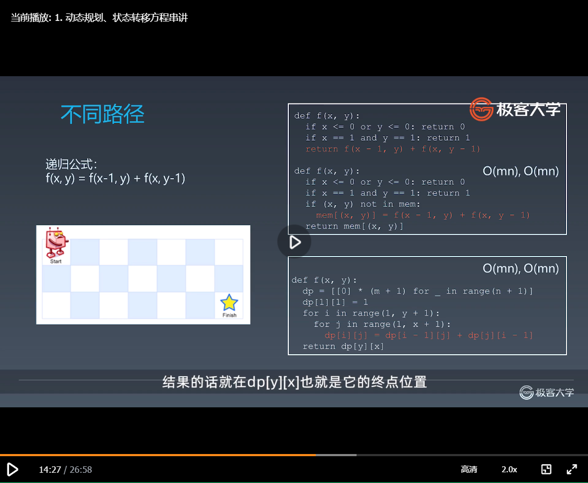
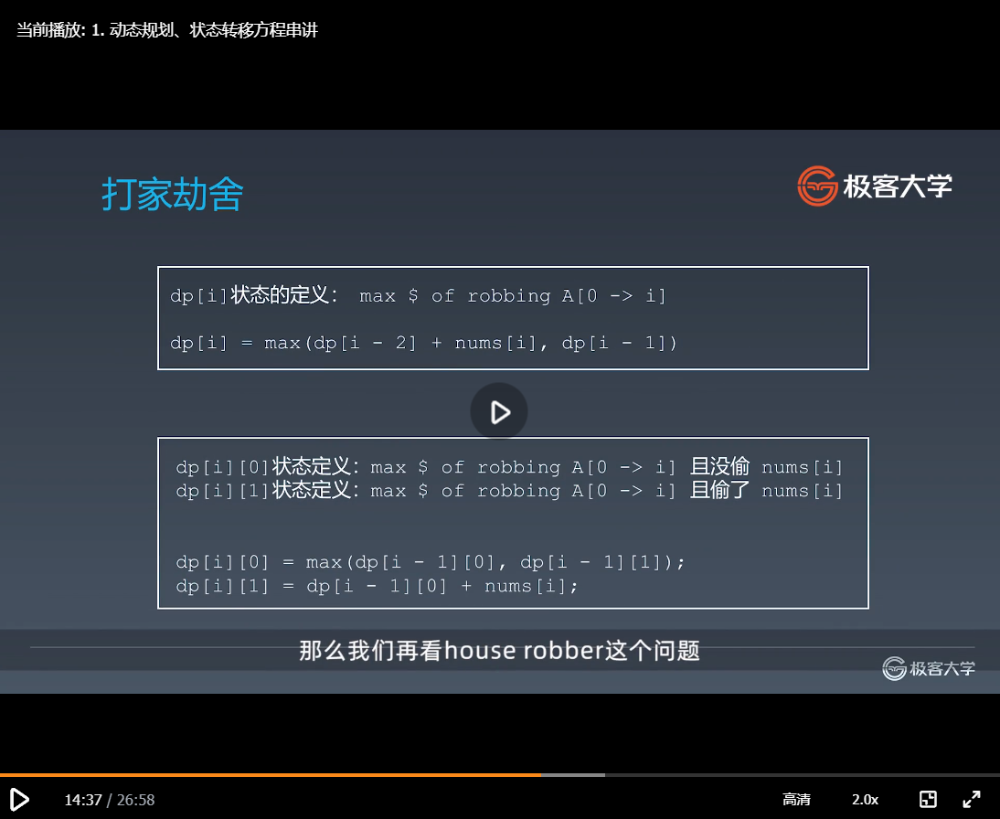
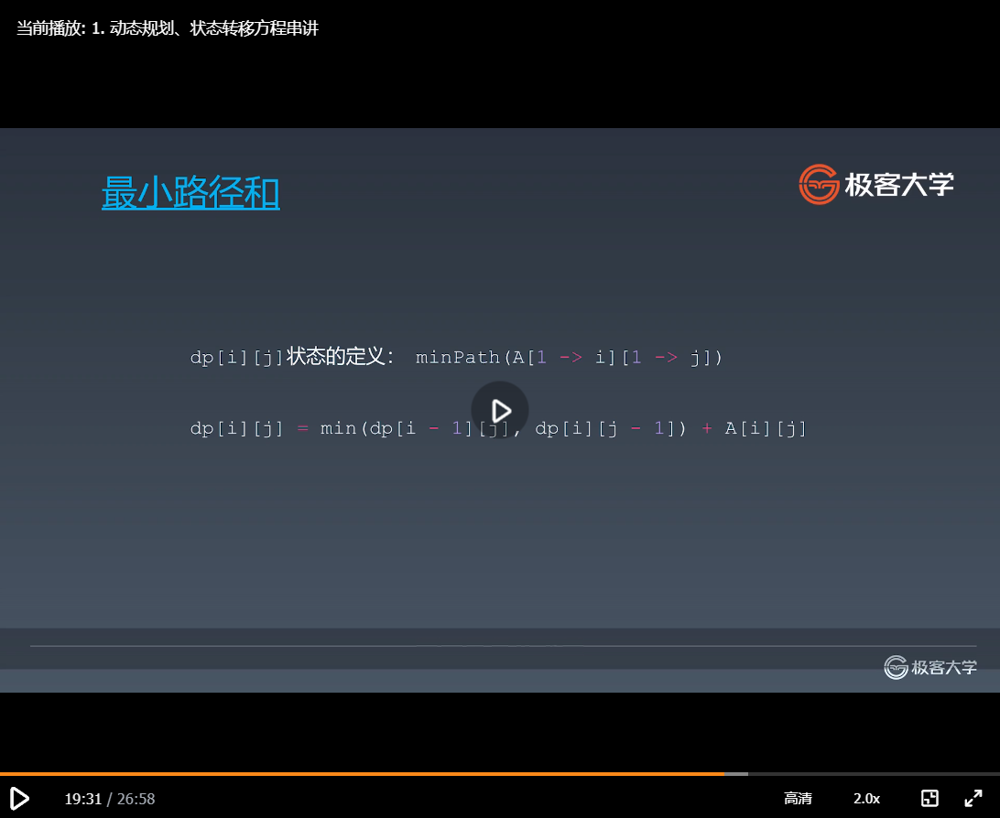
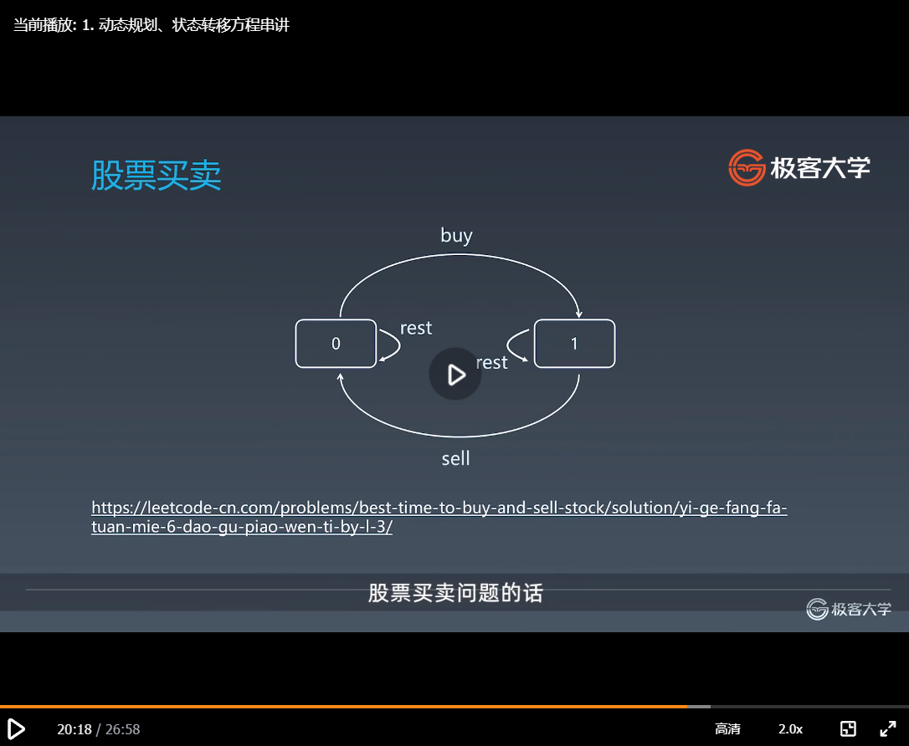
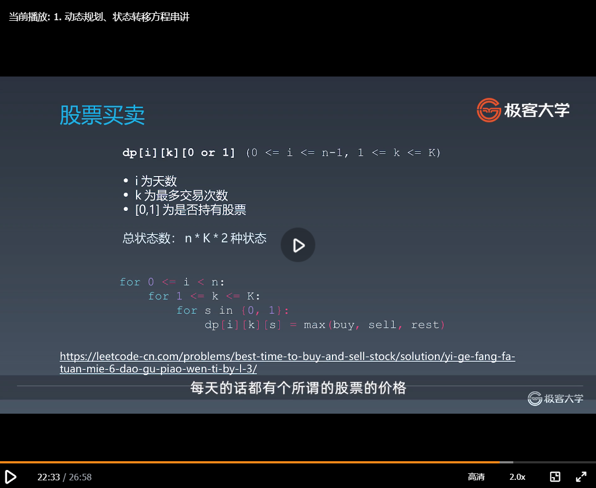
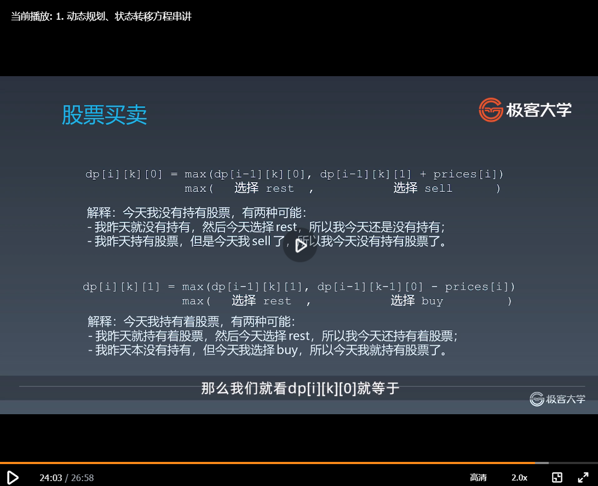
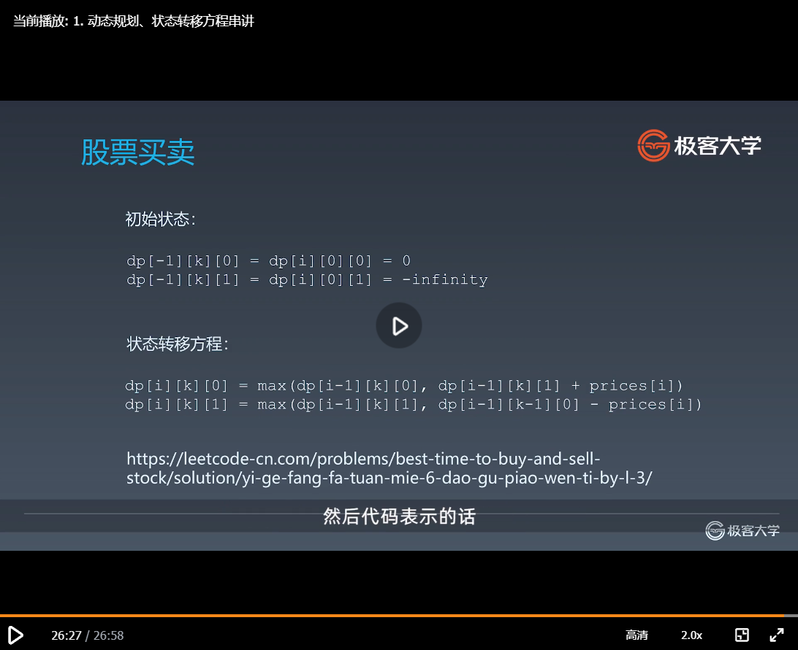

#第九周 
##一、学习笔记
###19.1高级动态规划——动态规划、状态转移方程串讲
之前我们的课程已经给大家讲了关于动态规划、状态转移方程以及找重复性和所谓的最优子结构，那么动态规划一直是所有学员都反应比较难学的，所以那个章节大家学完了之后是最基本的，给了大家很多时间，大家去练习，
那么在最后再结束之前的话，让我们再反过来给大家再重新回顾一下之前基础的动态规划，同时在这一章节里面再加深各种动态规划的题目，让大家对高级的动态规划有所了解。
那么这一章节的小节部分主要是三个小节：
####小结提纲
1. 动态规划复习，附带递归、分治
2. 多种情况的动态规划的状态转移方程串讲
3. 进阶版动态规划的习题
一、动态规划的复习，附带帮大家复习一下递归分治等之前常用的算法
第二部分的话就是动态规划的状态转移方程的话，结合之前给大家讲过的基础题目，做一个串讲
第三部分的话就是进阶版的动态规划一般应该怎么思考，和它有哪些常见的题目
####递归、分治、回溯、动态规划复习
##### 递归
首先递归本身的话，就是函数自己调用自己就叫做递归，也就是说递归和分治或者和回溯，其实没有一个所谓的是A就不是B之间的关系，它其实就是定义一个问题的不同的方面，本身它的函数调用是自己调用自己的话，我们就可以叫做是递归，就这么简单方便。
###### 递归-函数自己调用自己
那么我们首先来看它最关键的是把模板记住，这个模板本身的话我已经说过很多次，一定一写递归的话就想到这个模板，然后可以背诵出来，下笔如有神，就有这么一个感觉。

// Java  本身的话代码不长，结构的话更加重要，记住这四个结构模块，总共的话就是四块，整个递归代码
public void recur(int level, int param) { 
  // 第一部分的话就叫recursion terminator：递归终结条件（也就是写递归函数开始的话，一定要记得先把函数就是递归终止条件给写上。这一点的话如果不注意的话，最后造成的结果就是无限递归或者叫做死循环。类似于死递归之类的，就这个函数出不来了，你就只能强行把这个程序给杀掉）
  if (level > MAX_LEVEL) { 
    // process result 
    return; 
  }
  // 第二部分：process logic in current level ：处理当前层逻辑（就是你到了这一层，这个递归的层次的话，你要处理这一层要进行的逻辑就在这里的话，完成这一层要进行的业务代码逻辑代码）
  process(level, param); 
  // 第三部分：drill down ：下探到下一层（下到下一层的话，这里的话，它的参数来标记当前是哪一层，就level这里level就必须加一，同时把相应的参数p1p2p3放下去就行）
  recur( level: level + 1, newParam); 
  //第四部分：reverse/restore/clean/store the current level status if needed ：清理当前层
  //（要是递归完了，最后一部分你这一层有些东西可能要清理，就把它清理。
  //有些时候我们不需要清理这一层，因为的话它这一层的很多时候，它这一层本身的那些环境的话，它是拷贝一份出来的，对吧。
  //但很多时候的话会有一些全局变量，还有其他的一些事情你要进行清理的，那你就在最后这一部分来进行清理即可）
}

##### 分治
第二个的话就是所谓的分治，分治的话就是分而治之，仅此而已，就是分而治之。
它用不用递归，它肯定要用递归，当然的话你可以不写出递归的程序，让它分而治之也是行的，如果你是强行起循环的话，也是可以的。
########## 但是计算机本身设计的语言角度来说的话，绝大部分用递归来写的话是非常自然的，就是做分治这里。
所以大家的话还是要改变自己的思维习惯，就是切换成机器，或者是程序编程语言的思维，也就是递归经常要用。
###### 分治代码模板
那么还是分而治之的话，它本身的话代码的模板套用之前递归的代码部分，这里的话是递归终止条件（第一步），然后这里所谓的准备数据和拆分问题（第二步），在这个地方，同时的话，每一个子问题都调分治函数进行递归求解，最后得到一些中间的结果，最后是合并起来（第三步），合并完了之后返回（第四步）。

private static int divide_conquer(Problem problem, ) {  
         //第一步 recursion terminator（递归终止条件）：就是problem解决了，它其实的话本质上就是递归的层级，到了最下面这个层级，也就到了它的叶子结点，而叶子结点的话对于分治来说的话，一般来说它的叶子结点到达的标志就是在于这个子问题没有了，就没有问题需要再解决了
  if (problem == NULL) {
    int res = process_last_result();
    return res;     
  }    
           //  prepare data（准备数据和拆分问题）：第二步就是处理当前逻辑，处理当前逻辑的话，其实就是把这个大问题看如何分成子问题。
           //举个例子来说，求n的阶乘，这里的话就是写成n再乘以fac(n-1)，就是把n单独乘出来，然后去开始去调n-1的阶乘。
           //如果是Fibonacci的话，就是在这里的话变成两个n-1的递归结果再加上n-2的递归结果，存在一个变量里面去，或者是组装右括号存起来，当然你要判断左右括号是否用完
           //如果是之前的我们来组合左右括号的话，那么在这里的话，就是分别组装左括号
  subProblems = split_problem(problem)  
           //  conquer subprobleams（调分治函数递归求解）：第三步就是dirll down，就是调用这个函数下探一层。这里虽然名字就divide conqer，然后subproblem，其实就是调这个函数下探到下一层，解决更细节的子问题
           //  把这个比喻成公司的组织结构里面，每一个不同层级的人，你就解决自己层级的问题。像CEO就高瞻远瞩，看公司的战略和方向。到了高层的话就把这些任务分成相应的部门。比如说财务、比如说技术、比如说产品
           //  再到下面的话，技术产品那些，比如说VP或者总监，他也不会自己做事情，很多时候，他就把任务进行进一步地拆分，分给相应的技术总监去处理，这是比较大的公司，
           //  小的公司就直接是主要的开发人员，开发组组长程序员组成之类的，然后分到相应的小组的组长，再把任务分给相应的一线干活的这些人，然后他们就完成这个活，最后再把这个结果组装起来
           //  这其实和公司或者国家的运作也差不多
           //  其实你可以看到一个复杂的问题，其本身的话它的解决方法是异曲同工的，不管是在现实生活中还是在程序里面。
  res0 = divide_conquer(subProblems[0])
  res1 = divide_conquer(subProblems[1]) 
          // meger(合并结果：比泛型递归多的一步): 最后 的话就组装这个结果，然后返回来就行了
  result = process_result(res0, res1);
          //revert the current level states （返回）      
  return result;
}           
     //这里最关键一点是给你一个现实的现实题目或者面试题目。怎样把它拆分成子问题比较重要，主要看经验，而这个的话其实就是CEO，或者是所谓的架构师经常完成必做的事情，
     //还有一点就是说怎样来merge这些subresult，得到这些子结果把它合并起来可能也有个讲究
     //还有中间的话可能还需要做一些事情，假设比较复杂的这种分治的话，或者是比较复杂的公司组织结构的话，经常要做一件事情，就是中间的结果，比如说子结果一子结果二子结果三，如何做质量控制和质量保证的，也就是下面的人给你一个返回结果的话，你怎么知道这个他做的好还是不好，以及在公司的时候根据这些结果的好坏，给下面的完成这些子任务的人以相应的激励，这就成为了一个比较丰满的公司的组织文化
     //所以你来看它其实就是分治的结果
     //这里还有一点就是，和自订向下的编程思想一致，当前层你就只要考虑当前层的问题，
     //一般来说不要下探，或者至少不要下探太多，一方面的话人脑不太擅长用人肉递归，当你做人肉递归的话，你会觉得经常累，而且容易经常搞错，这是第一个
     //第二个的话，如果你一竿子要插下去，干扰别人做事的话，其实在公司组织结构，这是一种微管理或者是事无巨细的话，很讨厌的，个人是这么觉得，程序也如此

在上一章节给大家讲所谓的排序以及快速排序和归并排序的时候，就是这么一个结构。那么归并排序为例，归并排序就是一个典型的分而治之：
把一个数组劈成两半，左边部分先排好序，右边部分再排好序的情况下，然后把它们进行merge，merge的过程的话，最后就可以让整个数组变得有序，这就是所谓归并排序的思想。
大家可以回忆一下它的代码和模板是异曲同工的。
##### 感触
那么讲了之前的分治和递归之后，在这里的话总结归纳三点而已。在前面的课程中的话，反复给大家强调的：
一的话就是人肉递归低效且很累，这个要注意。
第二的话是找到最近最简方法，也就是找到重复性，最好是最近的重复性。
    这里的最近重复性，在我直播里面有一个同学在弹幕里面回复得非常好，就是说最近重复性的理解，特别是最近两个字，你就想成是最大公约数就好了，
    如果你拆的非常小的时候，这时候你会发现你的递归的话就是非常累吗，因为你的程序会写得特别繁琐，这时候就要找那种最大公约数的关系。
第三的话我们中学时候就已经教过的数学归纳法思想。
    那么这里其实是比较反人类的第三点。因为很多时候人的思维习惯，在现实中就比较希望把每一个步骤，自己都能够看到和把控住，不然的话你心里面会没底。
    一般你很难会觉得，你只要把你的下一层管好，同时再制定整个制度，让下一层再把下一层管好，最后的话整个体系就是完美的，一般不适用于这样的思想。
    但是你要处理复杂的问题，或者在复杂的公司里面工作，或者在复杂的社会里面要工作的话，都是要用这样的一种管理的方式，也就是同理可得的方式。
    那么还是这样自己慢慢来习惯这样的一种思维习惯。
那么它的本质就是所谓的寻找重复性。为什么寻找重复性？任何一个复杂问题，最后在面试中一般来说不超过10行，最为复杂的问题也不超过20行到30行。
    那么把这么复杂的问题，你要用计算机指令，在10行20行的程序能够完成的话，说明什么，说明它肯定是有重复性的。
    那么重复性最后就反映在代码指令集上面的话，肯定就是for循环或者是while循环或者是递归调用，那么最后的话本质就是寻找重复性。
    
1. 人肉递归低效、很累
2. 找到最近最简方法，将其拆解成可重复解决的问题
3. 数学归纳法思维
本质：寻找重复性——>计算机指令集
##### 分治算法的递归状态树

在这里再给大家画了一遍之前的分治算法的它的递归树，和它的整个分而治之的情况，那么也说了动态规划由此引申，它和分治其实没有非常显著或者本质上的区别，
但是很多时候我们发现当一个分治的问题，本身的话，它的子问题具有所谓的重叠，或者是所谓的最优子结构的时候，这个时候我们就会发现，很多时候我们可以去重或者是淘汰次优解，那么在这种情况下，这种分治的办法，如果你能够在中间每一步淘汰次优解的话，就变成了所谓的动态规划。
那么我们举一个具体的例子，我们就来看Fibonacci问题
##### Fib(6)状态树、重复子状态
状态树、重复子状态.png)
Fibonacci问题的话，如果要算fib(6)的时候，就会一步一步一步往下进行探，如果用最为朴素的分治，不考虑任何重复子问题，反复计算的话，最后我们算出来它的状态树是这么一个样子的；
从这个状态树我们可以看到有很多的重复计算，比如说f(0)在这里被计算一次，在这里被计算一次，f(1)也是同时还有f(2)f(3)f(4)这样的一个问题，对吧；
那么当我们发现有重复的问题，加了一个缓存进去的话，也就是分治再加上记忆化的缓存的话，这个时候我们就可以认为我们就已经从分治过渡到所谓的动态规划了。
##### 动态规划 Dynamic Programming
那么动态规划它的要点就在这一页PPT里面
1. "Simplifying a complicated problem by breaking it down into simpler sub-problems"
    (in a recursive manner)  指的是将一个复杂的问题，分解成各个简单的子问题
    在这里你会可以看到它其实就是一种分治的思想
2. Divide & Conquer + Optimal substructure 
   分治+最优子结构
   第二的话，它还有一个最优子结构，所以动态规划就是分治，再加上最优子结构。
3. 顺推形式：动态递推
   第三的话很多时候，它的状态本身可以进行顺推，也就是从下到上往上推，
   这个和Fibonacci数列也是一样的，你与其在开始从fib(6)上面像一个树形结构往下走，那你还不如就从下标为0123，一直用Fibonacci数列的递推公式往上递推，最后的话就会变成就写几个循环。
   如果是三维的话，就三层嵌套，两维的话就两层嵌套的循环，所以的话动态规划很多时候你也可以理解为动态递推。
########## 如果各位初学者的话，你可以从分治的角度再加上记忆化搜索来开始切入动态规划的题目，然后再转为递推的问题，这样的话你会觉得思维习惯上比较顺畅，或者是你会觉得这样理解起来比较简单。
那么如果大家的内功练得越来越多的时候，我建议大家就直接从递推开始了。
因为大部分的动态规划，最后的话肯定是递推的程序是最为简化的，也是符合动态规划整体思想的。
###### DP顺推模板
这里的话就把动态规划主要是递推这里的模板给大家写出来了。
function DP():
   dp = [][]  #二维情况：dp状态的定义
   for i = 0 ... M{
      for j = 0 ... N{
         dp[i][j]=_Function(dp[i'][j']...)
      }
   }
   return dp[M][N];
那么由此可以见本身的话就是一个嵌套的循环，然后从之前的dp的状态，推到最新的dp[i][j]的状态（循环内部），在这个位置，最后的话还有dp[M][N]反映最后的最终结果，就在这个位置（return返回处）。
从这里大家还可以看到一点，这一点是什么，就是说本身模板的话并不复杂，复杂在什么地方。
第一个复杂的地方就是DP状态的定义，需要你的经验，同时需要你把现实的问题定义成一个数组里面保存状态，这个数组可能是一维的两维的三维的都有可能
第二步复杂的地方毋庸置疑就是这个状态转移方程要怎么写，很多时候很简化的情况，Fibonacci数列就是dp[i]=dp[i-1]+dp[i-2]。
               但是更多的情况下，我们会求一个最小值，或者是我们可以累加累减，或者是在这里面有一层小的循环，从之前的k个状态里面找出它的最值，放到这个地方。
那么在这里大家可以再听一遍我刚才的总结，这里要注意什么，难点是什么，状态转移方程的话要注意什么，难点是什么，然后思考一下，把你觉得比较重要的要点写下来，反复多看几遍。
###### 关键点
关键点的回顾就是动态规划和递归或者分治没有根本上的区别（关键看有无最优的子结构）
它们的共性：就是都是找到重复性和找重复子问题，然后化繁为简，庖丁解牛的，把一个大的问题分解成各个重复的子问题
差异性：动态规划用来处理有所谓中间的重复性以及所谓的最优子结构，在中途可以淘汰次优解

########## 这就是关于动态规划，它的理论部分以及和前面的分治递归进行所谓的比较。
####常见的DP题目和状态方程
我们来看常见的DP题目和它的状态转移方程，在这里给大家进行一个串讲和总结，大家一定要多多回忆之前做过的DP的问题。

有待补充
#####爬楼梯

#####不同路径

有待补充：路径二有障碍物的状态转移方程
#####打家劫舍

#####最小路径和

#####股票买卖

######作业：利用动态规划写出前面6道股票买卖问题

###19.2高级的DP问题
看高级的DP问题，给大家讲一些例题以及如何去思考。
有待补充
####复杂度来源
1. 状态拥有更多维度（一维、二维或者更多、甚至需要压缩）
2. 状态方程更加复杂

本质：内功、逻辑思维、数学

那么我们现在来看高级的DP它为什么复杂、它的复杂度来源在什么地方，主要是两点：
既然我们知道DP本质的话，就是第一状态定义，第二的话状态转移方程.
那么复杂度的话也同理可得，
第一的话就是状态拥有更多的维度，这是它的复杂度来源一，这就意味着什么，第一你的数组变成二维三维了，每一个维度是什么，你必须更加得清晰，且你在写的时候不能逻辑出错或者是混乱，
      第二的话也说明了你要从现实的问题，也就是你从面试题本身能抽象出来，不同维度如何定义，那么对你的逻辑思维要求能力肯定也会更高，有些时候它的状态空间会变得特别的大，就导致的话循环变慢，这个时候你还要考虑所谓的压缩状态。
      这个时候你还要考虑所谓的压缩状态，那么简单的压缩状态的话，就犹如开始讲Fibonacci问题的时候，我们就不用存整个一维的数组，我们只需要存两个变量，也就是它的前一者和再前一者，同理可得，再更复杂的问题的话，它的压缩状态的话会更加得复杂。
第二块的话就是状态转移方程更难，一方面是题目本身的逻辑关系很难，另外一个方面的话就是由于状态空间维度太多，也会导致状态转移方程本身的话也变难。
      所以在这里的话要如何提高就是一点多练、多思考，也就是这个地方就是内功，是你的逻辑思维能力，也是你所谓的数学能力，
      所以我们可以看那些国际性的比赛、计算机编程比赛，这些题目到了最后，压轴的题目基本上是动态规划问题，因为到了最后其实就是考你的数学能力和你的抽象思维。
####爬楼梯问题改进
- 1、2、3
   int[] a = new int[n];
   a[0]=1;
   a[1]=2;
   a[2]=4;
   for(int i=3;i<n;i++){
      a[i]=a[i-1]+a[i-2]+a[i-3];
   }
- x1,x2,...,xm步
   int[] a = new int[n];
   int[] x = new int[m];
   for(int i=2;i<n;i++){
       for(int j=0;j<m;j++){
          a[i] +=a[i-x[j]];
       }
   }
- 前后不能走相同的步伐
  a[i][k]
  for(int i=2;i<n;i++){
      for(int j=0;j<m;j++){
         for(int k=0;k<m;k++){
         }
      }
   }
- Homework: https://leetcode-cn.com/problems/min-cost-climbing-stairs/

我们先来看一个简单的问题，把它进行深化。
爬楼梯问题本身的话，在面试的时候大家注意类似做这样的一种拔高题目，然后让你继续接着写，大家一定要注意。
我们来看爬楼梯问题，爬楼梯问题本身的话是比较简单的，上一级和两级台阶，那么接下来就来了，当你把程序全部写完了之后，
面试官这时候可能会问你第一个问题，就是说好一级两级可以，如果是它还可以上第三级怎么办，对吧，那么上第三级的话，在动态转移方程来说的话，这里就变成要从i+3也累加起来，当然的话你的上下界你循环的时候，这个起点也要注意以及初始化的值也要注意，
    因为你可以上三级台阶的话，0123的话，可能就要再多加一个对吧，你可以1上去，也可以是2上去，也可以是3直接上，那么这里也要变，具体细节的话就不在这里纠结。这是第一个要注意的。
第二个的话，它有时候可能会让你说你走的步不再是固定的步数，是给你一个数组，这个数组里面的元素表示你可以走的步数，对吧。
    这时候你会发现你的循环本身这里就多了一层了，j小于m加加j，然后它的递推就变成了你的第i个的状态就必须是变成最小的步伐数，有不同的办法，那就是从i-x[j]过去再加上，
    说明什么，它这里的话走了x[j]步，所以它必须是从i-x[j]上来的，然后它可以走多少次，就可以把它累加到a[i]这里，就变成这么一个循环，
如果这个时候问你，你不能走相同的步伐，应该怎么走了
    这个时候它的状态的话一维就不是特别够了，我们要再加一维就是i和k吧，第一维表示上到第几级台阶，第二维表示当前这一步我走的是第几步对吧，这个就表示我是最后这一步通过走一级台阶还是两级还是三级走上来的，当然在这里的话就变成一个抽象的，走x来走进来，
    所以这里必须还要再加一层循环了，就是如果我当前要走x[j]步的话，那么我之前也就还要再做一个循环，这个循环的话也是类似的ijk的话就在这里，然后它这里的话就从x[k]这里过来了，因为你最后走的是x[j]这一步，那你之前的话就不能再走x[k]这一步了，所以你要把相应的这里给排除掉，那么就多加了一层循环的嵌套，
    同时在这个地方的话，我递推方程不对，递推方程本身的话，就要考虑我每次递推的时候，比如它这一步假设是走了三步的话，那么它就不能从上一个i-1的这地方的三步，必须是从它的走第1步或者走第2步过来，像这么一种写法，
    我之前出过这个问题给一些面试的人，一般来说的话，把它变成123或者变成x1x2xm步都是可以的，那么关键就是前后不能走相同的步数，大家要练习一下，
这里有个小的homework，就是一个新的题目，叫min cost climbing stairs放这里，大家的话去做一下。它的话和之前那个题目也是异曲同工之处，

####编辑距离
https://leetcode-cn.com/problems/edit-distance/
请见视频，这里略

###20.1 字符串基础知识和引申题目
这一节的课程的话，会介绍字符串最基本的一些操作，然后最重要的就是在字符串里面如何运用算法，和其他数据结构来解决各种问题。
字符串本身的话在面试的时候出得比较频繁，所以这一章节的话也是比较重要的，同时的话会和前面的递归以及动态规划相结合，所以大家一定要反复对于这一章节的题目进行练习，都是很重要的题目。
#### 字符串基础知识
##### 字符串
字符串本身的话，我想只要写过编程的人在日常工作的时候都用过，那这里的话就把典型的三种语言，字符串怎么定义的，给大家放在这里“
- python
  x = 'abbc'
  x = "abbc"
- Java:
  String x = "abc";
- C++:
  string x("abbc");
  
string immutable:
https://lemire.me/blog/2017/07/07/are-your-strings-immutable/
In Java, C#, JavaScript, Python and Go, strings are immutable. 
In Ruby and PHP, strings are mutable.
The C language does not really have string objects per se. However, we commonly represent strings as a pointer char *. In general, C strings are mutable. The C++ language has its own string class. It is mutable.
In both C and C++, string constants (declared with the const qualifier) are immutable, but you can easily “cast away” the const qualifier, so the immutability is weakly enforced.
C最典型的C的话肯定是可变的，那个时候的话都没有字符串，它就是一个字符数组，最后的话你是用-0来结束的。C++的话就出来了String，但是它是mutable的，同时的话它也跟你说了。
如果你要让它变成不可变的，那就加const即可。
In Swift, strings are mutable.However, if you declare a string to be a constant (keyword let), then it is immutable.
我想给大家提醒一句，就是说python和java的话，这个String它是immutable的，immutable的话指的是不可变的，就是这个单词immutable的，也就是说你定义了这个String之后，它就是不可变的，当你把它加一个字母或者减一个字母的话，它其实是新生成了一个String，原来的String的话还是原来的内容。
C++的话它是可变的，把这一点大家一定要记清楚。
所以的话不管你用python还是用java的话，你每次改变String里面的内容的话，其实你都是创建了一个新的String。
immutable的话有好处，就是说它是线程安全的，那么，可变的话就会有可能再多线程的环境里面有一些问题。

关于可变和不可变的性质的话，有可能在面试的时候面试官会问你，所以大家一定要弄清楚。
##### 遍历字符串
- python: 
  for ch in "abc":
     print(ch)
- java:
  String x = "abc";
  for(int i=0;i<x.length();i++){
    char ch = x.charAt(i);
  }
  for(char ch : x.toCharArray()){
    System.out.println(ch);
  }
- c++:
  string x("abc");
  for(int i=0;i<x.length();i++){
      count << x[i];
  }
##### 字符串比较
java :
String x = new String("abc");
String y = new String("abc");
x == y --> false：主要是java这块，以及python和javascript里面也有相应的问题，就是说如果在java里面x==y的话，它是比较它们的指针，比较它们的reference的地址，而不是比较字符串里面的内容
x.equals(y) --> true
x.equalsIgnoreCase(y) --> true
#### 基础问题
##### 1. https://leetcode-cn.com/problems/to-lower-case/  转换成小写字母
最简单的题目而且是最基础的字符串的操作运算，自己练习
##### 2. https://leetcode-cn.com/problems/length-of-last-word/  最后一个单词的长度
最简单的题目而且是最基础的字符串的操作运算，自己练习
##### 3. https://leetcode-cn.com/problems/jewels-and-stones/  宝石与石头
最简单的题目而且是最基础的字符串的操作运算，自己练习
##### 4. https://leetcode-cn.com/problems/first-unique-character-in-a-string/ 字符串中的第一个唯一字符
1. brute-force:
  i 枚举所有字符
    j 枚举i后面的所有字符  //找重复
O(n^2)
2. map (hashmap：哈希表实现,O(1)找重复, treemap：二叉搜索树实现,O(logN)找重复)
O(N) or O(NlogN)
3, 用字母的对应的数组，用字母它对应的下标来统计，这个的话其实就是一个最简单的哈希表。也就是说字母你直接去算一下，它到底有多少次出现就这样
##### 5. https://leetcode-cn.com/problems/string-to-integer-atoi/ 字符串转换整数 (atoi)

#### 字符串操作问题
##### 1. https://leetcode-cn.com/problems/longest-common-prefix/description/ 字符串公共前缀
1. 纯暴力：从最小的单词开始枚举，每次枚举它自己和它的前缀，然后看在其他的字符里面能不能。O(n^2*m,m是单词的平均长度)
2. 更快一点的办法：写两层嵌套的循环，把字符串对齐排在一起，然后来检查第1列是否相同，相同的话看第2列，也相同的话去看第3列，最开始出现有一列字符是不相同的那就停止把前面的输出即可
3. Trie
4. 分治：时间复杂度并不好
##### 2. https://leetcode-cn.com/problems/reverse-string/   反转字符串
头指针和尾指针，一个不断地加加，一个不断地减减，然后交换两个数，一定要滚瓜烂熟
##### 3. https://leetcode-cn.com/problems/reverse-string-ii/   反转字符串 II
自己练一下
##### 4. https://leetcode-cn.com/problems/reverse-words-in-a-string/  翻转字符串里的单词
C语言尝试用O(1)的办法，
JAVA或者Python，因为它String的话都是不可变的，那就直接用系统函数就行了
这个题目我拿出来，就是因为在实际当中的话，大家应该用得比较多。
1. split,reverse,join:直接把s trim之后split，代码里面+的话指的是可以多个空格，它就按照空格把它分开成一个数组，每一个数组里面的元素就是一个单词，然后把这个数组反序，反序了之后再连接起来，用空格隔开
    如果想直接在内部进行交换的话，也可以尝试去写一下，
2. reverse整个string，然后再单独reverse每个单词(翻转两次，一开始翻转整个字符串，接下来翻转里面的每一个单词)：O(N)
##### 5. https://leetcode-cn.com/problems/reverse-words-in-a-string-iii/ 反转字符串中的单词 III
自己做
##### 6. https://leetcode-cn.com/problems/reverse-only-letters/  仅仅反转字母

#### anagram 异位词问题
##### 1. https://leetcode-cn.com/problems/valid-anagram/  有效的字母异位词
以前讲过，放在这里是为了完整性
##### 2. https://leetcode-cn.com/problems/group-anagrams/  字母异位词分组
以前讲过，放在这里是为了完整性
##### 3. https://leetcode-cn.com/problems/find-all-anagrams-in-a-string/ 找到字符串中所有字母异位词
类似滑动窗口，看长度为3的子串，拥有一个长度为3的窗口，这个窗口的话从左边慢慢向右边滑，每次滑一步，你就看这个窗口里面单词和p是不是异位词对吧
可优化的一个地方，它每次都是增加一个字符，再减少一个字符，所以的话如果你是用map来存的话，就可以很方便地把出窗口的单词减掉，把进窗口这个单词再加进来，把进窗口这个单词再加进来，然后看和它这个单词是不是异位词

#### palindrome 回文串问题
##### 1. https://leetcode-cn.com/problems/valid-palindrome/  验证回文字符串 
自己做和练习
##### 2. https://leetcode-cn.com/problems/valid-palindrome-ii/ 验证回文字符串 Ⅱ
自己做和练习
##### 3. https://leetcode-cn.com/problems/longest-palindromic-substring/  最长回文子串
在第2节高级字符串算法中讲

###20.2 高级字符串算法
在这边的话有很多的问题，在面试找那个出现得比较多的，在实际的算法中也经常会用的，就是动态规划和字符串相结合。
那么在这里的话，我就把所有的和动态规划相关的列在这里：
第一个系列的话，我就叫做公共子串和公共子序列的这个题目：
#### 最长子串、子序列问题
子序列和子串，它的区别在于子序列的话，它可以有间隔的，而子串没有
#####1.Longest common subsequence (最长子序列)
https://leetcode-cn.com/problems/longest-common-subsequence/ 最长公共子列
if (s1[i-1]==s2[j-1]) dp[i][j] =dp[i-1][j-1]+1
else dp[i][j]= max(dp[i-1][j],dp[i][j-1])
#####2. Longest common substring (最长子串)
最长公共子串的话在leetcode上没有题目，但是它这个的话和前者(最长子序列)的话是相关的
if (s1[i-1]==s2[j-1]) dp[i][j] =dp[i-1][j-1]+1
else dp[i][j]= 0
最后的值在所有的dp数组里面找一个最大值出来即可
#####3. Edit distance (编辑距离)
https://leetcode-cn.com/problems/edit-distance/ 编辑距离 (非常重要)
1. BFS, two-ended BFS
2. DP
这里最关键给大家说的有两点：
一点的话就是状态的定义，这个时候的话就不能是一维数组，因为你会发现一维数组的话，无论如何都没法满足条件，而是加了一维。
第一维表示什么呢？表示前一个字符串word1它的前i个字符，那么j这边的话就表示word2它的前j个字符,这样的进行匹配
那么它坐标方程是什么呢？坐标方程的话也是在上一节给大家讲过的，
如果w1i==w2j的话，说明这两个字符是相同的，当两个字符相同的情况下的话，那么直接它的编辑距离就可以i-1和j-1了
不然的话，这两个不相同的话，那就是要么A减少一个（指的是删除word1的字符），要么B减少一个（指的是指的是删除word2的字符），或者是A和B都减少一个（指的是替换）对吧，就得到了这样的一个所谓的状态转移方程
dp[i][j] // word1.substring(0,i) 与 wor2.substring(0,j)的编辑距离
if(w1[i]==w2[j]) edit_dist(i,j) = edit_dist(i-1,j-1)
else edit_dist(i,j) = min(edit_dist(i-1,j-1) +1 ,edit_dist(i-1,j)+1,edit_dist(i,j-1)+1 )

这就是dp在字符串的比较，和找公共子串和子序列中的运用，这里最关键的一点，我再强调一遍，
一是二维数组（第1维是word1的长度，第2维是word2的长度），
同时数组的定义一定要非常得熟练，以及滚瓜烂熟
#####4. https://leetcode-cn.com/problems/longest-palindromic-substring/ 最长回文子串
1. 暴力 O(n^3) :嵌套循环,枚举i,j(起点和终点),判断该子串是否回文
2. 中间向两边扩张法(O^2)
3. 动态规划
  dp[i][j]:i表示起点，j表示终点
  首先定义dp(i,j)
                 true    s[i,j]是回文串
     dp(i,j) =  
                 false    s[i,j]不是回文串
  接下来
  dp(i,j)=dp(i+1,j-1)&&S[i]==S[j]
  接下来我们来看它怎么来进行相应地DP，DP起来，其实也很简单，
  首先i和j如果是相等的话，或者i和j差一位的话，也就是j等于i+1的话，说明子串长度为0或者长度为1，说明它肯定是回文串
  那么接下来就是i和j不断地向外进行扩散，向外扩散的时候，i反正每次是加1的，j反正每次减1的，只要S[i]==s[j]的话，那么就可以向外扩散，也就是可以把true传递出去，不然的话它就不能把true传递出去,
  注意它的初始条件是空的子串，或者是长度为1的子串，那么肯定是回文串，
  能不能向上扩展到更长更大的一些子串，就看s[i]是否等于s[j]
  先枚举末尾，再枚举开始：
  for(int j=1;j<n;j++){//枚举end
      for(int i=0;i<j;i++){//枚举begin
  或者先枚举开始，再枚举结尾：
  for(int i=n-1;i>=0;i--){//枚举begin
      for(int j=i;j<n;j++){//枚举end
4.Manacher算法：最关键的思想就是不断地扩张，同时的话它可以是线性的。比较复杂，面试很难考到，不用去掌握

#### 字符串 + 递归 or DP
##### 1. https://leetcode-cn.com/problems/regular-expression-matching/ 正则表达式匹配
优秀题解： https://leetcode-cn.com/problems/regular-expression-matching/solution/ji-yu-guan-fang-ti-jie-gen-xiang-xi-de-jiang-jie-b/
##### 2. https://leetcode-cn.com/problems/wildcard-matching/  通配符匹配

##### 3. https://leetcode-cn.com/problems/distinct-subsequences/  不同的子序列
类似题:edit_distance 、 公共子串
1. 暴力递归
2. 动态规划
dp[i][j] 代表T前i字符串可以由s前j字符串组成最多个数。
所以动态方程：
当s[j]==T[i],dp[i][j]=dp[i-1][j-1]+dp[i][j-1]
当s[j]!=T[i],dp[i][j]=dp[i][j-1]

###20.3 字符串匹配算法
这一部分的话，算法本身的话没有太多的面试题可以，更多的话是一些高级算法，你要理解、你要知道，同时的话能够和面试官相应地解释。
但代码本身的话，它不一定要求你在白板上实现，或者是说更多的时候的话，它不会让你在白板上实现。
所以我们先看字符串匹配算法它的含义是什么？
#### 含义
字符串匹配算法，简单说就是给你一个A串和一个B串，问你A在B中什么位置出现，或者B在A中什么位置出现。
它们经常得到一个办法，
比如说第一是暴力法，
第二的话叫Rabin-Karp算法，
然后第三个的话就是KMP算法，
另外的话还有Boyer-Moore 算法，它的话会比KMP在平均情况下的话稍微再优化一点，还有一个叫Sunday 算法，这两个的话作为课后理解，我把它相应的资料已经放在这里了
然后这个课上面的话主要就是讲暴力法、Rabin-Karp、KMP（先给大家进行一个开头）
#### 1. 暴力法(brute force) - O(MN)的时间复杂度
M: 文本字符串text的长度,N: 目标字符串target的长度
之所以是O(mn)的话，因为每一次不管你起点在什么地方，你都要逐个再比较一次第二个串它的长度
##### 暴力法代码:
接下来看暴力法，它的代码，代码部分的话传进来的是两个，一个是txt，一个是pat，pat的话，你可以认为是下面去匹配的串，txt就是文本原文，也就是待匹配的串，那么M和N就它的长度分别记下来以后，
然后第一层循环枚举起点，起点就是i也就是说一开始i在这个地方，后来的话i在增长，变成这个地方，再i的话变成这个地方
那么对于不同的起点，还要有一层循环j来枚举pat这个串它的每个字符，再和txt进行比较，对吧，
所以的话还有内层循环，就是j的话，去比较txt和pat(j)它对应的下标的字符是否相同，如果不相同就break就行了，如果j最后等于等于N的话，说明整个pat串和txt的话子串是一模一样的，然后就返回第一次匹配的下标位置即可，
要是全部走完都匹配不上，只要有break，说明pat和text其中某一个位置的字符是不一样的，那么就返回-1，说明没有找到。
它的时间复杂度，因为这里有一个循环嵌套，所以的话是M再乘以N就这么得来的，
// Java
public static int forceSearch(String txt, String pat) {
    int M = txt.length();
    int N = pat.length();
    for (int i = 0; i <= M - N; i++) {
        int j;
        for (j = 0; j < N; j++) {
            if (txt.charAt(i + j) != pat.charAt(j))
                break;
        }
        if (j == N) {
            return i;
        }
        // 更加聪明？
        // 1. 预先判断 hash(txt.substring(i, M)) == hash(pat)
        // 2. KMP
     }
    return -1;
}

//C/C++
int forceSearch(string text, string pattern) {
    int len_txt = text.length();
    int len_pat = pattern.length();
    for (int i = 0; i <= len_txt - len_pat; i++) {
        int j = 0;
        for (j = 0; j < len_pat; j++) {
            if (text[i + j] != pattern[j]) break;
        }
        if (j == len_pat) {
            return i;
        }
    }
    return -1;
}

// Python
def forceSearch(txt, pat):
  n, m = len(txt), len(pat)
    for i in range(n-m+1):
        for j in range(m):
              if txt[i+j] != pat[j]:
                      break
        if j == m:
              return i
    return -1 

// Javascript
function bf(text, pattern) {
  let n = text.length;
  let m = pattern.length;
  for (let i = 0; i < n - m + 1; i++) {
      let matched = true;
      for (let j = 0; j < m; j++) {
            if (source[i + j] !== pattern[j]) {
                    matched = false;
                    break;
            }
      }    
      if (matched) return true;  
  }  
  return false;
}

console.log(bf("abcabcabx", "abcabx"));

？加速
那么我们来看整个过程，这个比一下对吧，每个都是从首字母开始比，然后再挪，那么在这里的话，
有些人可能会想能不能加速，对不对
首先的话，想讲一点，枚举起点本身枚举这个(txt)起点本身的话，一般来说是不可能加速的，至少在我们这章节来介绍这些匹配算法的话，枚举这个起点是没办法再继续加速了，关键就是这里面能不能用更加聪明一点的办法，来解决这个问题
那么依照这里面能够更聪明的办法，我们就引申出了接下来要讲的更加聪明吗？
        // 1. 预先判断 hash(txt.substring(i, M)) == hash(pat)  
                  首先你要比的话，肯定就是每次从里面抠出，假设这个长度是M，这个长度是N的话，每次从上面串里面抠出N长度的子串，那么一一一步加速，就是说直接比较hash(txt.substring(i, M)) == hash(pat)，如果等于等于hash(pat)的话，说明这个长度相同的子串和它pat本身的话，是哈希值是一样的，那么我们可以再用暴力法继续每一个字符去比较，如果发现它的哈希值不一样，我们就不用挨个比较了。只要哈希不一样，说明这两者肯定不一样，我们就直接走了就行
                  所以我们要讲的第一个办法，就叫做Rabin-Karp算法的话，就是用子串的哈希值，首先来对比一下来进行加速，
        // 2. KMP:接下来再讲KMP，我在这里就给大家提示了， 然后在这里为了完整性的话，就直接给大家将第二个优化的办法，叫KMP。
                      KMP主要是什么呢？你在这个地方发现ABCDAB都能够和原来待匹配串（ABCDABD）里面匹配的上，说明什么问题？说明这前面都能够是完全一样的，那么我就在前面这个字符串里面找到它的前缀和它的后缀最大的重合的可能，
                      最大的重合的可能，我们发现是AB和后缀AB是完全可以重合的，那么说明它最大的前后缀重复的长度是2，说明什么，说明到时候整个串匹配上，但是发现这里匹配不上的时候，我们直接可以向这边的话挪动6-2的位置，直接把前缀AB挪到后缀AB的位置来了，
                      因为这个是最大的前缀和后缀相符的位置，那么就直接把AB往后挪，直接从这里开始ABCDABD来比较，
                      所以在这里大家就只要记下一个最初的概念，就是说我们KMP的话就是用来找已经匹配的这一个片段，它的最大的前和最大的后缀，最长有多长是这么一个概念。
                      那么具体的话，我会在后面再讲KMP的时候，给大家带来。
            //所以在这里大家首先要明确一点，就是后面的所谓的匹配的高级算法，都是依照暴力法来进行优化，
              优化的部分就是说当枚举完起点了之后，那么txt里面的片段和整个pat如何进行有效快速地比较，这就是引发出了两个，这第一个的话叫Rabin-Karp，后面这个话就叫KMP
#### 2. Rabin-Karp算法
在朴素算法中，我们需要挨个比较所有字符，才知道目标字符串中是否包含子串。那么，时候有别的方法可以用来判断目标字符串是否包含子串呢？
答案是肯定的，确实存在一种更快的方法。为了避免挨个字符对目标字符串和子串进行比较，我们可以尝试一次性判断两者是否相等。因此，我们需要一个好的哈希函数（hash function）。通过哈希函数，我们可以算出子串的哈希值，然后将它和目标字符串中的子串的哈希值进行比较。这个新方法在速度上比暴力法有显著提升。
在最坏的情况下，它没有太多的速度的提升，因为你每次还要单个再比，但是在现实中的话，基本上每次它哈希值都不一样，当它哈希值一样的话，一定基本上99.9%的可能性，它的每一位的字符都是一样的。
那么在现实中，它的平均的时间复杂度要大大优于前面的暴力搜索。
##### Rabin-Karp算法的思想：
1. 假设子串的长度为M（pat），目标字符串的长度为N（txt）
2. 计算子串的hash值hash_part
3. 计算目标字符串txt中每个长度为M的子串的hash值（共需要计算N-M+1次）
4. 比较hash值：如果hash值不同，字符串必然不匹配；如果hash值相同，还需要使用朴素算法再次判断
所以的话你可以认为Rabin-Karp算法的话，就是在之前的暴力求解基础上加了一个用哈希来做预判断的过程，
你也可以认为类似于Bloom Filter一样，前面加了一个筛子，把一些明显不合格的就筛掉，不要再朴素算法求解了，
当然如果它们哈希值是一样的情况下，那没办法，只能再继续用朴素算法，一一比较两个字符串它的每一个字符都是一样的，
##### Rabin-Karp代码：
接下来我们来看这个代码，Rabin-Karp代码：
那么首先有两个常数，一个D的话是256，256指的是什么，我们在计算哈希的话我们取的哈希值，就是说每一位因为是一个字符，字符的话是0~256之间的，所以我们可以认为它是256进制的，
256进制是什么意思，就是说第1位的话，它是0~256，然后第2位的话，就是0~256里面的一个数把它再乘了一个256，对不对，就好像个十百千万，那么因为txt里面的话是256的范围，那么每一个字符的话相当于要乘一个256再加在一起，最后的话的话，那么就可以是有效的进行判重了。
这个要是不清楚的话，等一下后面看一下你就应该更加明白。
反正你就记住每一位它的权重，就是256的相应的次方。也就是说第0位的话txt里面第0位的话就是256的0次方，第1位的话就256的1次方，第2位256的2次方，和十进制二进制一样的，
那么为了避免最后的哈希值，因为你每次要乘个256就非常大了吗，爆掉，那么我们每次就模一个素数，素数的话就选9997就行，当然你也可以选9997或者是中间加几个，反正最好是一个素数就行了。
接下来我们来看M和N保存一下对吧，
记住pat小的是放在M的，txt大的是放在N的长度，i和j以及patHash以及txtHash分别都定义出来了
定义出来之后，现在i从0到M，然后计算patHash和txtHash的值
怎么计算？就是把之前的哈希的值再乘以256再加上当前这一位它的ASCII码的值，加在一起之后再模上一个9997这一块，同理可得txt也是这样的，
也就是说pat和txt的话，就各自把自己的位里面的数按照相应它的权重乘以个256，最后就算出它的哈希，同时模上一个Q在这个地方
这时候你会发现，因为我们在挪动的时候，每次的话都会把最前面，当挪动一步的话，从匹配串挪到下一个位置这里的话，txt里面它的子串的哈希的话，要发生相应的变化
要把A挪走，要把后面的新的A再加进来，如果挪走A呢？
挪走A的话，它用的办法，就是把最高位A它相应的值减去，再把最低位A再加进来，那么
最高位A它的权重是多少呢？其实就是循环M-1次，就要算出一个最高位的256^(M-1)，其实就是就算这么一个东西，当然你每次的话模上一个Q，就得到了最高位，也就是每次要挪走的那一位：它的权重值，我们把它命名成highestPowPow的话就指的是power的意思，最高位的权重值，
那么接下来这个循环，枚举匹配的起点，对吧，枚举txt里面子串它的起点，起点枚举出来的话，就看pat和txt哈希是否相等，
如果相等干吗？如果相等就按照之前所说的朴素算法再搞一遍，也就是说写一个内层循环比较txt和pat的相应位置上的字符是否一样。如果一样的话，return i把匹配到的起点返回出去
那么关键就是在这里，如果它不相等的话，根据之前我们讲的滑动窗口，那么最高位的字符应该走出去，最新进来的低位的祖父要走进来，怎么做呢？
把最高位的字符，也就是说是第i位的字符乘上一个highestPow，对吧，因为它是在最高位，所以要乘上一个highestPow，从txtHash里面减去，减完了之后再乘一个256，
因为滑动窗口要挪动一位，挪完了之后再加上新进来的这一位，新进来这一位就是i再加M对吧，
i在这个位置是起点，下一步的话再加M的话，就是这个位置，把B要重新加进来，这样的话就可以更新txtHash的值了
这个时候因为我们减掉了一个highestPow的值，有可能txtHash是负数，那么如果是负数怎么办，就给它再加上一个Q就行了
因为它每次模Q的话，其实就直接加上个Q就是一样的了，因为反正的话到时比的是哈希的话在，只是一个模糊的比较。当它比到一起的时候，我们再干吗，再进行精确的比较即可，所以的话这里可以容忍每次都模上一个Q这么一个形式，
这就是所谓的Rabin-Karp的办法
因为它哈希函数设计得比较巧妙，就可以导致每次i要换位置之后，txtHash可以直接用O(1)的办法进行更新，不然的话你就要调系统自带的对于String的哈希函数，那么还是O(m)的在里边。这是因为这个原因的话，这里基本上变成O(1)了，所以大部分情况下都是O(n)的，
只是当匹配到的情况下，当它哈希相同的话，会有一个内嵌的O(m)的循环，所以你可以认为它最坏是O(mn)，平均情况下就是O(n)的时间复杂度
那么这就是Rabin-Karp的办法来进行加速
////Java
public final static int D = 256;//256进制，256个字符
public final static int Q = 9997;
static int RabinKarpSerach(String txt, String pat) {
    int M = pat.length();
    int N = txt.length();
    int i, j;
    int patHash = 0, txtHash = 0;
    for (i = 0; i < M; i++) {
        patHash = (D * patHash + pat.charAt(i)) % Q;
        txtHash = (D * txtHash + txt.charAt(i)) % Q;
    }
    int highestPow = 1;  // pow(256, M-1)
    for (i = 0; i < M - 1; i++)
         highestPow = (highestPow * D) % Q;
    for (i = 0; i <= N - M; i++) { // 枚举起点
        if (patHash == txtHash) {
            for (j = 0; j < M; j++) {
                if (txt.charAt(i + j) != pat.charAt(j))
                    break;
            }
            if (j == M)
                return i;
        }
        if (i < N - M) { 
           txtHash = (D * (txtHash - txt.charAt(i) * highestPow) + txt.charAt(i + M)) % Q; 
            if (txtHash < 0)
                  txtHash += Q;
          }
      }
      return -1;
  }
  
////JavaScript
function rabinKarpSearch(text, pattern) {  
  const D = 256;
  const Q = 9997;  
  
  let N = text.length;  
  let M = pattern.length;  
  let patHash = 0;  
  let txtHash = 0;
    
  for (let i = 0; i < M; i++) {
      patHash = (D * patHash + pattern[i].codePointAt(0)) % Q;    
      txtHash = (D * txtHash + text[i].codePointAt(0)) % Q;  
  }
    
   let highestPow = 1; // 256 ** (M - 1);  
   for (let i = 0; i < M - 1; i++) {
       highestPow = (highestPow * D) % Q;
   }  
   
   let i, j;
   for (i = 0; i < N - M + 1; i++) {    
     if (patHash === txtHash) {
           for (j = 0; j < M; j++) {     
              if (pattern[j] !== text[i + j]) break;   
           }      
           if (j === M)
            return i;    
     }    
     if (i < N - M) {
           txtHash = (D * (txtHash - text[i].codePointAt(0) * highestPow) + text[i + M].codePointAt(0)) % Q;      
           if (txtHash < 0) {        
           txtHash += Q;      
           }   
         }  
       }  
       return -1;
       }
       console.log(rabinKarpSearch("abcabcabx", "abcabx")); 

//Python
class Solution:
    def strStr(self, haystack: str, needle: str) -> int:
        d = 256
        q = 9997
        n = len(haystack)
        m = len(needle)
        h = pow(d,m-1)%q
        p = 0
        t = 0

        if m > n:
            return -1

        for i in range(m): # preprocessing
            p = (d*p+ord(needle[i]))%q
            t = (d*t+ord(haystack[i]))%q
        for s in range(n-m+1): # note the +1
            if p == t: # check character by character
                match = True
                for i in range(m):
                    if needle[i] != haystack[s+i]:
                        match = False
                        break
                if match:
                    return s
            if s < n-m:
                t = (t-h*ord(haystack[s]))%q
                t = (t*d+ord(haystack[s+m]))%q
                t = (t+q)%q
        return -1
#### 3. KMP算法
（我想老生常谈，很多人就觉得很难理解）
KMP算法的话，因为理解起来特别得晦涩，主要是要知道子串也就是匹配串本身，它的每一个它的自己的子串最大的前缀和最大的后缀，它的值是多少，所以的话我们可以先说说
KMP算法(Knuth-Morris-Pratt)的思想就是，当子串与目标字符串不匹配时，其实你已经知道了前面已经匹配成功那一部分的字符（包括子串与目标字符串）。
以阮一峰的文章为例，当空格与D不匹配时，你其实知道前面六个字符是“ABCDAB".
那么当你知道前面的字符是这个样子的时候，它就要干吗，找出哪个前缀和它的后缀是刚好相等的，我们发现这两个是刚好相等的，那我们就直接把AB挪到text AB的位置，直接往后面挪四位就行了。
KMP算法的想法是，设法利用这个已知信息，不要把“搜索位置”移回已经比较过的位置，继续把它向后移，这样就提高了效率。
也就是说当它不匹配的时候，不是每次起点加1，而是可以+2+3+4+一个比较大的数，让它往后移得更快一点，这样提高了效率。
##### KMP 字符串匹配算法视频：（吐血推荐，youtube、博客上面解释KMP最好的，强烈建议看这个视频）
https://www.bilibili.com/video/av11866460?from=search&seid=17425875345653862171
https://www.bilibili.com/video/BV1hW411a7ys/?spm_id_from=333.788.videocard.0
##### 字符串匹配的 KMP 算法
http://www.ruanyifeng.com/blog/2013/05/Knuth%E2%80%93Morris%E2%80%93Pratt_algorithm.html
##### KMP代码
https://www.jb51.net/article/43202.htm JAVA实现KMP算法理论和示例代码
https://blog.csdn.net/bury_/article/details/79199228  字符串匹配-KMP算法 讲解与java代码实现
https://www.cnblogs.com/imzhr/p/9613963.html  KMP算法详解及其Java实现

#### 4. Boyer-Moore 算法（课后理解）
https://www.ruanyifeng.com/blog/2013/05/boyer-moore_string_search_algorithm.html

#### 5. Sunday 算法（课后理解）
https://blog.csdn.net/u012505432/article/details/52210975

###20.4 homework
这个说完了之后，就是这次的homework，大部分homework的话，我已经给大家在刚才的讲课里面的话已经过了一遍，
用什么算法以及示例的代码，最关键大家就是干吗，要自己练，要多练习几次，把这些代码的话写得滚瓜烂熟，这些题目的话都是面试中的比较高频的题目，
同时的话你把这些写好的话，你平时工作中写一些逻辑的代码，写一些业务的代码，我想也会事半功倍的
1.  https://leetcode-cn.com/problems/first-unique-character-in-a-string/ 字符串中的第一个唯一字符

2.  https://leetcode-cn.com/problems/string-to-integer-atoi/ 字符串转换整数 (atoi)

3.  https://leetcode-cn.com/problems/reverse-string-ii/   反转字符串 II
     https://leetcode-cn.com/problems/reverse-words-in-a-string/  翻转字符串里的单词
     https://leetcode-cn.com/problems/reverse-words-in-a-string-iii/ 反转字符串中的单词 III

4.  https://leetcode-cn.com/problems/reverse-only-letters/  仅仅反转字母

5.  https://leetcode-cn.com/problems/find-all-anagrams-in-a-string/ 找到字符串中所有字母异位词

6.  https://leetcode-cn.com/problems/longest-palindromic-substring/ 最长回文子串
     https://leetcode-cn.com/problems/isomorphic-strings/  同构字符串
    https://leetcode-cn.com/problems/valid-palindrome-ii/ 验证回文字符串 Ⅱ

7.  https://leetcode-cn.com/problems/wildcard-matching/  通配符匹配

8.  https://leetcode-cn.com/problems/longest-valid-parentheses/  最长有效括号

9.  https://leetcode-cn.com/problems/edit-distance/  编辑距离

##二、学习总结
###1.效果、感受
本周进度有所滞后，视频中字符串算法有看且有做笔记，但是高级动态规划来不及看。
###2.学习过程
先看录播，边看录播边做笔记，把笔记和每周的学习总结放到一个markDown文档里面，然后着手习题，用习题来检验学习效果。
###3.收获
这九周对数组、链表、队列、栈、堆、图、递归、分治、回溯、dfs、bfs、贪心算法、二分查找、动态规划、Trie树、并查集、高级搜索、AVL树、红黑树、位运算、布隆过滤器、LRU缓存、排序算法、字符串算法均有一定掌握，但是由于底子较薄，只是建立初步印象，需要花更多时间去掌握。
###4.刷题笔记
略

